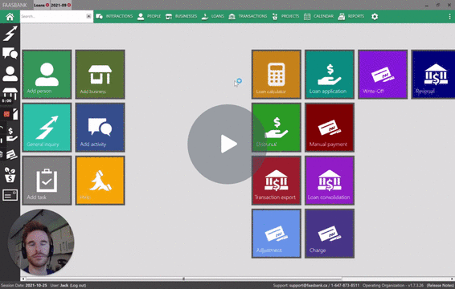
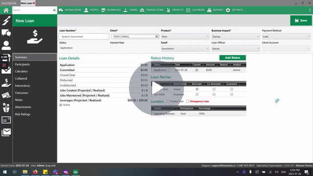
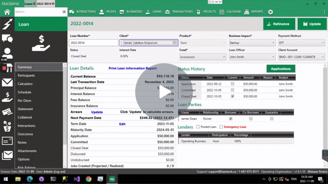
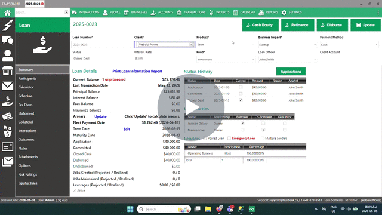
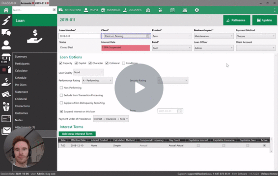
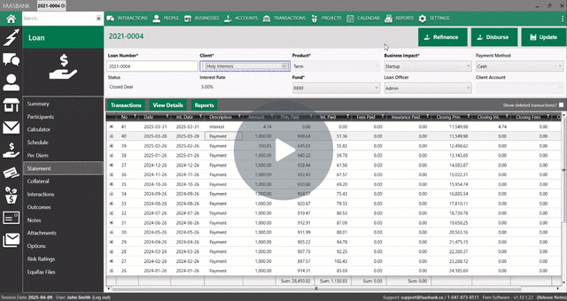
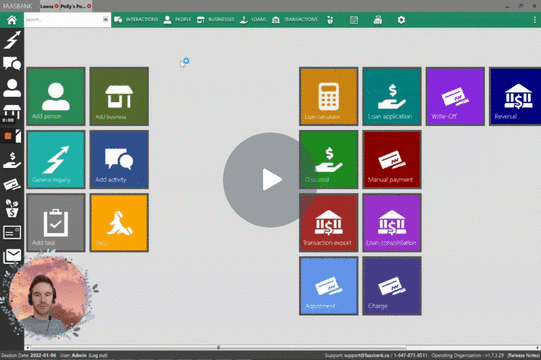
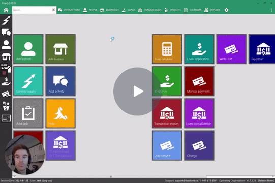

# Bite-sized Videos

These videos focus on particular features or functionality in FaaSBank, providing you with quick insight into how to utilize those areas for your organization.

## CRM

### Letter Editor

#### [Creating a new Letter Template](https://www.loom.com/share/f1fbe9cb674245d9a7cb0bf84cfa1d92)

## Loan Management

### Loan Calculator / Amortization Schedules

#### [Creating an amortization schedule with multiple disbursal fees](https://www.loom.com/share/bda4ce8900fd4424b4e649616ae14b7d)

#### [Creating an Amortization Schedule with an Interest-Free Period at the beginning](https://www.loom.com/share/77e9176a4266460ebe66fb49db304ab7)

#### [Creating a Bring Forward schedule to reflect a future-dated interest rate change](https://www.loom.com/share/b59f529084f74fb096ca0217af93390c)

### Interest

[Switching off fee capitalization for an individual loan](https://www.loom.com/share/57903c7d58f44d27983cd3a02c90b04e)

### Insurance

#### [Changing the insurance particulars on an existing loan](https://www.loom.com/share/86e062956835489d8961bad2c928f781)

#### [Fix Loan Insurance Configuration With a Bring Forward Schedule](https://www.loom.com/share/92a98350d3414eb98c1b00b9b5cc47b4)

### Suspended Interest

#### [Partially applying/capitalizing/discarding suspended interest](https://www.loom.com/share/4ec62cb4cd7e469baa40a692fa0d7d26)

## Transactions

#### [Back-dated Reversal Feature - reversing Payments that are not the most recent transaction posted to the loan](https://www.loom.com/share/7ff91220a2894d67a0bc3076999758c5)

#### [Loan Consolidation - merging one or more loans into another loan](https://www.loom.com/share/194be297db6d43e79235387095d7c254)

#### [Posting a payout Payment to a loan that has interest suspension switched on](https://www.loom.com/share/37f7b64ad80b4e29bdf115f80c0f549f)

## Settings & Administration

### Adding a New User

A step-by-step guide on the process can be found [here](https://scribehow.com/shared/FaaSBank_-_Adding_a_New_User__w9WQJrJsRC2UaD8fU_rd-g).

#### [Adding a New User](https://www.loom.com/share/ba1473a08a6a4773baef45f1de44ee68)

