# Navigating the Software

## Logging in

When FaaSBank launches, you will see the **login form**.

To login, select your user from the **User dropdown menu, then enter your password**. Following this, click the **Login button**.

If the correct password has been entered, you will then be logged into the software.

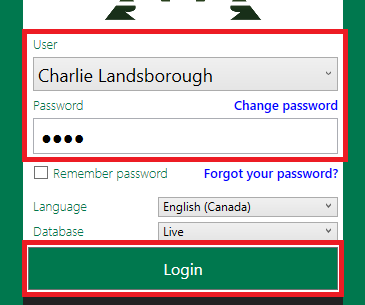

### I don't see my name in the User dropdown menu!?

If you do not have a FaaSBank user account, contact the individual in your organization that is the admin for the software. Admin users have the ability to create new users within FaaSBank's Settings area: **Settings -> Permissions -> Users**.

Failing that, if you admin is unavailable, contact the Fern support team and they'll be able to assist 🙂

### I've forgotten my password, and the 'Forgot your password' option isn't working!

The '*Forgot your password?*' option on the login page will only work if you have **your email address saved to your FaaSBank user account**. This can be done in **Settings -> Permissions -> Users**.

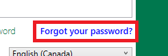

If this isn't the case, you will have to contact an Admin user in your organization. They will be able to reset your password within Settings -> Permissions -> Users.

## Accessing the Training database

The Training database is a copy of your live FaaSBank database that can be used for testing and trying out new features in the software. The actions you perform in the Training database have **no repercussions on your live data**. Go wild! 💃

To log into the Training database, on the FaaSBank login screen, **select Training from the Database drop-down menu and click Login:**

**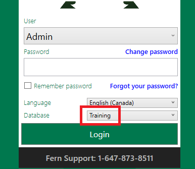**

You will then be faced with **three pop-up messages** while the training database is being readied:

1. Click **Continue** on the first pop-up.

   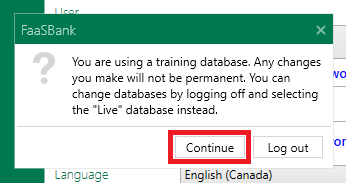

2. Click **OK** on the second pop-up.

   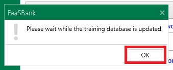

3. Then wait for the third pop-up to appear, and click **OK** on it.

   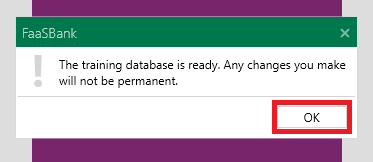

The training database is now ready for use 😎

**Note**: Remember to **log out of Training and log back into the Live database** when you're done testing.

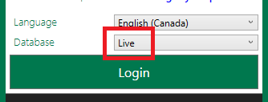

**Note**: if a Training database is very old, you may encounter a crash when attempting to access it. If this happens, please contact the Fern support team for assistance. They will be able to delete and recreate the database.

### Training database disclaimer

The FaaSBank training database is intended **solely for testing and training purposes**. It provides users with a safe environment to explore features and perform trial entries without impacting live loan data.

> **‼️Important:** Do not store or rely on any real or critical business information in the training database.

This environment may be **deleted, reset, or overwritten at any time without notice**. Any data entered into the training database should be considered **temporary and non-persistent**.

If your organization requires a separate database for managing additional loan types or workflows, please contact the FaaSBank support team to explore more appropriate solutions.

## Home Screen

When you log into the software, you will be met with FaaSBank's home screen.

It is comprised of the following elements:

### Global Search

The global search bar is located in the top-left corner of the software.

It can be used to find:

* People  
* Businesses  
* Loans  
* Grants

You can locate a loan/grant by entering its number, or by entering the name of the client.

Alternatively, you can locate a client by entering one of their loan/grant numbers.

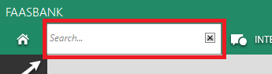

Selecting a search result will open that record, and display it in a **new tab** at the top of the software.

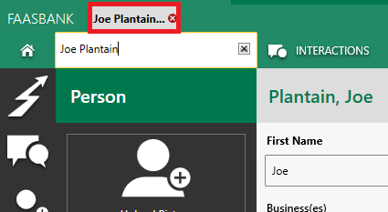

### Tab Management

FaaSBank is styled on a modern web browser: each record or window you open appears as a **tab along the top of the software**. This allows users to have multiple strands of work open at one time.

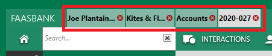

To **close** a tab you can click the little red ❌ inside the tab, or use one of the options that appear when you right-click on a tab:

* **Reload** - refreshes the record, pulling in the latest information from the database  
* **Close tab** - closes that single tab  
* **Close other tabs** - leaves that tab open, but closes all others  
* **Close all tabs** - closes all open tabs, includes the one that is selected

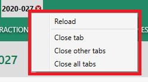

### Grid Views

The grid view buttons run along the top of the software. It is easiest to imagine the grid views as spreadsheets of the information you have **saved** into FaaSBank:

* **Interactions** - displays the general inquiries, activities, tasks and appointments that have been saved  
* **People** - displays the people who have been saved  
* **Businesses** - displays the businesses who have been saved  
* **Accounts**/**Loans** - displays the loans and grants that have been saved  
* **Projects** - displays the projects that have been saved

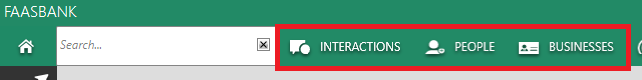

### Quick Launch buttons

Various Quick Launch buttons appear in the main area of the home screen, and on the vertical menu bar that runs down the left side of the software.

As is the case with the grid view buttons, the quick launch buttons that appear are **dependent upon the permissions that have been assigned to the user**. For example, if a user has been granted **no access to the Loans module**, then all loan-related buttons will be hidden from the interface for that user.

When a record/window is opened in the software, the quick launch buttons on the home screen get hidden from view, but **the vertical menu bar is always displayed**.

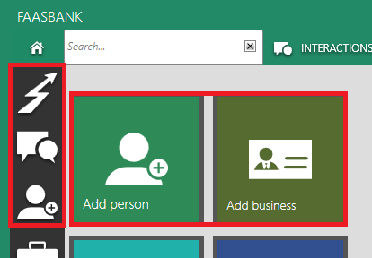

The buttons on the vertical menu bar as as follows:

#### Add a General Inquiry

Allows a user to record a **general inquiry**. A general inquiry is usually a **first point of contact with a new or potential client** e.g. an email from a business asking what types of loans are offered by your organization.

#### Add an Activity

Allows a user to record evidence of **an activity or client interaction**. Whereas a general inquiry is usually informing a potential client of the services offered by your organization, an activity would be recording an interaction you had with an existing client e.g. a business counselling session. Other types of activity could be training sessions, workshops, or board meetings.

#### Add a Person

Allows a user to add a new **person** to FaaSBank. This could be a new or potential client. In the Person record you can capture all their pertinent information e.g. contact details, address etc.

#### Add a Business

Allows a user to add a new business to FaaSBank. This could be a new or potential business client. In the Business record you can capture all the business's pertinent information e.g. contact details, address, NAICS codes, business number etc.

#### Send an Email

#### Add a Loan

#### Post a Manual Payment

#### Add a Project

#### Mail Merge Letter Editor

### Reports toolbar button

The quickest way to generate reports in the system is via the reports toolbar button. It is the three little dots found under the exit 'X' in the top-right corner of the software.

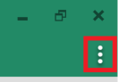

When you click the button and select Reports in the menu, you will see the various report categories that exist in FaaSBank.

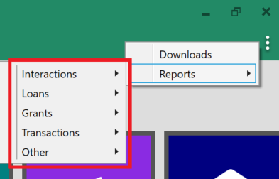

Those submenus house the various reports that a user can generate from the FaaSBank software. For example, for loans, there are a whole host of reports that can be generated, each providing different pieces of information on the loans in your portfolio.

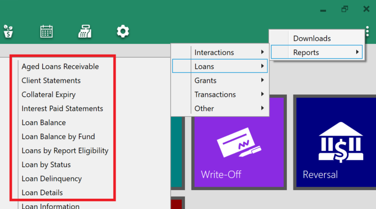

For most reports, when you select it FaaSBank will then display a **report parameter window**, allowing you to edit some of the generation settings on the report e.g. setting a Start and End date, including/excluding particular loan funds etc.

For example, on FaaSBank's Loan Balance by Fund report, a few of the parameters a user can edit are: the report run date ('*Balance as of*'); include/exclude certain loans funds; and sort by loan number, client name, last payment date etc.

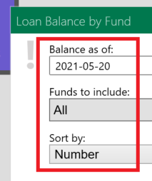

Note: mandatory funder reports, for example, the FedDev, FedNor and WD CFDC Performance reports, do not get generated from the reports toolbar button. Program particular reports such as those get generated from the **Reports button on the top menu bar**.

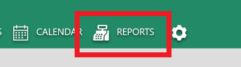

### Home button

The Home button is located in the top left corner of the FaaSBank software. It will always bring a user back to the software's home screen and its big colourful tiles.

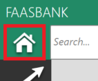
