# Client Relationship Management

## Add a Person

From the home screen, click "Add person"  
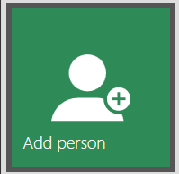

The Person record window is broken into a number of sections e.g. Contact Information, Addresses and Relationships. The center area of the screen is used to capture information; clicking on a subheading in the left menu will bring that section to the fore.

**Please remember that you do not need to visit every tab: the only pieces of information required to save a person to FaaSBank are their first name and last name.**

The top area of the Add Person window will remain static, regardless of what tab you happen to be working on. This is to reduce confusion: if you have multiple 'Add Person' windows open at one time you will always be able to tell which person you are working on. In the example below, we are adding the contact James Brown to the system, and despite being on the 'Address' tab we can still see the mandatory pieces of information at the top of the screen for easy identification.  
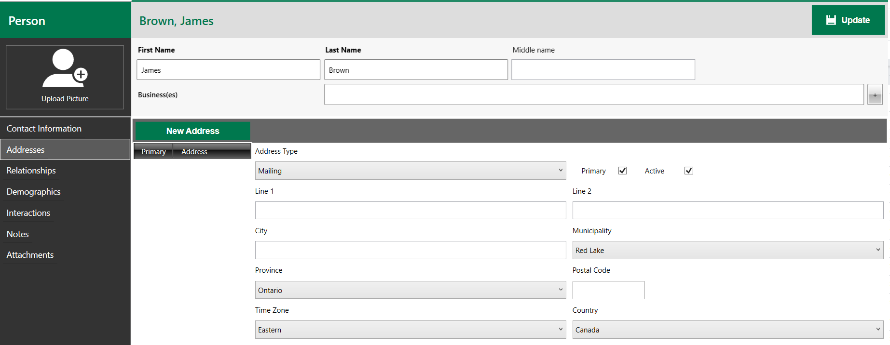

### Contact Methods

Clicking the 'Add' button will add a row to the Contact Methods data grid. With the fresh row present, we can store contact information for the person. As we can see in the screenshot, five pieces of information can be captured:  
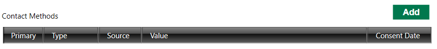

* Primary - identifies if this is the primary method of contact for the person.  
* Type - e.g. phone, email, website, Skype etc.  
* Source - to differentiate between Home and Work.  
* Value - the actual phone number, email address, website address etc. of the person.  
* Consent Date - the date the person granted permission to be contacted via this method.

To enter another contact method, simply click the 'Add' button again. This will place another row into the data grid.

Validation constraints have been placed on the contact methods to ensure that data remains consistent and accurate e.g. if you select the contact method 'Email', the value field will expect an @ symbol to appear. If you accidentally typed a phone number instead of an email address and tried to save this person, FaaSBank will display a prompt asking you to resolve the issue before the person can be saved.

### Simultaneously creating a business record

It is quite often the case that when you are adding an individual to the system you will also wish to add their business too.

In FaaSBank we have this possible from within the Add Person record, meaning you can add a person and their business to the system simultaneously.

This is handled via the Business(es) field in the static panel at the top of the record:

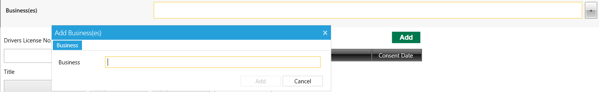

This field can be used to create a new business record; or, if the person you are adding to the system is associated with a business that already exists in the system, then you can select this business to identify the person as an owner of that business.

If creating a new business, simply type the business name into the Business(es) field. Once entered, clicking the green 'Save' button will:

* save/update the person record  
* save the new business record  
* and identify and save the Owner relationship between the person and the business

If all is well a pop-up notification will appear on screen, informing you that the business record was successfully created.

The second scenario is that the person's business already exists within the FaaSBank database. If this is the case, simply click into the Business(s) field and start typing the business name. The system will search through all the businesses that are in the FaaSBank database, and display results that match your input. When you see the desired business in the search results, select it by clicking its row.

This will then populate the Business(es) field with that business, allowing you to save the person record and create the Owner relationship between the two records.

### Saving changes

Simply click the green 'Save' button located in the top-right corner of the window to save a person's record to the FaaSBank database. This will save this individual to the system and display a pop-up notification to confirm that the save has been successful. This person will now be viewable in the global search, and within the 'People' grid view.

## Add a Business

From the home screen, click the **'Add business' button**.

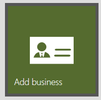

Similar to the Add Person screen, the Add Business tab is divided into multiple sections. Once again, it is not compulsory that you visit or enter information into every section, but use the tabs on the left side of the window to navigate through them as you need to.

The default section – onto which the Add Business screen opens – is Contact Information. It allows you to capture the high-level information about the business e.g. Business Number, contact details, NAICS industry code etc.

The **Business Number field** is designed to store the nine-digit Business Number that identifies the business to federal, provincial, and municipal governments. This is the number designated by the **Canada Revenue Agency**.

The other sections are as follows:

* **Addresses**

Any addresses associated with this business.

* **Relationships**  
  Identify relationships other than owners and employees that this business has with clients of your CFDC.

* **Attachments**

Attach documents or files to this business.

* **Financial statements**  
  Generate and export baseline financial information about the business.

* **Notes**  
  Create notes for this business. These will remain until manually deleted by a CFDC analyst.

* **Accounts**  
  Blank for a new business being added to the system, but for an existing business this tab displays the business's loan history of active and inactive loans.

* **Interactions**  
  Similar to the loans tab above, this will be blank for new businesses being added to FaaSBank. For existing businesses this will display a list of the general inquiries and activities that this business has been associated with.

* **Bank Accounts**  
  An area to add bank account information associated with the business.

  To add a new bank account, click the **New Account button** at the top of the grid. This will add a row to the grid. You can click into the row to enter/update the three required pieces of information: Bank/Financial Institution; Transit Number; and Account Number.

  Remember to save your changes by using the Update button in the top-right corner of the Business record.

  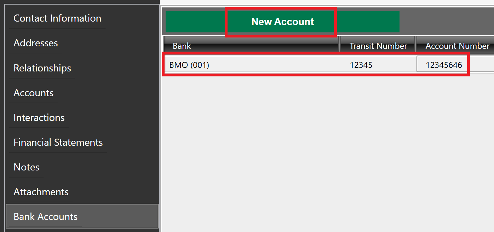

  ### FAQ: A business client changed bank account! How do I link their new bank account to their loan?

  First, go into the business's Bank Accounts tab and add the new bank account. Make sure to save the change to the business.

  Next, open the client's loan record, **select the new bank account in the Client Account field**, then click the Update button to save the change.

  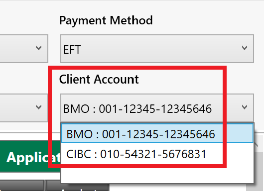

* **Outcomes**  
  Used to capture outcome information, including jobs created and or maintained, as well as leverages projected and or realized.

* **Risk ratings**  
  Capture the individual risk ratings of a business

* **Business Directory**  
  If you are a NACCA AFI, this area allows you to edit the information that appears for the business on the NACCA Business Directory website.

### Entering Details

As with the Add Person screen, the information required to save a business to FaaSBank has been kept to a minimum to allow for quick, real-time input. To add a business the only piece of compulsory information is the business name. Without a business name you will not be able to save a business; an error prompt will appear asking you to please enter the business's name.

As found in the Add Person screen, the Add Business screen also has a static area at its peak which remains present, regardless of which section of information you are on.

### Saving a Business

When you are happy with the information you have input regarding the business, the next step is to save it. This can be done by using the green 'Save' button in the top-right corner of the Add Business tab.

Saving a business means that this business will now appear alongside all others in the Businesses grid view, which can be accessed using the area buttons on the FaaSBank Central bar.

## Create a General Inquiry

A person contacts your CFDC with a question or query, and you respond with basic information either in person, by telephone, by mail or electronically. This information was broad enough that it could be shared with anyone; it was not business specific knowledge. You now wish to record evidence of this general inquiry in FaaSBank.

From the home screen, click "General Inquiry"

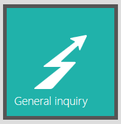

When the button is clicked a General Inquiry tab should open, and your screen should resemble the screenshot below:

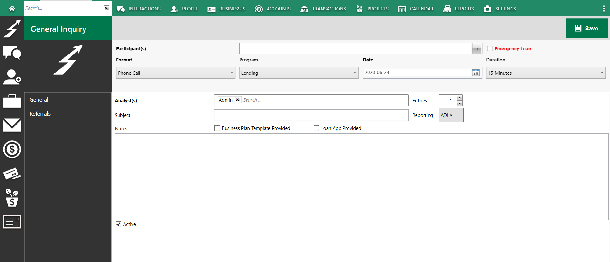

The following info can be captured in the General Inquiry window:

**Participant**  
Who prompted this general inquiry?

If the contact is already saved within your FaaSBank database, you can search for them by simply typing into the 'Contact' field. This will display a list of contacts that match your input, and as you continue typing the list will narrow down until you have your desired contact.

FaaSBank provides you with the option to associate an inquiry with either:

* A person  
* A person AND their business  
* or, a person AND their loan (if they are identified as a borrower on the loan)

**Format**  
The type of the general inquiry: walk-in, telephone, email or other. Select the appropriate option from the drop-down menu.

**Program**  
What program was the information provided associated with.

**Date**  
The date of the general inquiry. When you open the general inquiry window this date is always defaults to "today's" date. The date determines on which quarter's Quarterly Report the general inquiry will appear.

**Duration**  
The length of the general inquiry.

**Analyst**  
The CFDC analyst who facilitated the general inquiry. This field is defaulted to the user logged into the system e.g. as per the screenshot below, the user Leopold Bloom is logged in and thus the Analyst field reflects this.  
Add and remove analysts are required to reflect who facilitated the general inquiry. If multiple analysts were involved, they could be selected and added to the field.

**Entries**  
This field allows for the capturing of bulk general inquiries. For example, if you had a short information session with six different people, rather than entering six separate general inquiries, you could simply set this field to '6′. This figure of six will then flow to your Quarterly Report. This field is defaulted to '1'.

**Subject**  
The subject line that will appear in the various Interactions grids to allow for quick reference.  
Business Plan Template & Loan App Provided  
Was the person presented with a business plan template or a loan application form? If so, use the two check-boxes to record the info as needed.

**Notes**  
Any notes associated with the general inquiry.

**Required Information**  
In a bid to keep the input and saving of processes as quick as possible, we have stripped down the pieces of information required to save a general inquiry. The only required information is the program and date of the general inquiry, both of which are populated by default. With just these two fields populated the general inquiry can be saved, and will thus appear on the relevant Quarterly Report.  
If only program and date are populated, when saved the inquiry will be associated with Miscellaneous Contact, and the analyst will be recorded as the user who is logged in.

### Saving a General Inquiry

When you have completed the input for your general inquiry, use the green 'Save' button to save it to the database.  
All saved general inquiries will appear within the Interactions Grid View, and depending on who or what was associated with the inquiry, it may also appear in a Person, Business or Loan's individual record view, within the Interactions tab.

### Viewing Saved General Inquiries

Interactions grid view, and within the Interactions tab of any record that was identified as a Participant

## Create an Activity

### Managing Attendees

Where an interaction appears in the software is dependent upon the relationships aligned with its attendees.

When you are adding a person as a participant, the pop-up can display multiple options, depending on the different types of relationship that exist for that person in the software.

For example, in the screenshot below, we see two options for Person A:

* If we added the first option as a participant, this interaction would **only appear in the Person record**. This is because no business link is established with that particular selection; whereas  
* If we selected the second option as our participant - '*Person A(Owner-Business B)*' - this is identifying them in their capacity as an owner of that business. In this case, the interaction would appear within the Person record **AND** within the Business record.

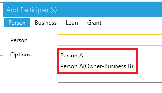

As a Person can have multiple businesses, when you click the 'Add Activity' button from **within** the Person record, it doesn't specify a business link in the attendee that gets automatically added. To add this, would you have to remove the attendee, then select the attendee option that specifies the business link (as per the screenshot above).

### Viewing Saved Activities

Same as with General Inquiries - Interactions grid view, and within the Interactions tab of any record that was identified as a Participant

## Referrals

Referrals can be tracked from within both the **General Inquiry** and **Activity** windows.

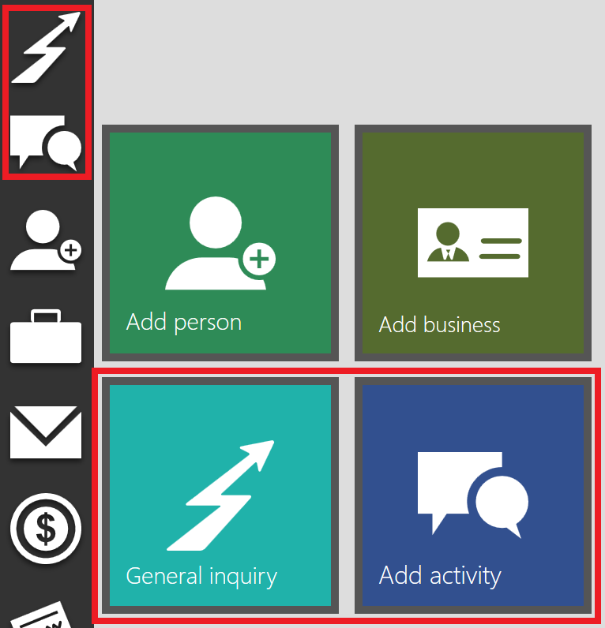

Each of those windows contains a **Referrals tab**. There a user can record the person referred, whether they were referred to or by your organization, who the referral source was, and any relevant comments.

To add a referral, click the **Add Referral button**. A pop-up window will appear asking you to enter the person who was referred. You can either search for an existing person, or type in the name of a new person who doesn't yet exist within FaaSBank.

After clicking the **Add button** in the pop-up window, you can then **click into the Type, Source and Comments fields** in the Referrals grid to update the information as required. Remember to **save** your General Inquiry or Activity!

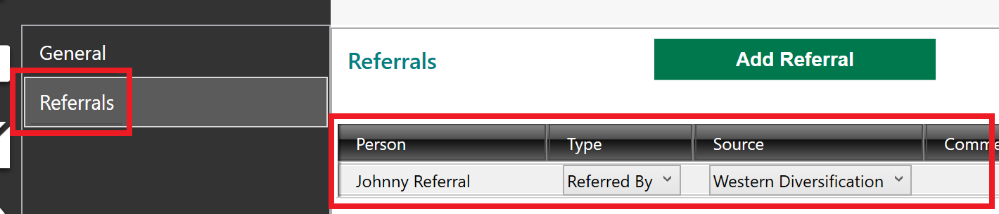

To edit the list of Referral Sources go to **Settings -> Interactions -> Referral Sources**. This will allow you to add/edit/delete sources as needed.

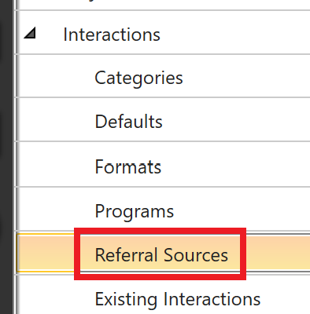

Finally, saved referrals can be viewed in the **Interactions** grid view. There you will see two columns: **Referral Type and Referral Source**.

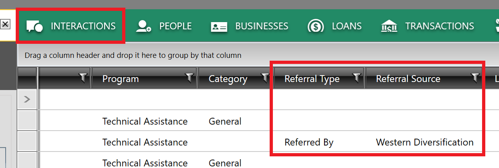

## Create a Task Reminder

FaaSBank will display a reminder when it reaches the 'Reminder' time specified in the Task.

### Viewing Saved Tasks

Interactions grid view; within the Interactions tab of any record that was identified as a Participant; and within the Calendar (accessible via the top menu bar)

## Sending an Email

### Configuring FaaSBank for Email

The regular email feature in FaaSBank can be used to send individual emails to your clients, using your own email address. It also enables users to very easily send copies of reports (Per Diem, Client Statement, Amortization Schedule etc.) to their clients without having to export/save them outside of FaaSBank.

To send emails via FaaSBank you will first need to get the following two pieces of information: your email provider's **SMTP Server address and SMTP Port number**. Your IT person should be able to assist you with finding this information.

Once you have that info, it gets entered into FaaSBank's **Settings** area: **Settings -> General -> Organization**. Remember to use the Save button to save your changes.

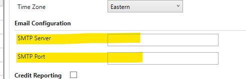

### Entering your Email Address and Password

Following this, you can **enter your own email address and password** alongside your user in FaaSBank. This can be done in **Settings -> Permissions -> Users**.

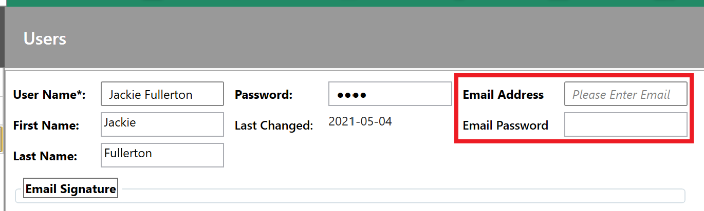

Following this, you should try **sending a test email from FaaSBank** to ensure the information has been entered correctly. Steps to achieve this can be found [here](03-client-relationship-management.md#sending-a-test-email).

#### Using an Office 365 Account to send emails from FaaSBank after November 2022

As of November 2022, Microsoft no longer provides direct SMTP access to Office 365 accounts using only a username and password, as is the case when you use FaaSBank to send emails. There is a straightforward fix, however, that enables you to send email through FaaSBank using your Office 365 account while ensuring the account is protected with 2-step verification.

If your organization uses Office 365 and wishes to send emails from FaaSBank, please follow the steps below to create an app password for the software.

1. Go to the [Security basics](https://account.microsoft.com/security) page and sign in to your Microsoft account. This should be the account of the email address that you want to use to send emails from FaaSBank.

2. Select **More security options**.

3. Under **App passwords**, select **Create a new app password**. A new app password is generated and appears on your screen. **Make a note of the password.** You may wish to print the page or take a screenshot, as you will need to enter the password into FaaSBank.

4. In FaaSBank, navigate to **Settings -> Permissions -> Users**.

5. Select your user in the Users grid, then enter your Email Address and **your new Email Password** (the app password generated via step 3) into the fields at the top. **Save** the change.

Once this has been completed, you should now be able to successfully send emails from FaaSBank. Please see [this section of the User Guide](03-client-relationship-management.md#sending-a-test-email) for steps on how to send a test email to ensure it is working as anticipated.

Please see here for further information on Microsoft app passwords: [Manage app passwords for two-step verification - Microsoft Support](https://support.microsoft.com/en-us/account-billing/manage-app-passwords-for-two-step-verification-d6dc8c6d-4bf7-4851-ad95-6d07799387e9)

#### Using a Gmail Account to send emails from FaaSBank after May 30th, 2022

As of May 30th 2022, ​​Google no longer provides direct SMTP access to Gmail accounts using only a username and password, as is the case when you use FaaSBank to send emails. There is a straightforward fix, however, that enables you to send email through FaaSBank using your Gmail account while ensuring the account is protected with 2-step verification.

If your organization uses Gmail and wishes to send emails from FaaSBank, please follow the steps below to set this up:

1. In **Settings -> General -> Organization**, in the *Email Configuration* section, ensure that **SMTP Server is set to smtp.gmail.com and the SMTP Port is set to 587**.

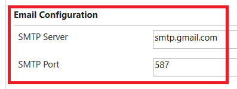

2. In a web browser, sign into your Google Gmail account using your email address and password.

3. Click the account icon in the top-right corner of the window (typically a circle containing the initial of your first name), then click '**Manage your Google Account**'.

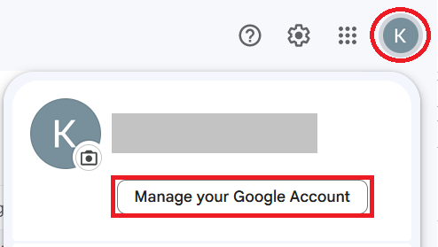

4. Select **Security**, then switch on **2-Step Verification**.

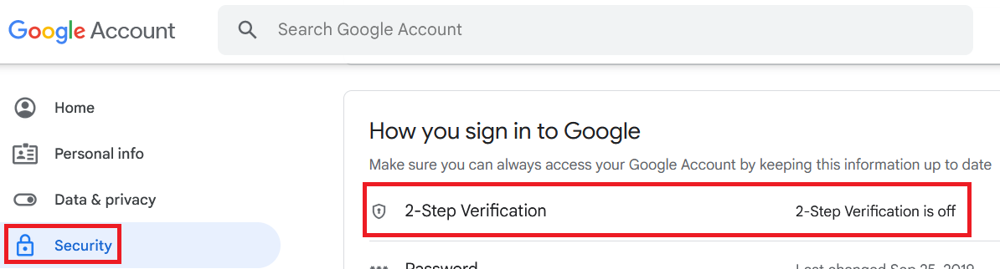

5. You will be asked to **provide a phone number** that will be used for the verification. Follow the instructions to complete the verification process.

6. When your phone number has been verified, click into the search field at the top of the window, type in *app passwords*, then select **App passwords** from the search results. You may have to sign in again to verify your identity.

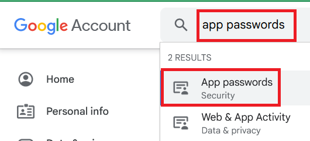

7. You will be asked to select an app and a device. Select **Mail** as the app and **Windows Computer** as the device. Click the **Generate button**.

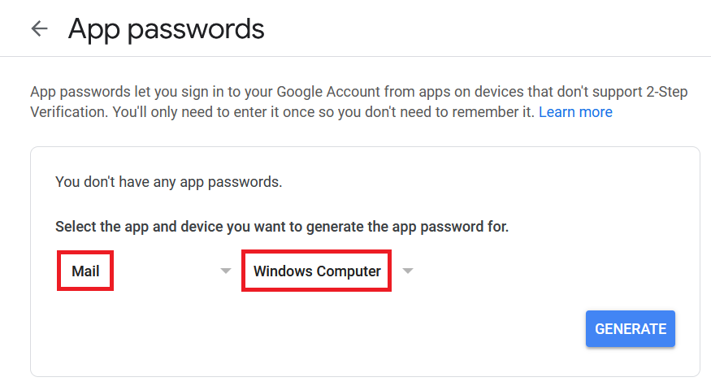

8. An app password will be generated and displayed on screen. **Make a note of the password.** You may wish to print the page or take a screenshot, as you will need to enter the password into FaaSBank.

9. In FaaSBank, navigate to **Settings -> Permissions -> Users**.

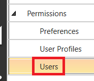

10. Select your user in the Users grid, then enter your Email Address and **your new Email Password** (the app password generated via steps 7 and 8) into the fields at the top. **Save** the change.

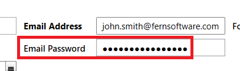

Once this has been completed, you should now be able to successfully send emails from FaaSBank. Please see [this section of the User Guide](03-client-relationship-management.md#sending-a-test-email) for steps on how to send a test email to ensure it is working as anticipated.

See here for further information on Google app passwords: [https://support.google.com/accounts/answer/185833?hl=en](https://support.google.com/accounts/answer/185833?hl=en)

### Updating your Email Signature

A user's email signature can be changed in **Settings -> Permissions -> Users**.

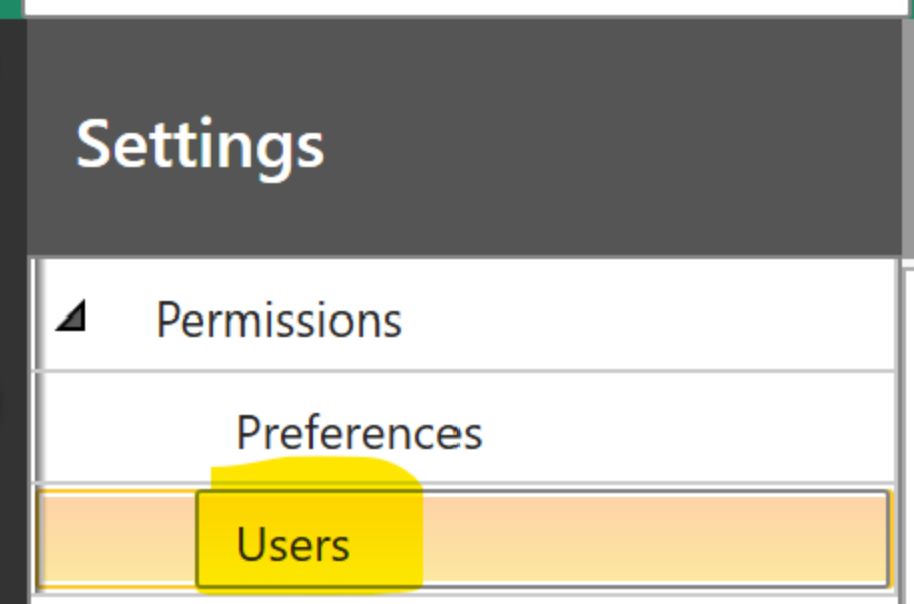

There, select your user (you will only need to do this if you have access to all user's permissions), then click the **Email Signature button**. This will display a text box where you can update the email signature as needed. Remember to **save** the change.

After saving the change, we recommend sending yourself or a colleague a test email to ensure the signature appears as anticipated 💃

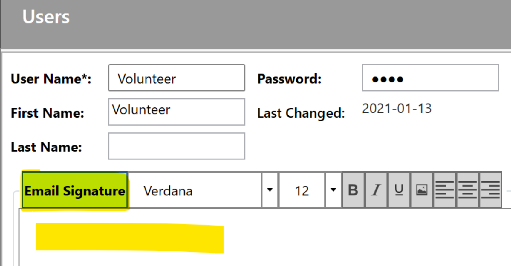

### Configuring Bulk Email and Bulk Email Override

Rather than using the SMTP method to send email from FaaSBank, you can enter a single email address into FaaSBank's Settings area and use it to send email from the software. Please note that this email address will be used for **ALL** users of the software.

To enter the email address you will use, navigate to **Settings -> General -> Organization**.

In this section, the three fields you are looking for are:

* **Bulk Email From Address** - enter the email address you want your organization's emails to be sent from  
* **Bulk Email Display Name** - enter the display name that recipients will see on the email  
* **Override SMTP with Bulk Email settings** - tick this field if you want FaaSBank to **use the bulk address for all emails being sent**, rather than any email addresses saved to FaaSBank user accounts.

For example, if Fern were using FaaSBank to send emails, we'd enter details along these lines:

**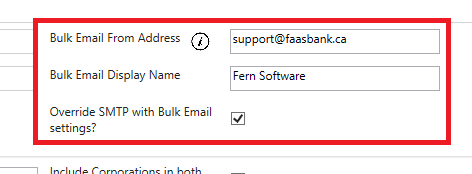**

After you have entered your details, use the **Save button** to save the change.

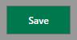

**Note: after saving your bulk email address, you must inform Fern of the email address you will be using. Fern will need to make further updates to ensure that FaaSBank has the relevant permissions to send emails using that address.**

When your email address has been verified by Fern, you can then use the **New Email** window to send a test email. You can access this window via the little envelope icon on the menu bar that runs down the left side of the software.

In the New Email window, you should see that there is **a tick box called 'Send using Bulk Email info'**. **Tick that field**, so that FaaSBank will attempt to send the test email using your bulk email info, rather than the email address saved to your user account. (The field will be ticked by default if you enabled the override option in FaaSBank's Settings area.)

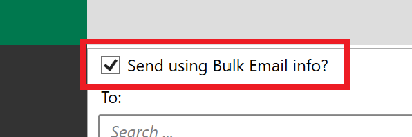

In the **To field** type in the email address that you'd like to send a test email to (e.g. your personal email, or a colleague), and click the **Enter key on your keyboard** when you have finished typing. Clicking Enter will properly select the email address, like how it appears in a wee rectangle in the image below. Following this, type in a **Subject** line and **Body** text.

When your email looks good, click the **Send button** to send.

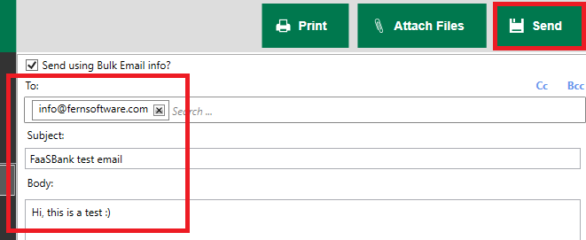

All being well, you should then be presented with a pop-up window informing you that the email has been successfully sent; and the recipient should receive the test email 😊

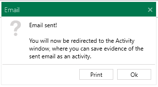

### Sending a Test Email

To do this, go into the **Email window** via the envelope icon on the vertical menu that runs down the left side of the software:

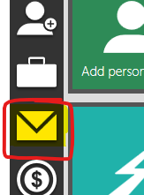

In the **To field t**ype in the email address that you'd like to send a test email to (e.g. your personal email, or a colleague), and click the **Enter key on your keyboard** when you have finished typing. Clicking Enter will properly select the email address, like how it appears in a wee rectangle in the image below:

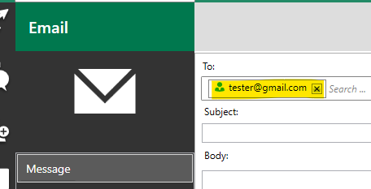

Then type a Subject and Body, and click the **Send button** to send the email. If the email configuration in FaaSBank is correct, it should send the email. If not, it will likely display an error message on screen. Let us know how it goes.

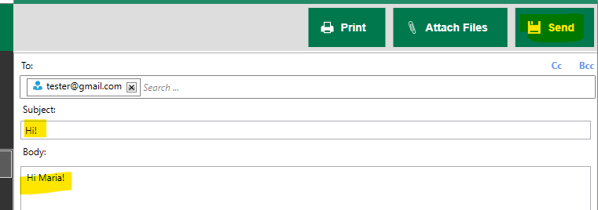

### Bulk Emailer

FaaSBank's bulk email tool can be used to quickly and easily send emails to a whole bunch of your clients at the same time. You can attach reports to the emails - for example, a monthly Client Statement report - and even change the email's subject line and body text for only specific clients if necessary.

Please note that the bulk email feature is switched **off** for users by default. To access the feature, your user will need to assigned the 'Send Bulk Emails Access' permission in FaaSBank's Settings area. This can be done by an admin user in **Settings -> Permissions -> Users**.

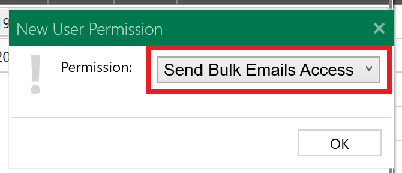

When your user has been granted the permission, you will be able to launch the feature via the bottom button on the vertical menu bar that runs down the left side of FaaSBank.

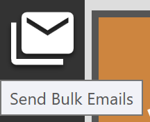

In the example below we will show you how to **send a Client Statement report to some of your active loan clients**.

When you open the tool, you will first see a pop-up window, providing you with two options: Select Report/Template, or Blank Email.

In our example, we want to send our clients a Client Statement report, so we're going to choose **Select Report/Template**.

If you just wanted to send a regular email with **no FaaSBank report attached**, you would select the **Blank Email** option.

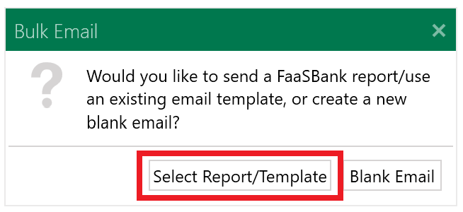

The next window, titled Mail Templates, contains three different sections:

1. **Email Subject**  
   In this field enter the subject line for your email.

2. **Attachment**  
   Choose the FaaSBank report that you want to include as an attachment.

3. **Template**  
   Here you can select a letter template that has been previously saved in FaaSBank. If no template exists for the email you wish to send, leave the selection at **No Template**.

When you are happy with your selections, click the **OK button** to proceed!

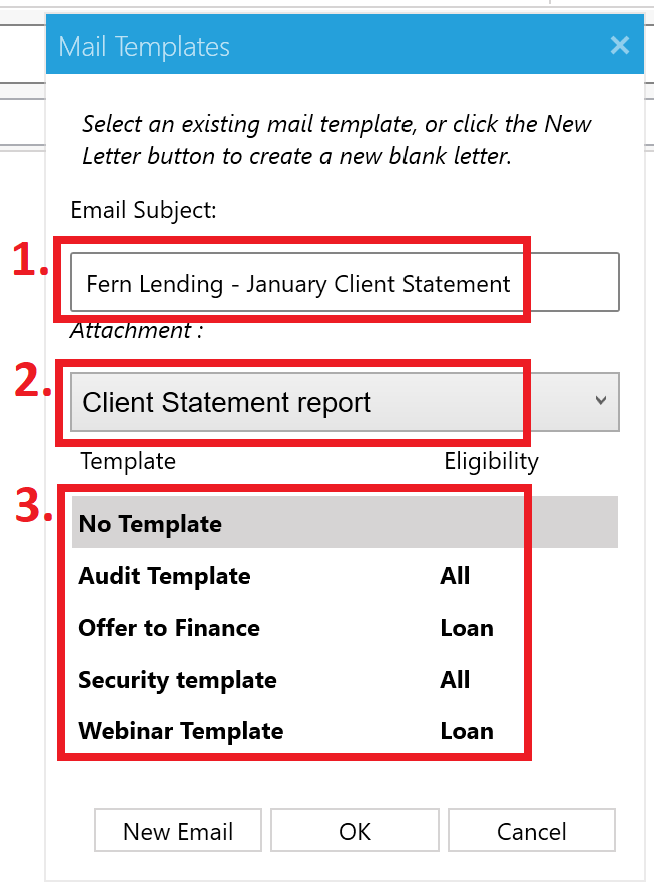

The next step is **selecting which loan clients should receive the email**. It is important to note that the email will be sent to both **the loan client business AND its primary borrower**.

You can use the filters in the window's left column or in the column headers to filter the loans as required. There are three steps to the process:

1. Use the **first column in the grid** to identify the loans that will receive the email. To select all loans shown in the grid, tick the box found at the very top of the first column.  
2. When you have selected the relevant loans, click the **Add Selected Loans button** in the left column.  
3. Click the **Return to Letter Editor button** at the top to be taken to the word processing area where you can type up your email.

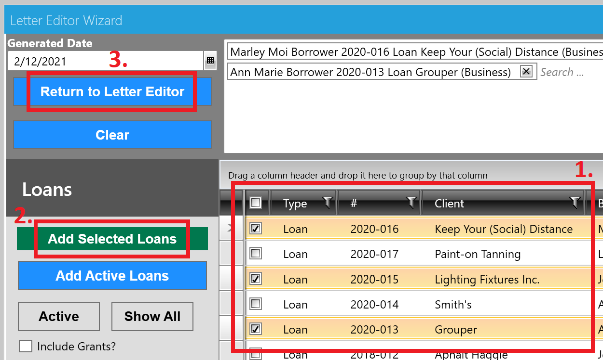

If your email includes a report, then first you will be asked to **set the parameters** for that report. In our example, we included a Client Statement report. In this case we would be faced with the report window below, allowing us to choose the **report's start and end dates** (and filter by transaction type if necessary).

For example, if you wanted to send the Client Statement reports for January 2021, you would ensure that the report start and end dates were set appropriately. Generally the rest of the fields in the report parameter window can be left as-is, as you will want to show all transactions on the report.

When the report window looks good, click the **OK button** to proceed.

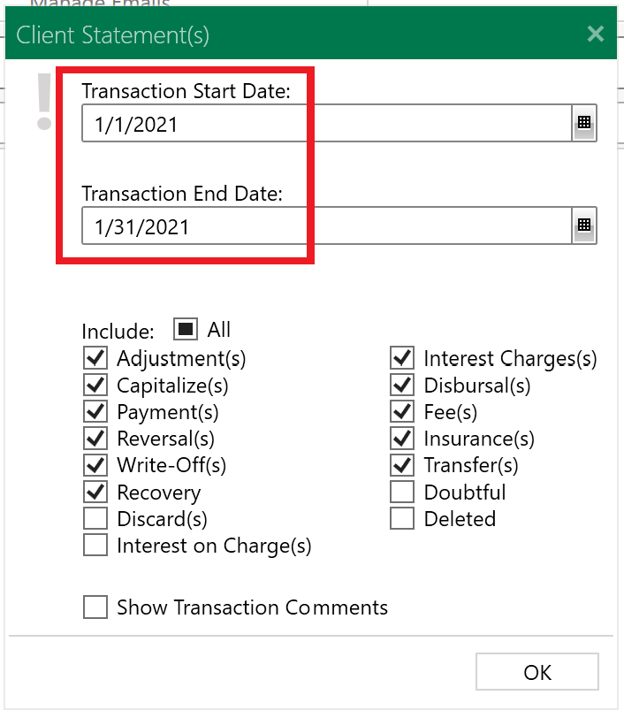

FaaSBank will then generate the Client Statement report for each selected loan, and **attach a PDF copy of the report** to their particular email.

The next step is typing the body of your email. To do this, click into the word processing area and type out the email as required.

#### Entering Mail Merge Information

Please note that it is possible to insert **mail merge fields** into the body of the email. This allows you to quickly add client and loan information to your email without having to type it out manually. To add a merge field, click the **Mailings tab** at the top of the window, choose what type of field you wish to enter (Person, Business or Loan info), then select the relevant field.

For example, in the screenshot below, we have included the merge field BusinessName, which will add the loan client's business name to the email.

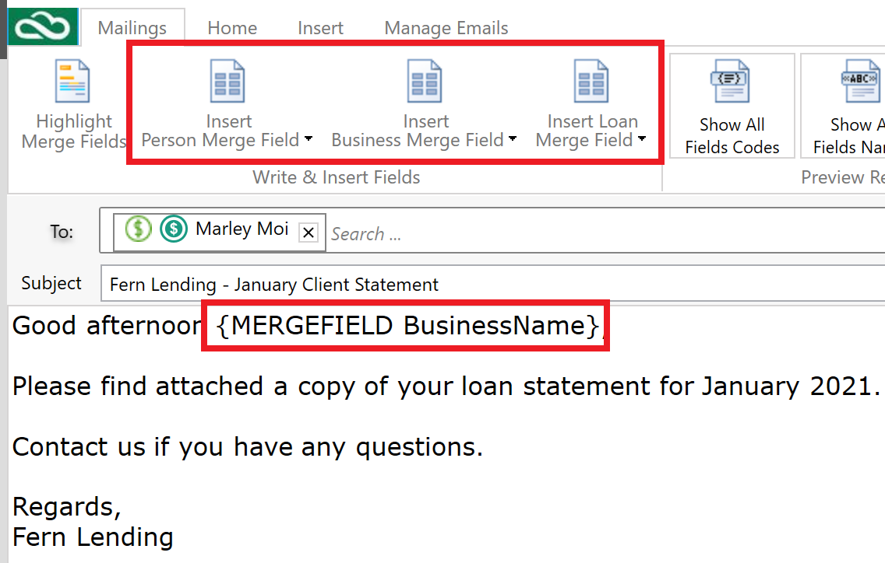

After adding merge fields, you can click the **Preview Results button** (also found within the Mailings section) to see how the merged info appears on the email. In the screenshot below, after clicking the Preview Results button you can see that the business's name has replaced the *BusinessName* merge field.

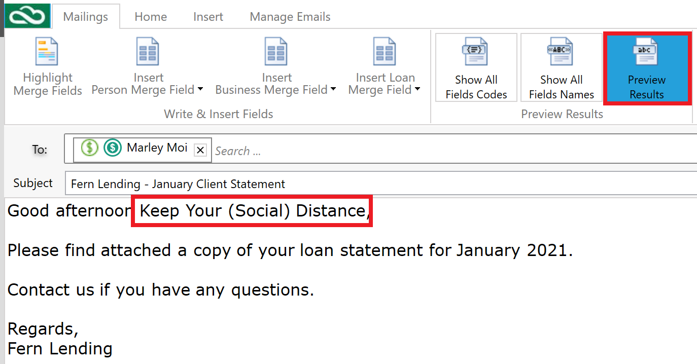

#### Applying the Subject and Body to all emails

When you are happy with the email's subject and body, you will then want to apply this change to **all emails that will be sent**.

To apply this change, return to the Manage Emails tab and click the **Apply button**.

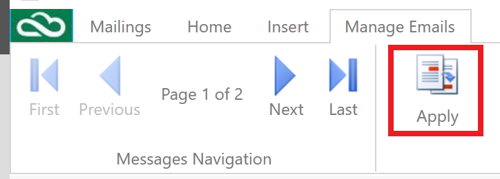

On the pop-up message that appears, click **Yes**.

When that change has been applied, you can use the **Next and Previous buttons** to jump to-and-from the various emails that will be sent. If your email includes mail merge fields, you should see that merge info change as you switch emails (as long as the Preview Results button is still selected in the Mailings tab).

This allows you to make manual changes to one or more emails that will **NOT** be reflected on all emails. If you make such changes, just ensure you **don't** click the Apply button (or those changes will be applied to all emails 🙃).

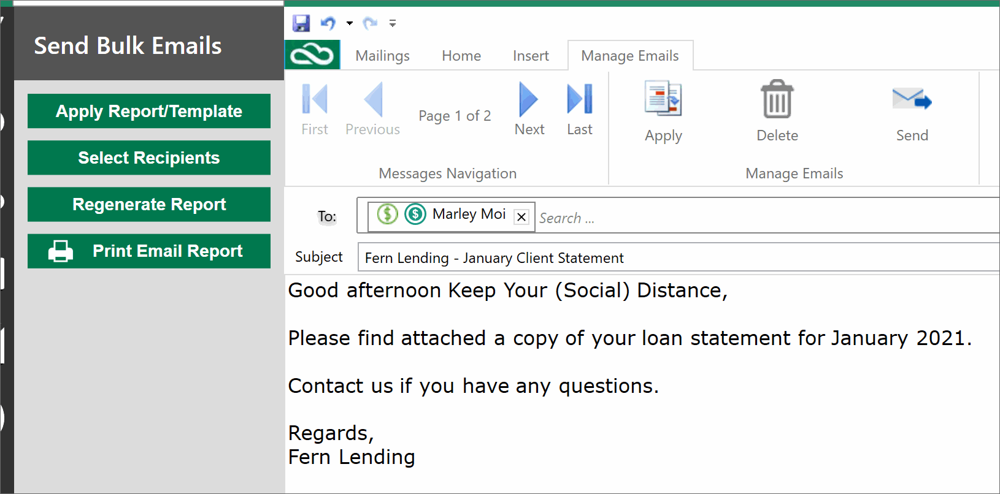

Prior to sending, you can also preview an attachment by **double-clicking the attachment item** at the bottom of the email window. This should then open the attachment in the relevant program for your review.

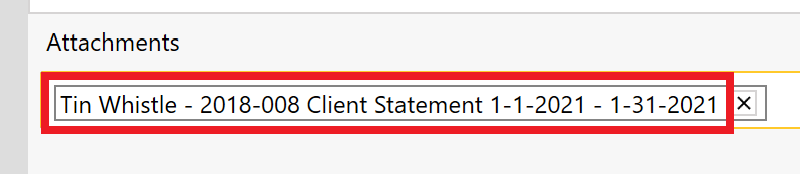

#### Sending the email(s)

Prior to sending, if you wish to do a quick check of the client's address (or addresses) that will receive the email, simply hover your mouse over their name in the **To field**, and the associated email address will be shown.

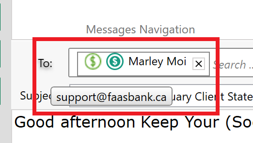

If all looks good with your email subject and body, recipients and attachments, the next step is to send your email.

To do this, click the **Send button** in the Manage Emails tab.

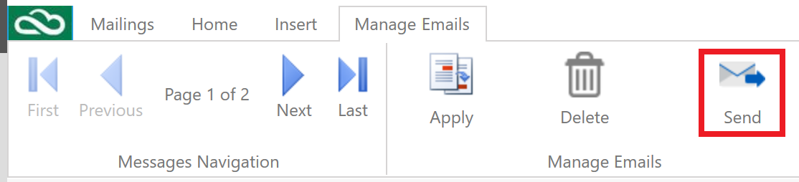

A pop-up window will appear, telling you how many emails will be sent. If the number looks good, click **Send** to proceed.

After the emails have been sent, you will be provided with the option of generating a report showing all recipients; and you will also have the option of **saving a copy of each email as an Activity to the loan record**. If a report was included, a copy of it will be saved to the activity as an attachment.

## Mail Merge Letter Editor

FaaSBank's Mail Merge Letter Editor window can be used to create letter templates populated with pieces of person, business and loan information. The saved letter templates can then be quickly generated for individual or multiple clients at once.

To access the Letter Editor, click the little **envelope icon** on the bottom of the vertical menu that spans the left side of FaaSBank.

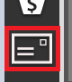

When the Letter Editor window opens, your first decision is whether you want to use a pre-existing letter template (i.e. one that has already been saved to FaaSBank), or create a new letter from scratch.

If you wish to use a pre-existing template, click the **Mail Merge Templates button** in the left column. This will display a pop-up window showing the existing templates. To load an existing template, select it in the list, then click the **OK button**.

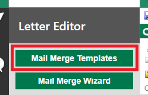

Secondly, if you wish to populate your template with mail merge information - e.g. loan client business name, address, loan committed amount etc. - you will need to use the **Mail Merge Wizard button**.

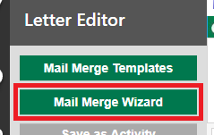

Clicking the Mail Merge Wizard button will open a pop-up window. Use the grid in the window to identify **which loans are to receive the letter**. Use the check-box in the first column to identify the loans.

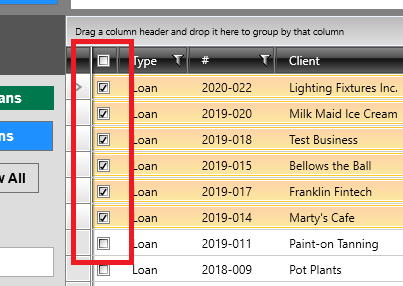

**Note**: by default the grid loads in **all active loans**. If you wish to filter the grid to only display loans at a certain status - e.g. Closed Deal - you can use the filter in the Status column header to filter the loan list.

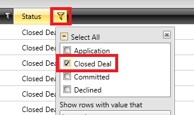

When the relevant loans have been selected, click the **Add Selected Loans button** in the left column.

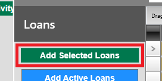

**Note**: if your letter will include **loan balance information**, you should use the **Generated Date field** to determine which date will be used for the balance. For example, if you are doing fiscal year end letters that need to show the loans' balances as of March 31st, you would set the Generated Date to March 31st.

If you do not change the Generated Date, it will pull all loan balance information from the **current** date i.e. the loan's balance as per the creation date of the letter template.

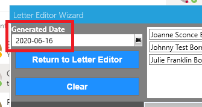

When the relevant loans have been selected - you will be able to see the selected loans in the field at the top of the pop-up window - click the **Return to Letter Editor button** to be taken back to the word processing area.

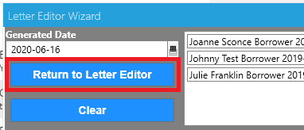

If you are using a pre-existing template, you can click into the word processing area to update the template as required.

If you are creating a new template - or drafting a new letter - you can click into the word processing area to start drafting your letter.

### Adding merge information

A user can determine which pieces of client and loan information they want to be shown on the merge letter(s).

To select the relevant pieces of information, navigate to the **Mailings tab** in the word processing area.

In here you will see **three merge buttons**:

* Insert **Person** Merge Field  
* Insert **Business** Merge Field  
* Insert **Loan** Merge Field

If you click one of these buttons, it will show all the possible pieces of merge information.

**Select a particular piece of information** to add it to the letter in the word processing area.

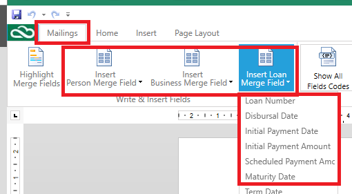

For example, if we wanted to include the client business's name and their loan number on the letter, we would use two merge fields:

1. We'd select '**Business Name**' from the Insert Business Merge Field button; and  
2. We'd select '**Loan Number**' from the Insert Loan Merge Field button.

This will **add the merge field** to wherever the mouse cursor is in the word processing area.

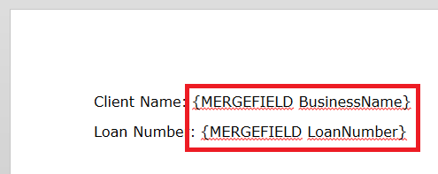

When the relevant merge fields have been added, you should click into the word processing area to populate and format the letter as required.

#### "Why are the Merge Field buttons disabled?!"

The three Merge Field buttons are disabled until **at least one loan/grant has been selected in the Mail Merge Wizard grid**.

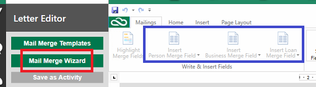

When you've selected at least one loan/grant and returned to the word processor area, you should then see that the buttons have been enabled.

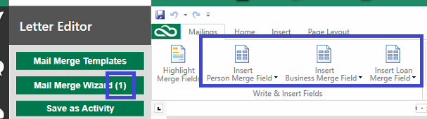

### Viewing the merged information

When your letter setup looks good, you will likely want to see how it appears when it is populated with the merged information.

To have the merge fields populated with data, go into the **Mailings tab** at the top of the word processing area, then click the **Preview Results button**.

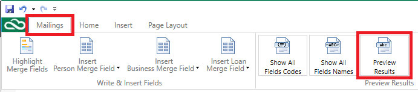

This will then populate the merge fields with actual loan and client data:

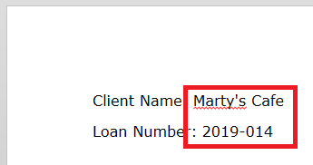

If you selected multiple loans, you can use the **navigation buttons** in the top menu bar to jump between the letters.

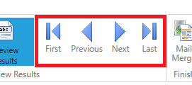

### Saving a copy of the letters to your computer

When the letters look good, you may then wish to save a copy of them to your computer. You can choose to save them to either a Microsoft Word or PDF file.

To save them as a single **Word** document, click the **Mail Merge button** found within the **Mailings tab**. FaaSBank will then prompt you to select a save location for the file on your computer.

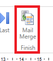

To save them as a single PDF file, click the **green FaaSBank cloud icon** on the word processor's menu bar, select **Save As**, then click **PDF Document**. FaaSBank will then prompt you to select a save location for the file on your computer.  
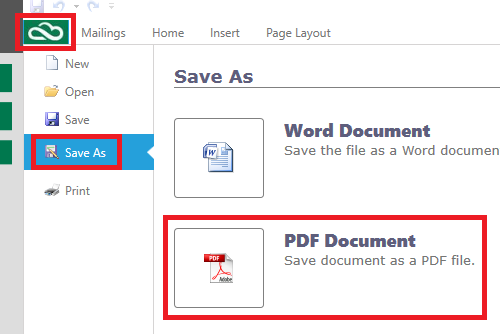

### Saving a copy of your template

You can save a copy of your letter template to FaaSBank so that you can easily regenerate the letter in future.

To save your template:

1. Click the **Mail Merge Templates button**.

   

2. If you are saving changes to an existing template, click the **Save button**.

   However, if you are saving a NEW template, click the **Save As button**.

   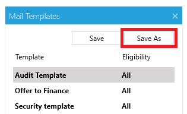

3. A pop-up window will then appear allowing you to specify a name for the letter template. Enter the name into the field at the top of the pop-up window.

   In this window you can also specify if the letter template should be eligible for loans/grants, and determine the type of letter it is.

   Once you have entered a name for the template, click the **OK button**.

   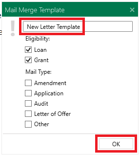

This will **save** your template to FaaSBank, meaning you can use it again in the Letter Editor window in future.

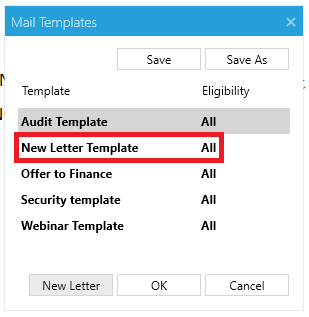

### Making changes to an existing letter template

Follow the steps below to save changes to an existing template:

1. First, open the **Letter Editor window**.

2. Click the **Mail Merge Templates button** in the window's left column.

3. In the pop-up window, select the template you wish to edit, then click the **OK button**. This will load your template into the word processing area of the window.

4. **Make the necessary edits to the template**.

   If you are adding new merge fields to the template, you may wish to select a few loans in the Mail Merge Wizard area, so you can see how the merge fields get populated with the information. You can preview the merge results by clicking the 'Preview Results' button found in the Mailings tab.

5. When you've finished with your edits, click the **Mail Merge Templates button** in the left column.

6. In the pop-up window, click the **Save button**. This will save your changes to the letter template.

### Saving a copy of each letter as an attachment in FaaSBank

You can also save a copy of each letter as a **Word document attachment** to each impacted loan in FaaSBank. This process will create an **activity** for each loan and attach the relevant letter to the activity.

To perform this process:

1. Click the **Save as Activity button** in the left column.

   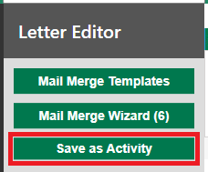

2. Use the pop-up window to determine what information will get saved for the activities:

   1. **Attachment File Name** - the name that the attachment will be saved with.  
   2. **Subject** - the subject line that the activity will be saved with.  
   3. **Activity Date** - the date you want associated with the saved activities.  
   4. **Program** - select a program relevant to the letters you were generating.  
   5. **Format** - select a format relevant to the letters you were generating.  
   6. **Category** - select a category relevant to the letters you were generating.  
   7. **Indepth** - select whether or not the letters constituted "in-depth" activities.

      When the relevant information has been entered, click the **OK button** to save the activities and attachments.

      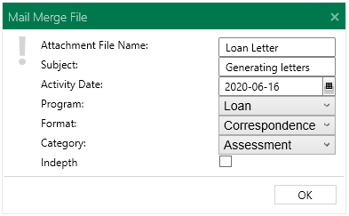

If you then open one of the loans that were involved in the mail merge letter, you will be able to see **a copy of the letter saved as a Word document in the Attachments tab**.

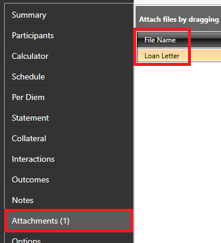

### Creating Address Labels

It is possible to use the Mail Merge Letter Editor to create address labels for your grant/loan clients.

To create labels please follow these steps:

1. Click the **Letter Editor button** on the menu bar that runs down the left side of the software.

2. In the left column, click the **Mail Merge Wizard button**:

This will open a grid showing your **active** grants/loans. If you wish to create labels for inactive clients, use the Show All button to load in all loans.

When the grid is displaying the relevant loans, you can use **the tick box at the top of the grid's first column to select all loans** for inclusion. Alternatively, you can go through and manually select whichever clients should be included in the labels.

Once the clients have been selected, click the **Add Selected Loans button**, then the **Return to Letter Editor button**:

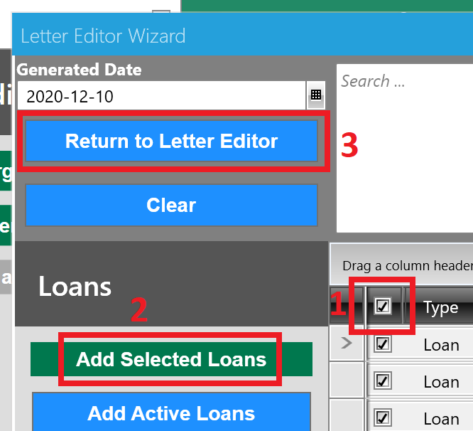

3. In the Letter Editor window, go to the **Insert** tab, then choose either the **5161 or 5162 Avery Labels option**. (These labels are very similar: they have different spacing.)

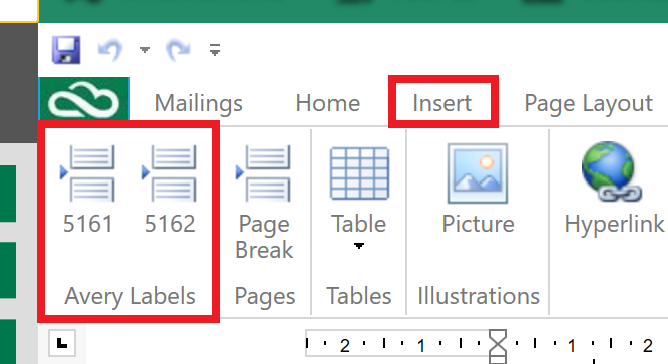

Click **Yes** on the pop-up window that appears.

Give FaaSBank a second to load the info. It should then **display address labels like this**:

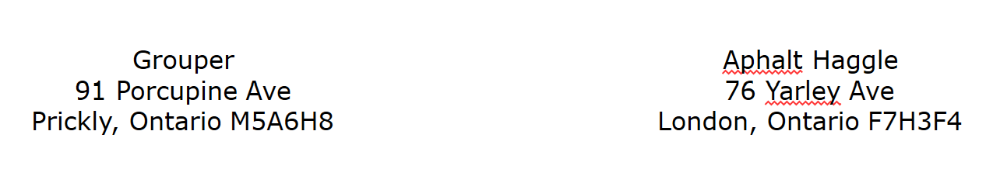

To save the labels to **Microsoft Word**, you can click the **Save** icon at the top of the Letter Editor:

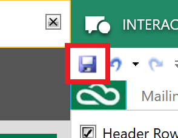

## Equifax Reporting

### Pulling Equifax Credit Reports

It is possible to **pull client Equifax credit reports directly from within the FaaSBank software**. To be able to use this feature, your organization will first need to complete a "client authorization" form for Equifax. Please reach out to us at [support@faasbank.ca](mailto:support@faasbank.ca) if your organization is interested in using this feature of the software.

#### Identifying which users can pull credit reports

Before being able to pull any credit reports, you will need to **identify which users will have the ability to do this in the software**. Only **an admin user** will be able to assign this permission.

To assign the permission to a user, follow the steps below:

1. Go to FaaSBank's **Settings area**.

   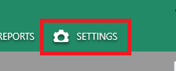

2. Navigate to **Permissions -> Users**.

   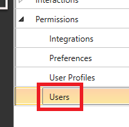

3. In the **Users** grid, **select the user who will be permitted to pull credit reports**.

   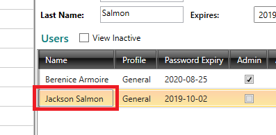

4. Click the **Add Permission button** found above the Permissions grid.

   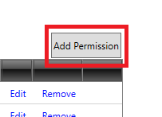

5. In the New User Permission window, **select Perform Equifax Credit Check** from the Permission drop-down menu.

   Click the **OK button**.

   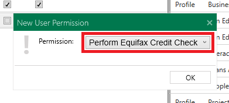

6. You should then see that the *Perform Equifax Credit Check* permission has been added to that user's list of permissions.

   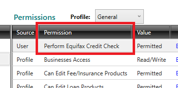

7. If all looks good, click the **Save button** in the top-right corner of the window to save the change.

   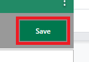

This user will now be able to pull Equifax credit reports for both Person and Business records in FaaSBank.

#### Pulling Credit Reports for Person and Business Records

When a user has the '*Perform Equifax Credit Check*' permission, they will see a new **Check Credit button** shown in the top-right corner of Person and Business records in the software.

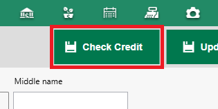

After clicking the button, the user will be displayed with this confirmation window. If you wish to proceed with the credit check, click the **Yes button**.

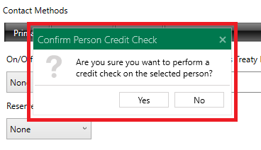

If the record has enough uniquely identifiable information, **the credit report will be generated and displayed in a Report Preview window**. From here you can print the report using the window's top toolbar.

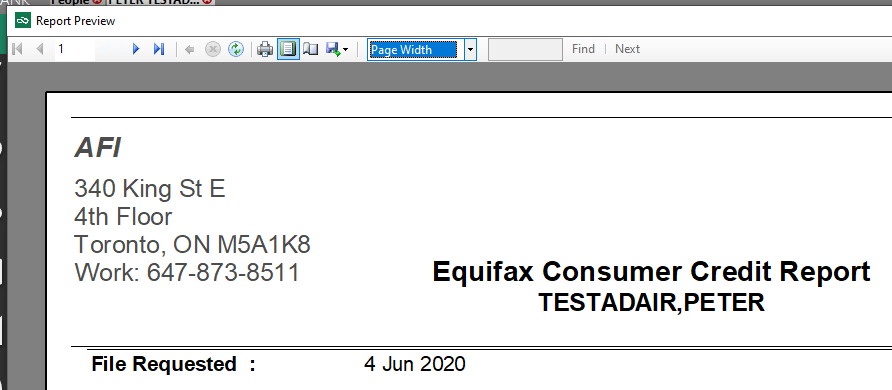

When a credit report is run, FaaSBank will automatically save a copy of the report to the software. This will appear in the new **Equifax Files tab** in the Person and Business records. (Please note that this tab is **only visible to users who have the 'Perform Equifax Credit Check' permission**.)

In this tab, users can **double-click** a report to open an instance of it as a PDF; or **right-click it and choose Save As** to save a copy of the report to their computer.

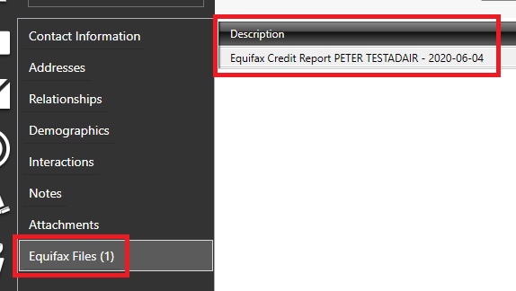

#### Multiple Matches

If FaaSBank finds more than one possible match in the Equifax database, it will display the **Matched Records pop-up window**. In this window, **select the relevant record**, then click the **Ok button** to generate the credit report.

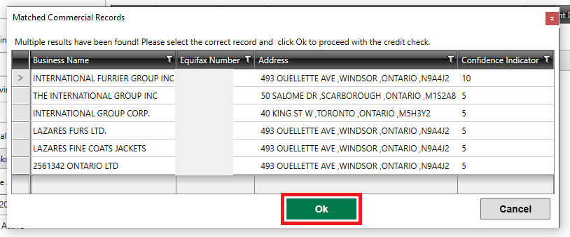

#### What information needs to exist in FaaSBank to pull a client's credit report?

FaaSBank uses the following information to attempt to match a Person/Business with the correct client in Equifax's databases.

##### People (Consumer report)

1. Last Name  
2. First Name  
3. Street  
4. City  
5. Province  
6. Postal  
7. DOB

##### Businesses (Commercial report)

1. Business Name  
2. Address Line 1  
3. City Name  
4. Province/ State Code  
5. Postal Code  
6. (Optional)  
7. Phone Area Code  
8. Phone No.

### Reporting to Equifax on the performance of your clients

The Equifax Reports module in FaaSBank can be used to produce two spreadsheets for submission to Equifax: the **Commercial** and **Consumer** reports. These spreadsheets allow you to report to Equifax on the performance of your loan clients.

To be able to generate the spreadsheet reports you will first need to ensure that your organization's Equifax information exists in FaaSBank's **Settings** area.

  
The Equifax settings are found at the bottom of the **Organization tab**. They include:

* **Consumer Member Number** - your member number for submitting Equifax *Consumer* reports  
* **Commercial Member Number** - your member number for submitting Equifax *Commercial* reports  
* **Include Corporations in both Equifax Reports** - determines whether corporation businesses appear on both the Commercial and Consumer report. This is determined by the business's selected **Legal Type**.  
* **Advanced Record Editing** - if ticked, users can manually refresh individual records in Equifax batches, and also update records e.g. select a different client address/phone number to display on the report.  
* **Consumer Address preference** - choose whether the consumer's Physical or Mailing address appears on the submitted report.  
* **Commercial Address preference** - choose whether the business's Physical or Mailing address appears on the submitted report.  
* **Equifax Commercial Phone preference** - choose whether the business's Phone or Cell number appears on the submitted report.

When you have made the necessary changes to the Equifax Settings, remember to click the green **Save** button in the top-right corner of the window to save your changes.

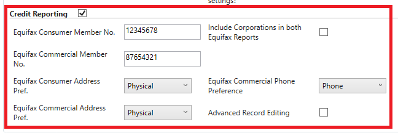

#### Determining which report a client gets displayed on: Commercial vs. Consumer

FaaSBank uses a Business record's **Legal Type** to determine if their loan will appear on the Commercial or Consumer Equifax report.

To review or update which of the Equifax reports the legal types impact, navigate to **Settings -> Businesses -> Legal Types**.

There, use the Equifax Reporting column to determine which Equifax report each legal type should be reported to. If a legal type **shouldn't** contribute to *either* Equifax report, set the drop-down value to '**None**'. This will ensure that clients with that legal type are excluded from all Equifax reporting.

Remember to **save** your changes.

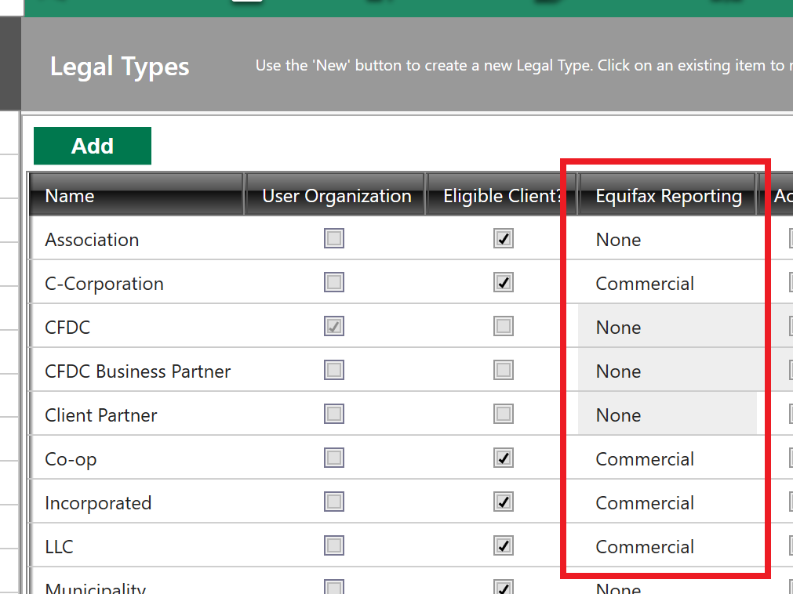

#### Generating the Equifax Report(s)

When your Equifax Settings are looking good, you can then generate the spreadsheet report(s) in  FaaSBank.

When the Equifax option is switched on, the **Equifax Reports button** will appear on the Quick Launch home screen. Click it to open the Equifax window.

**Note**: the Equifax Reports tile is only visible to users who have **Transactions module access**. It will be hidden for all other users.

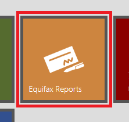

The Equifax window is split into three main areas:

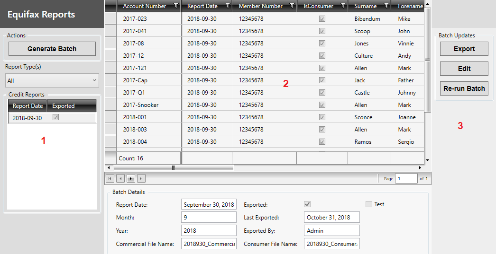

**1. Report List**  
The left column displays the Equifax reports that have already been run. If you select a row,  the main area of the window - highlighted number 2 in the screenshot below - will display the  records associated with that report.

The Report Date indicates the month that the report deals with; and the Exported check-box  indicates if the report has been exported for submission to Equifax.

**2. Records**  
The middle grid displays the records that will be included on the Equifax report. Viewing them  in this way allows a user to review the records before submission to Equifax.

Most of the important pieces of information - Past Due Amount, Current Due, Habit Codes,  
Narrative Codes etc. - are found on the very right side of the grid.

The panel below the grid includes the report's export information: who exported the file,  when was it exported, and what were the file names.

**3. Action Bar**  
Four buttons appear here:

* **Export** - to take the information displayed in the grid and export it to Excel (for submission  to Equifax)  
* **Generate Batch** - to create a new Equifax report for a specific month. This would be  done before the export.  
* **Edit** - clicking this button allows the user the Equifax information in the grid i.e. to enter a  Narrative or Term Code to a record.  
* **Re-run Batch** - to regenerate the selected batch i.e. to refresh the information so that it is  up-to-date.

To create a new Equifax batch, click the **Generate Batch button** in the right column.

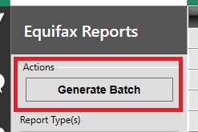

A pop-up window will then appear asking you to **select the year and month** that the reports  will be generated for. Click into the fields to select the relevant year and month. Click the **Generate button**.

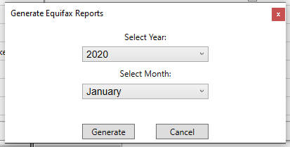

After the batch generates, you should see your reporting period appear in the left column;  
and the records - the information that makes up the report - will appear in the central grid.  You can then review the information in the main grid.

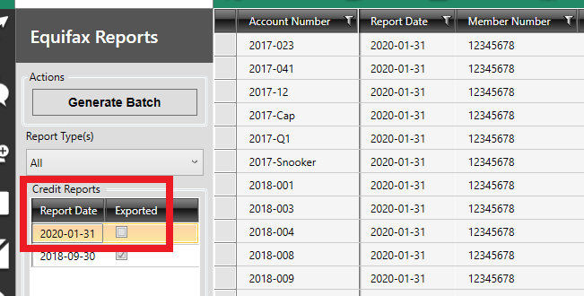

In the grid, the **IsConsumer** column indicates if that record will appear on the Consumer or Commercial report: if the check-box is ticked, that record will appear on the **Consumer report**.

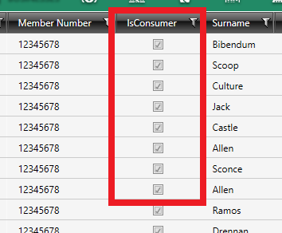

If all looks well in the grid, use the **Export button** in the right column to create the Equifax  Excel export spreadsheets.

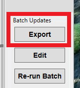

A window will then appear allowing you to select where the file(s) will be saved. Choose your  location, hit Save, and that's it! Your Excel files will then be in that location, for  upload/submission to Equifax.

#### Editing a Row

If you need to edit a record on the report, click the **Edit button** in the right column.

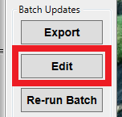

The **Narrative, Term and Status Code fields** will then be available for editing. Update them  as required.

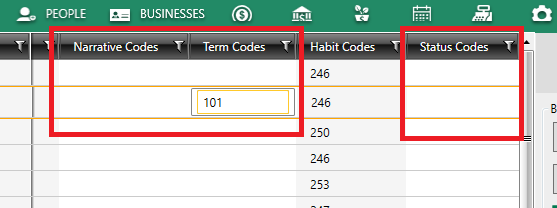

When you have made your changes to the grid, use the green **Save Changes button** in the  right column to save them; or use the Cancel Edit button to undo any changes.

You can then use the **Export button** in the right column to create the Excel export file(s).

#### Consumer Account Ratings & Commercial Habit Codes

FaaSBank will automatically assign the **Account Ratings and Habit Codes** listed below based on the standing of a loan at the time of the Equifax batch generation. Only a single Rating / Code will be assigned to a loan.

**Account Ratings** appear in column N of the **Consumer** report.

**Habit Codes** appear in column N of the **Commercial** report.

| Consumer Account Rating | Commercial Habit Code | When FaaSBank assigns this code |
| :---- | :---- | :---- |
| 0 | 245 | Loan is too new to rate e.g. loan was disbursed in the month that the Equifax batch was generated for. |
| 1 | 246 | Pays (or paid) within 30 days of payment due date or not over one payment past due e.g. client successfully makes their scheduled payments. |
| 2 | 247 | Pays (or paid) in more than 30 days from payment due date; but not more than 60 days, or not more than two payments past due e.g. loan is two payments behind schedule. Loan falls within the 31-60 days bracket on the FaaSBank Loan Delinquency report. |
| 3 | 248 | Pays (or paid) in more than 60 days from payment due date; but not more than 90 days, or three payments past due. Loan falls within the 61-90 days bracket on the FaaSBank Loan Delinquency report. |
| 4 | 249 | Pays (or paid) in more than 90 days from payment due date; but not more than 120 days, or four payments past due. Loan falls within the 91-120 days bracket on the FaaSBank Loan Delinquency report. |
| 5 | 250 | Pays (or paid) in more than 120 days, or more than four payments past due, but not yet rated 9. Loan falls within either the 121-180 or 181+ day brackets on the FaaSBank Loan Delinquency report. |
| 7 | 251 | Equifax definition: "*Making regular payments under a consolidation order or similar arrangement.*" In FaaSBank, this is when the Loan's Delinquency status = *Consolidation* or *Consumer Proposal*. You can add a Delinquency status to a loan by clicking the 'Applications' button found above the Loan's Status History grid, then clicking the 'Add Delinquency' button. |
| 8 | 252 | When the Loan's Delinquency status = *Repossession* |
| 9 | 253 | Loan has been fully written-off, or it has a Delinquency status that is **not** Consolidation, Consumer Proposal or Repossession e.g. *Bankruptcy* or *Collections*. |

#### Non-Host Pooled Loans Excluded

Please note that ***Non-Host*** **Pooled loans** are automatically **excluded** from the Equifax reports. These are loans where the '*Pooled Loan*' check-box has been ticked, and **the Participation field** found in the Lenders grid has been set to '***NonHost***'.

This loan configuration stipulates that your organization is **a partner** on the pooled/syndicated loan, rather than the **Host/Lead**. Accordingly, the loan gets excluded from any Equifax reporting as the Host/Lead org may be reporting it to Equifax themselves. This reduces the chance of duplication on the Equifax side.

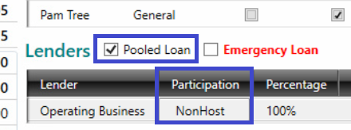

#### Excluding a Loan Fund from the Equifax reporting

❗ **Note**: currently it is **not** possible for a user to exclude a particular loan from the Equifax reporting. If you need to exclude one or more loans, please reach out to the support team at [support@faasbank.ca](mailto:support@faasbank.ca) for assistance.

It is possible to exclude a particular loan **fund** from the Equifax reports. Doing so means loans on that fund will not appear on the reports.

To do this, go into **Settings -> Loans -> Funds**. In the Funds grid,in the ***Exclude from Equifax*** **column**, tick the fund (or funds) which should be excluded from the reports.

After the relevant funds have been selected in that column, click the **Save button** to save your changes. All loans on the *Exclude from Equifax* funds will be dropped from any future Equifax reports you generate in FaaSBank.

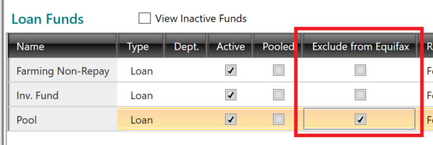
