# Loan Origination

## Creating a Loan

Every loan in FaaSBank must have **a loan number, a client and a primary borrower**.

A new loan can be added to FaaSBank using either the 'Loan application' tile found on the software's home screen, or the equivalent button found on the vertical menu that runs down the left side of the software. Clicking either button will open the New Loan window in a new tab at the top of the software.

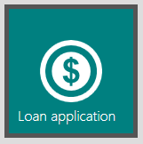

### Required Information

The first two fields in the New Loan window are of great importance: Loan Number and Client. Every loan must have a Loan Number and Client identified.

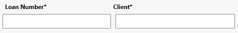

Loan numbers can be manually entered by the user, or automatically generated by FaaSBank. The majority of organizations using the software enter their loan numbers manually, but if you wish to have FaaSBank auto-generate them, this can be managed in Settings -> Loans -> Numbering.

If you wish to enter the loan number manually, simply click into the field and type in the number. It can be any mix of characters, numbers and symbols:

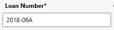

Next you will want to identify the loan client. In FaaSBank the client is the business who is receiving the loan. Use this field to search through the existing business records who exist in the software. When the desired business appears, select it from the search results. It will then populate the field as per the screenshot below.

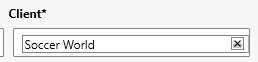

When a client business is selected, the Loan Parties grid will get populated with all people who have been identified as either owners or employees of that specific business:

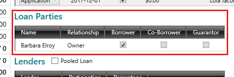

In FaaSBank, every loan must have a primary borrower identified. Identify the primary borrower via the 'Borrower' column in the Loan Parties grid.

If the selected business has only a single owner, then that owner will be automatically identified as the primary borrower, as per the screenshot below:

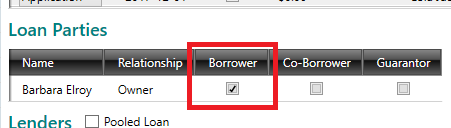

On the other hand, if the selected business has multiple owners associated with it, you will have to click into the grid to specify who the primary borrower is.

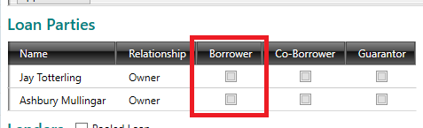

When your new loan has a Loan Number entered, a business Client selected, and a Primary Borrower selected, I would recommend saving the loan to the system using the green Save button in the top-right corner of the window:

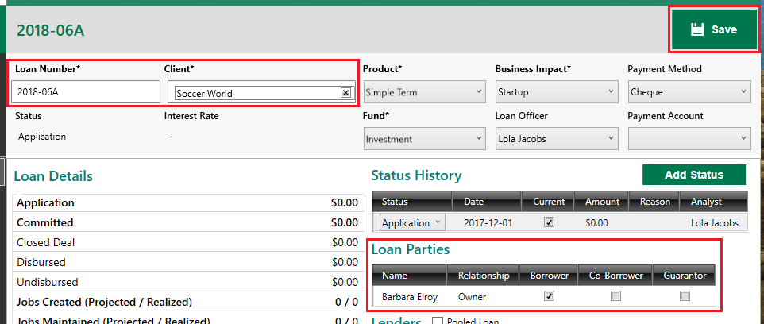

If the loan is being saved at Application or Committed status, a little pop-up window will appear asking to clarify how much money was applied for and/or approved. Enter the necessary amount and click OK:

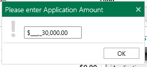

Your new loan will now be saved to the system, meaning it can be found and opened using both the global search bar and the Loans grid view.

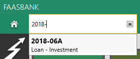

### How to delete a loan

Occasionally you may need to delete a loan from FaaSBank. The important thing to remember is that to be able to delete a loan, **it cannot have any transactions**.

This means if the loan has transactions, you will first need to **delete those transactions**. To do that, go into the loan's **Statement tab**, click the **Transactions button** found above the grid, then click **Delete Last Transaction**. That will open the Deletion window allowing you to delete the transaction. Do this for **every transaction** that exists on the loan.

When the loan has no transactions remaining, you will see a **Delete button** appear in the top-right corner of the window. Use this button to delete the loan. Click **Yes** on the pop-up confirmation window that appears. The loan will then be hidden from the user interface and removed from all forms of reporting.

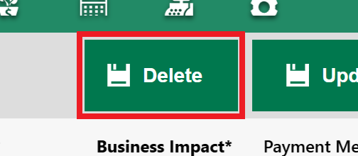

## Line of Credit loans

### Creating a line of credit loan product

Before being able to create lines of credit in FaaSBank, you will need to have a Line of Credit **loan product** set-up. This can be done in **Settings -> Loans -> Products**.

For this product, **ensure to select '*LineOfCredit*' from the Type drop-down menu**. This is how the software knows whether or not to treat a loan as a line of credit versus a regular Term-style loan.

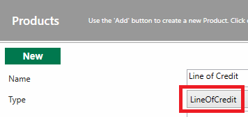

### Creating a line of credit loan

When you select your line of credit product in the New Loan window, you will see a new row appear in the Loan Details area: **Line Of Credit Type**. The drop-down menu on the row contains two options.

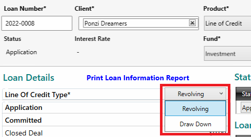

#### Revolving

When selected, any Principal amount paid back by the client becomes **available for disbursal to them again** i.e. the amount of Principal they pay back gets added to the loan's Undisbursed figure. This is the most commonly selected option for line of credits getting created in FaaSBank.

For example, with the line of credit in the screenshot below, the client received $75,000 and have **repaid $15,000 of Principal**. Accordingly, the Disbursed and Undisbursed figures in the loan's Loan Details area have been automatically updated to reflect this:

* Disbursed = $60,000  
* Undisbursed = $15,000

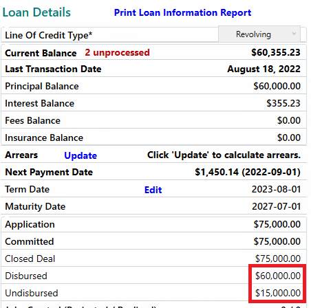

##### Closing a revolving line of credit

When a 'Revolving' Line of Credit loan has its balance paid down to 0.00, the loan does **not** get automatically advanced to a 'Paid Out' status. A **Close button** appears in the top-right corner, allowing users to inform FaaSBank that the client will **not** be receiving any future disbursals on this loan i.e. the line of credit is closed.

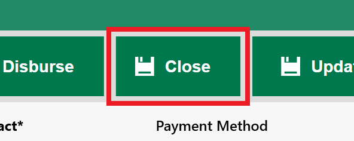

#### Draw Down

A 'Draw Down' line of credit acts very much like a standard Term loan: Principal repaid by the client does **not** become available for re-disbursal to them. Accordingly, when a 'Draw Down' LOC gets fully paid down to 0.00, it gets automatically advanced to a 'Paid Out' status.

## Advancing the Status of a Loan

TBC!

### Editing or deleting a status

TBC!

## Multiple Lenders grid

The Multiple Lenders grid allows you to track **multiple lenders** for a Loan record in FaaSBank, to identify when money for a loan comes from multiple different lending sources.

❗ Please note that adding multiple lenders to a loan has **no significant impact** on the behaviour of the loan in the software: it does **not** change the calculation of the loan's amortization schedule, nor does it have any impact on the posting of transactions to the loan. It does **not** result in FaaSBank tracking separate Interest Accrued and Paid amounts for each lender on the loan. ❗

### Enabling the Multiple Lenders feature

By default the Multiple Lenders feature is switched **off** for all organizations. Please reach out to the Fern support team at [support@faasbank.ca](mailto:support@faasbank.ca) if you would like it enabled for your organization. There is no cost associated with switching on the feature.

### Creating "Lenders" in FaaSBank

To be able to add multiple lenders to a loan, you first need to **add the lenders as Business records** in FaaSBank.

For a "lender" to be available for selection in the Multiple Lenders grid, you need to add them as a Business with the **Legal Type = Operating Business Partner** (or the equivalent Legal Type in your version of FaaSBank).

When a Business has been identified in this manner, they will then be available for selection in the Loan's Lenders grid **when the 'Multiple Lenders' check-box has been enabled**.

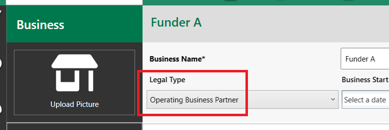

### Adding multiple lenders to a Loan

When the Multiple Lenders feature has been enabled, you will see that **the 'Multiple Lenders' check-box field** is available for selection above the Lenders grid in the Loan record.

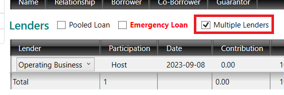

When it is ticked, an **Allocation button** will appear, allowing you to add multiple lenders to the loan.

Within the Allocation button, click **Add** to add a single lender row to the grid, or **Add All** to add all lenders (i.e. all Businesses with the Legal Type = Operating Business Partner) as lenders on the loan.

Click into the row and **update the lender's info as required**: identify the date of their funding and the amount that they contributed to the loan. (Also update the Lender row for your own organization as needed i.e. what was your org's contribution to the loan.) Remember to **save** the change.

Repeat this process if you need to add additional lenders to the loan.

For example, if a loan was applied for $200,000, and the money is coming from three lenders, I can add the other lenders then click into the rows to update them as necessary. In the screenshot below, I have specified that the main lender contributed $125,000 (which is 62.5% of the total loan amount), whereas the other two lenders contributed lesser amounts ($50,000 and $25,000).

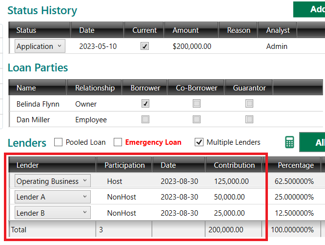

### Having FaaSBank calculate the other lenders' contributions

Clicking the little **Calculator icon** beside the Allocation button will display a pop-up window that allows you to define the host's contribution to the loan and the total value of the loan. FaaSBank will then split the difference across all other lenders that have been added to the Loan record.

For example, if I have a $100,000 loan with three lenders and I specify the host's portion as being $50,000,

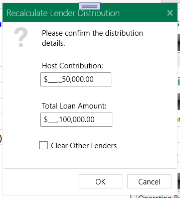

In this scenario, FaaSBank will automatically calculate the contributions of the other two lenders as being $25,000 ($50,000 / 2):

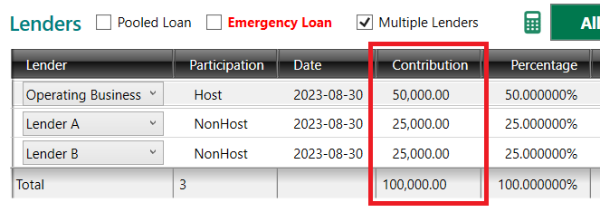

### Loan Balance by Lender report

When the Multiple Lenders setting has been enabled, your organization will be able to run the **Loan Balance by Lender report**, which groups each loan in your portfolio by their assigned lenders.

The report can be accessed from the little menu button in the top-right corner of the software. There navigate to **Reports -> Loans -> Loan Balance by Lender**.

Note: the report does NOT calculate each lender's portion of the outstanding loan balances: it currently shows the **FULL** outstanding loan balance alongside each lender. This may be something we tweak in future based on user feedback.

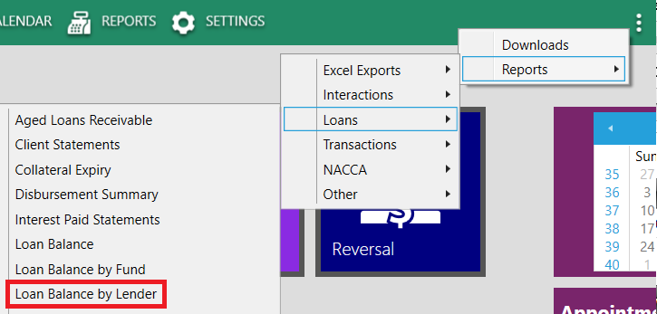

## Using the Calculator to create Amortization Schedules

### Key Calculator Information

There are two versions of the loan amortization calculator: **Regular** and **Schedule Scripts**.

The **Regular** calculator is what you see when you enter the **Calculator tab** in a Loan record. It should be used for creating straightforward (or relatively straightforward) amortization schedules e.g. $100,000 over 60 months, at an interest rate of 8.50%.

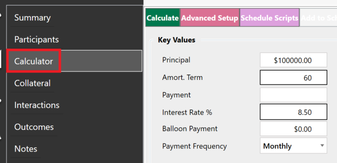

The Schedule Scripts area of the Calculator should be used when you need to create **customized or flexible amortization schedules** to meet the needs of your clients. It can also be used to create schedules that include **multiple fees or disbursal fees**.

It can be accessed via the **Schedule Scripts button** at the top of the Calculator.

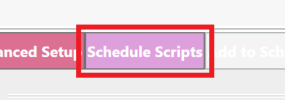

With Schedule Scripts, you build out your desired schedule by **adding a "script" row** for each type of transaction that you want to appear on the schedule. The only item that **doesn't** require a "script" row is the loan's **initial disbursal**: specify it using the fields above the Scripts grid.

In the screenshot below we have laid out quite a complex amortization schedule scenario. This schedule would be calculated as follows:

1. In the fields above the grid, we have specified that the client will be receiving **$100,000** on **May 25th 2021**. This Disbursal information will be the first transaction row on the generated schedule.

   Here we have also specified that the loan's Interest Rate will be 8.50%.

2. Frequency = 'One Time - Capitalized Fee' indicates a **Disbursal fee**. In this case, it is an Admin fee for $100, being charged on May 25th 2021.

3. A second **Disbursal fee**. In this instance it is a Legal fee for $250 being charged on May 25th 2021.

4. This is the first Payment script row. The row in this example states that the client will be making monthly **interest only payments** (Event Type = 'Payment: Interest Only') for 6 months, starting on June 25th 2021.

5. After the interest only payments, the client will then make **12 payments of $1,000**, beginning December 25th 2021 🎅

6. After those 12 payments, the client will then pay down the remainder of the loan in **42 payments**, starting on December 25th 2022. In this row, the Amount field has been left blank: this tells FaaSBank to calculate the dollar amount of these 42 payments.

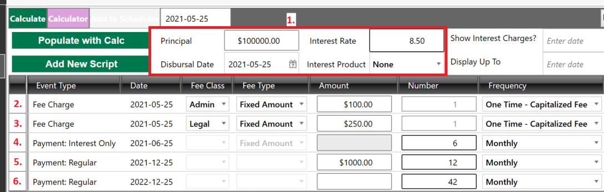

The start of this schedule would look like this:

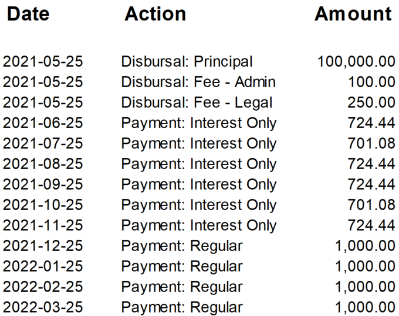

#### Use 'Calculate' to generate the schedule, then 'Add to Schedules' to save it

There are three steps to the amortization schedule process:

1. Setting up the Calculator with the relevant information.  
2. Clicking the **Calculate button** to generate the schedule. FaaSBank will display the generated schedule in a report preview window.  
3. If the schedule looks good, you will want to save it to the loan by clicking the **Add to Schedules button**. It is the blue button found at the top of the Calculator.

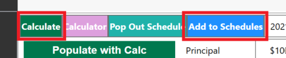

When a schedule has been saved, it can then be viewed within the loan's **Schedule tab**.

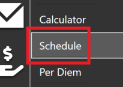

#### In the Regular calculator, either the Amort Term or Payment field must be blank, but they cannot both be blank

This is because FaaSBank needs to calculate one of those two values:

* If you want FaaSBank to calculate the client's **payment** amount, enter an Amort Term value and leave the Payment field blank.

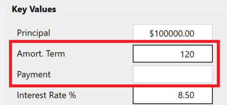

* If you know the client's payment amount and want FaaSBank to **calculate the length of time it will take them to pay off the loan**, enter the Payment amount and leave the Amort Term field blank. FaaSBank will then calculate the payment amount when you click the Calculate button.

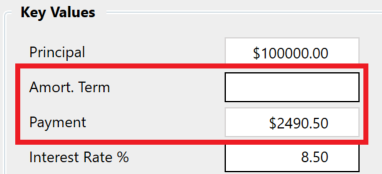

#### What does the 'Term Date' field in the Calculator do?

The Term Date field has **no** bearing on the calculation of the schedule itself. It is solely used as a way to inform the client of **when the interest rate on their loan is liable to change**. For example, you may have a mortgage with a 25-year amortization and a 5-year term, meaning the interest rate may change after five years. In this case, if it was a new loan, you would set the Term Date in the Calculator to be five years after the loan's disbursal date.

The 'Term Date' is shown in the header section of a printed amortization schedule:

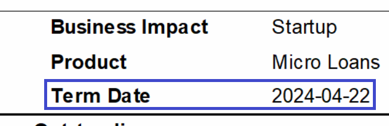

If your organization doesn't use a Term Date and doesn't want it to be shown on printed schedules, you can go into **Settings -> Loans -> Extras**, untick the 'Term Date Visible' option and save the change. When that is unticked, the 'Term Date' field will no longer appear on printed schedules, meaning you can basically ignore the field in the Calculator 🙌

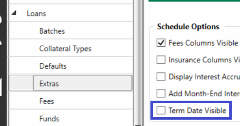

#### When creating a Bring Forward schedule, the Disbursal Date field acts as the start date for the schedule

A Bring Forward amortization schedule is a schedule that **uses the loan's outstanding balances as its starting point**. This process can be initiated by clicking the Bring Forward button found in a loan's Schedule tab.

A Bring Forward schedule can be created when an existing loan is being disbursed additional funds, but it can also be created when no new funds are being disbursed to the client.

If **no new money is being disbursed** to the client, when doing the Bring Forward you will first want to ensure that the **Principal field in the Calculator is set to 0.00**. (Alternatively, if the client is receiving additional funds, enter that amount into the Principal field.)

Following that, set the Disbursal Date as needed. When doing a Bring Forward that involves no new money, the Disbursal Date field acts as **the start date for the schedule you are creating**. **Note**: it is **not** possible to set the Disbursal Date to fall before the last transaction date on the loan when you are doing a Bring Forward. The best practice is to **set the Disbursal Date to equal the loan's last transaction date**, as that way the schedule and the loan's Statement will be in harmony as at that date. If the selected Disbursal Date is dated after the loan's last transaction date, FaaSBank may prompt you to post an Interest charge to the loan, to bring the Statement into alignment with the new schedule.

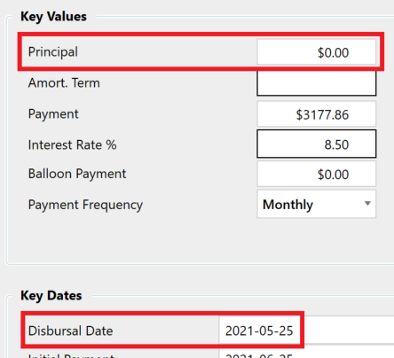

The generated schedule will show **the loan's outstanding balances as per your selected date**, with one row per outstanding balance e.g. a transaction row for outstanding Principal, and a transaction row for outstanding Interest.

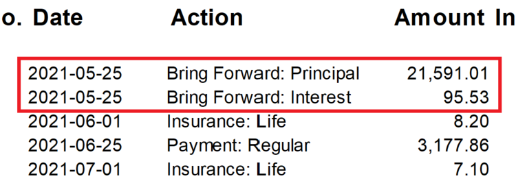

### Adding Fees to a Schedule

1. Single fee - use the Regular Calculator.  
2. More than one fee - use the Schedule Scripts area.  
3. Capitalized/Disbursal fee gets added onto Principal.  
4. Regular Fee charge becomes an outstanding Fee balance (generally no interest gets calculated on this, though organizations can specify 'interest on outstanding fee balances' for loan products if required).

#### Creating an amortization schedule containing multiple disbursal fees

Please see the video below for an overview of how you can use the Schedule Scripts area of the Calculator to create a schedule that contains more than one disbursal fee.

[FaaSBank - creating an amortization schedule with multiple disbursal fees - Watch Video](https://www.loom.com/share/bda4ce8900fd4424b4e649616ae14b7d)  
[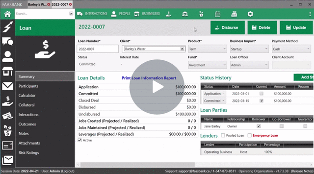](https://www.loom.com/share/bda4ce8900fd4424b4e649616ae14b7d)

### Adding Insurance to a Schedule

To be able to include Insurance Charge transactions on your loan amortization schedules, your organization must first have at least **one active Insurance Product** set-up in FaaSBank's Settings area.

When an active Insurance Product exists, you will then be able to select the Insurance Product in **the loan Calculator's Insurance area**.

In the Calculator's Insurance area:

1. Select the relevant Insurance Product using the **Product** field.  
2. Select Monthly from the **Frequency field**  
   1. This will result in monthly Insurance Charge transactions being included on the generated amortization schedule  
3. Select the relevant **Insurance Start Date**  
   1. This will be the date of the first Insurance Charge transaction on the generated amortization schedule

After you have selected the Insurance Product, you will see that the Rate field gets populated with the product's default rate (this comes from the Insurance Product set-up in Settings).

If you need to apply a custom insurance rate to the loan - i.e. a rate that differs from the default rate - you can tick the Custom check-box field then enter the custom rate as needed. Further information on this can be found in the next section of this document.

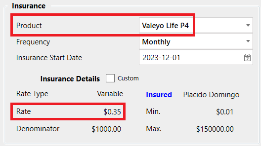

When the Insurance area and the rest of the Calculator is configured as per the loan requirements, **use the Calculate button** at the top of the Calculator to generate the amortization schedule for the loan. You should see that the Insurance Charge transactions on the generated schedule reflect the rate that was shown in the Calculator.

For example, on a loan of $100,000, with the insurance rate of $0.35 per $1,000 of outstanding Principal, the Insurance Charge amount would be $35.00.

If the selected Insurance Product has a variable rather than a fixed rate, this means that the Insurance Charge amount gets calculated based on the loan's outstanding Principal balance (rather than a fixed Insurance amount being charged every month). When a variable rate is used, you will generally see that the Insurance Charge amount gets reduced as the loan's Principal balance gets reduced. For example, on the screenshot below, the second Insurance Charge is for $34.51 rather than $35.00, as the Payment on 2023-12-06 will have resulted in the loan's Principal balance being reduced.

Remember to **save your schedule** is all looks good ☺️

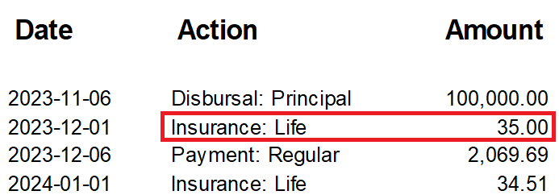

#### Applying a custom insurance rate to a loan

Occasionally you may have the situation where a person's insurance rate needs to differ from the default insurance rate e.g. if the borrower is a smoker and their loan is over $150,001.

When the loan has **a single insured person** and their rate differs to the default rate, you can set the rate in the loan Calculator as necessary. To do this, in the Insurance section of the Calculator, **tick the Custom check-box field**, then enter the custom insurance rate in the **Rate field**. (Note: please see the next section for info on when multiple people are being insured on a loan.)

For example, if the borrower was a smoker aged between 36 and 40, their insurance rate may be $0.54 rather than $0.38. In this instance, I'd tick the Custom field then enter $0.56 into the Rate field:

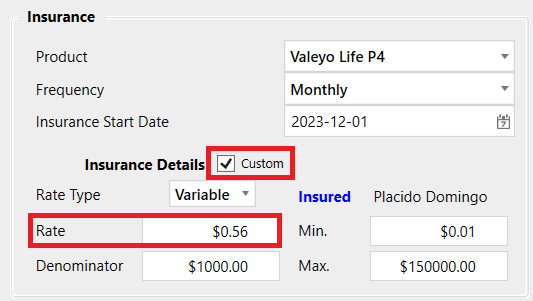

After that, **use the Calculate button** at the top of the Calculator to generate the amortization schedule featuring the custom rate. You should see that the Insurance Charge transactions on the generated schedule reflect the custom rate you entered into the Calculator.

For example, on a loan of $100,000, with the custom insurance rate of $0.56, the Insurance Charge amount would be $56.00.

Remember to **save your schedule** is all looks good ☺️

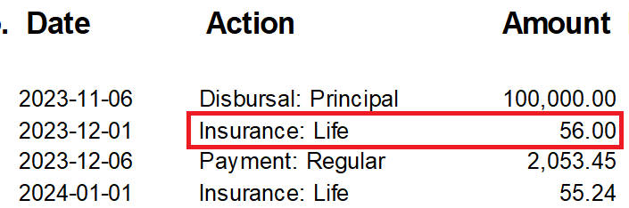

#### When multiple people are insured on a loan

If multiple people are being insured on a loan, after selecting the relevant Insurance Product and Frequency in the Calculator's Insurance area, you will want to **click the 'Insured' link** to launch the *Insurance Applicants* pop-up window.

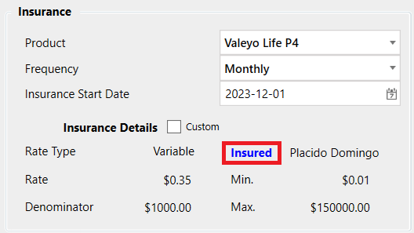

The pop-up window allows you to search for and select other people who are being insured on the loan (by default the loan's primary borrower is selected as the sole insuree).

To select another insured person, click into the Insurer field then start typing their name; select the relevant person when you see them appear in the search results. **Click the '+' button** beside the Insurer field to add them to the grid in the window.

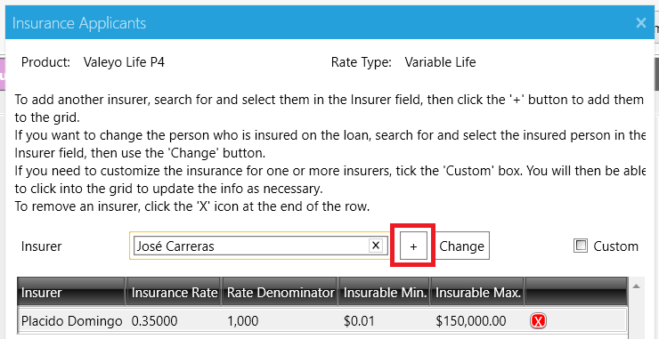

By default FaaSBank will **split the insurance rate across the borrowers**. For example, if two people are being covered by the $0.35 Life rate, you will see that the Rate gets shown as $0.175 for each borrower in the grid:

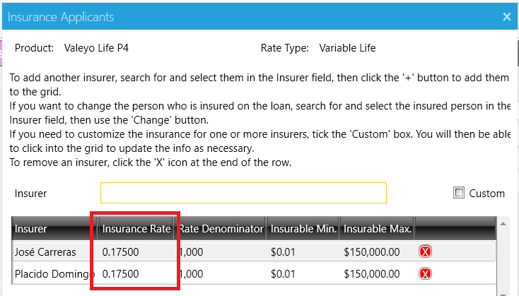

If one or more of the insured borrowers requires **a custom insurance rate**, you should **tick the Custom check-box field** found above the grid area in the pop-up window. That will then allow you to click into the grid to make the necessary changes e.g. you would be able to specify custom rates, increase the insurable maximum amount etc.

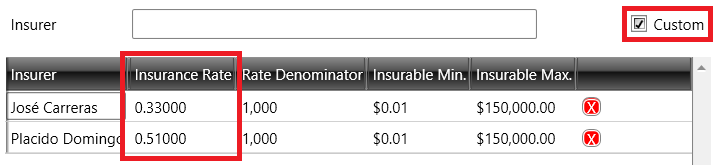

When the grid in the pop-up window looks good - all relevant individuals are present and their rate information is correct - **click the Accept button** to return to the loan Calculator.

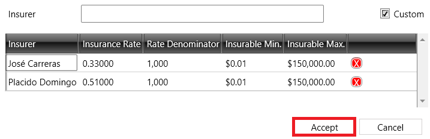

After that, **use the Calculate button** at the top of the Calculator to generate the amortization schedule that reflects the multiple insurees' rates. You should see that the Insurance Charge transactions on the generated schedule reflect the rates that were specified in the *Insurance Applicants* pop-up window.

For example, on a loan of $100,000, if one person was insured at $0.33 and the other at $0.51, the initial Insurance Charge amount would be $56.00.

Remember to **save your schedule** is all looks good ☺️

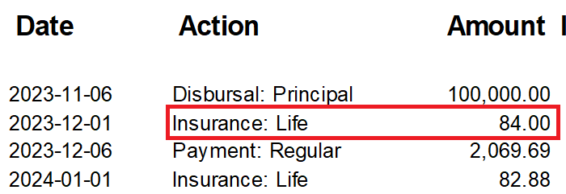

#### Doing a Bring Forward schedule to reflect insurance changes

If the insurance particulars for an existing loan change, you will want to create a Bring Forward schedule to reflect those changes e.g. if the insurance rate changes, if the maximum insurable amount changes etc.

The video linked below walks through this scenario, showing you how to create and save a Bring Forward amortization schedule that specifies a change in a loan's maximum insurable amount.

[FaaSBank - changing the insurance particulars on an existing loan](https://www.loom.com/share/86e062956835489d8961bad2c928f781)

[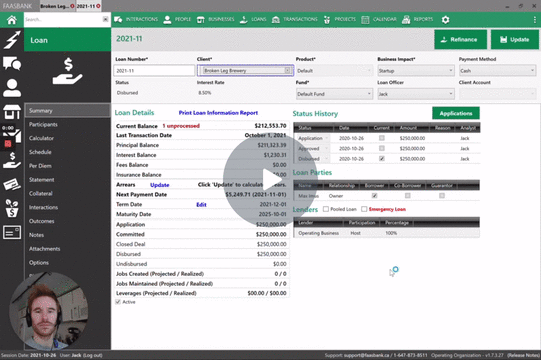](https://www.loom.com/share/86e062956835489d8961bad2c928f781)

### Amortization Schedule FAQ

#### I have only posted the initial disbursal transaction to a loan. Do I really need to create a Bring Forward schedule if I only need to change a detail or two on the schedule?!

No, in this instance, as only a single transaction has been posted to the loan, you can safely jump into the Calculator and create a schedule **without** going the Bring Forward route.

The most important thing to remember is that a regular (i.e. a non-Bring Forward) schedule has **no relation to the transactions that have been posted to the loan**. This means that after you save the schedule to the loan, on the loan's Summary tab you may see **the red unprocessed transactions text appear**.

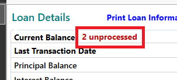

To ensure that someone doesn't accidentally repost the disbursal transaction (and any others that have already been posted to the loan), you should **click the red text**. This will open a Transaction Processing window, showing all the loan's scheduled transactions up to the current date. You should **delete any that have already been posted to the loan**.

Do this by **right-clicking** them and selecting **Delete**.

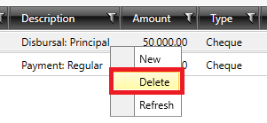

If you then return to your loan and **reload it**, you should see that the **red unprocessed text is gone**, and all is well in the world 🙌

## Adding Loan Collateral

### Adding Loan Collateral

Multiple pieces of collateral can be tracked for a loan. You can add the collateral info via the Loan record's **Collateral** area.

 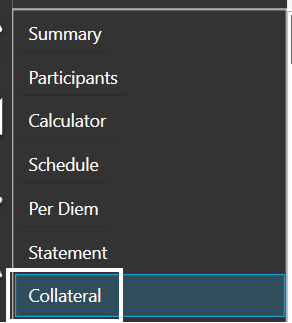

When in the Collateral area, first **click the "Add Collateral" button**, then work your way through the fields, starting with **Collateral Type**.

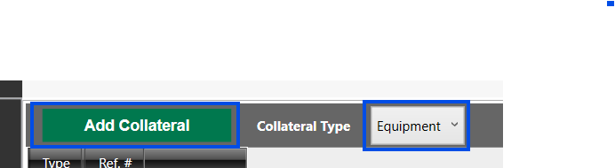

You can identify the following information for each piece of collateral being added to a loan:

| Field | Description |
| :---- | :---- |
| **Collateral Type** | A drop-down menu with various collateral types (e.g., vehicle, equipment, housing/mortgage, insurance).  Selecting a "Housing" type displays an address option, while selecting an "Insurance" type reveals an "Insurance Type" drop-down (Life, Disability, or Inclusive). The options shown in the drop-down menu can be edited in **Settings -> Loans -> Collateral Types**. |
| **Reference #** | A text field where users can enter a unique reference number for the collateral. |
| **Value** | A currency field to record the monetary value of the collateral. |
| **Issue Date** | A date picker to enter the date when the collateral was issued or acquired. |
| **Expiration Date** | A date picker to specify when the collateral expires, if applicable. |
| **Discharge Date** | A date picker to record the date when the collateral is discharged or no longer applicable. |
| **Description** | A text field for entering additional details or notes about the collateral. |
| **Active** | A check-box indicating whether the collateral is currently active. Deactivating a piece of collateral does **not** delete it from the database - it means the piece of collateral will not be displayed by default in the user interface, and it will not be factored into any collateral reporting. |
| **Add Expiration Task** | A system-generated task reminder is created based on the Expiration Date when the check-box is selected. |
| **Collateral Owners** | Clicking the "Add New" button will display a search field allowing users to select one or more individuals as owners of the collateral. |
| **Collateral Issuers** | Clicking the "Add New" button will display a search field allowing users to select one or more businesses as issuers of the collateral. Users can also specify the issuer's role (e.g., "Appraiser" or "Issuer") using the "Relationship" field. |

After adding your collateral, make sure to save your changes by clicking the "Update" button in the top-right corner of the Loan record.

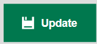

### Creating Loan Collateral Task Reminders

Use the "**Add Expiration Task**" check-box field to create a task reminder based on the collateral's **Expiration Date**.

When the check-box is ticked, a "**Reminder Date**" field will appear, with the date set one month before the Expiration Date. The Reminder Date is when FaaSBank will notify the user about the collateral's expiration. You can edit the date as needed prior to saving the change to the Loan record.

If the "Add Expiration Task" check-box was ticked for one or more pieces of collateral, after clicking the "Update" button in the top-right corner of the Loan to save your changes, you will be displayed with a pop-up window informing you that a task will be created. The window will show you the task details, including the chosen Reminder Date.

Click **Yes** to save the task and the changes to the loan.

After the changes have been saved, blue "**View Expiration Task**" text is shown in the "Additional Info" section for that piece of collateral. Clicking the text will open the task that was created.

By default, **the user who saved the piece of collateral to the loan** - or saved changes to the collateral - **will be the analyst assigned to the expiration task**. If you wish to add other analysts or change the assigned analyst, click the blue text, update the Task window as needed, then save the change to the task (by clicking the "OK" button in the Task window).

## Posting Loan Disbursal Transactions

### Posting a Loan's Initial Disbursal Transaction

Use the **Disburse button** in the top-right corner of a Loan record to post its initial disbursal transaction. This will automatically advance the loan to a Disbursed-type status e.g. Closed Deal.

Note: you will only be able to post the loan's initial Disbursal when it is at an Approved-type status e.g. Approved or Committed. FaaSBank will not allow you to disburse a loan **until it has been approved** 😇

### Disbursing additional funds to a Loan

There are generally two scenarios where you may need to disburse additional funds to a loan:

1. The loan was only partially disbursed initially, meaning it still has undisbursed monies available for disbursal; or  
2. The loan has been approved for additional funds (the guide section here outlines how to approve additional funds for an existing loan: [FaaSBank User Guide](https://docs.google.com/document/d/1DtA1c6eWvJQ0mkmqoA6iWnAp13z3Q8UmvwPTQlMC72E/edit)).

If the loan's current amortization schedule does not reflect the new money, we would recommend creating a Bring Forward schedule to factor it in. This section of the guide covers creating Bring Forward schedules: [FaaSBank User Guide](https://docs.google.com/document/d/1DtA1c6eWvJQ0mkmqoA6iWnAp13z3Q8UmvwPTQlMC72E/edit)

### Over-disbursing a loan

Only users with the "Can Edit Loan Products" permission are allowed to over-disburse a loan. In other words, users with that permission are allowed to disburse more money to a loan than has been approved on it.

### Posting 'Cash Equity' Negative Disbursal Transactions

❗*Please note that the 'Cash Equity' feature is disabled by default. Please contact the Fern Support team if you would like it to be enabled for your organization.*

Users can use FaaSBank's 'Cash Equity' transactions to identify **cash equity received from the client** that will be disbursed back to them at a later date as part of the regular loan disbursal process.

Post a Cash Equity transaction using **the 'Cash Equity' button** found in the top-right corner of the loan record. **Note**: this button only appears when a) the loan record has been **saved**, and b) **before the loan has received its initial disbursal transaction** i.e. before the loan has been advanced to a Closed Deal / Disbursed status.

Clicking the button will open the Cash Equity transaction window.

In this window, select a transaction **date**, then **enter the value of the cash equity** received from the client. When all looks good, click the **Disburse button** to post.

Following the posting, you will be returned to the loan record. The **Statement** tab will now be visible as the Loan has had a transaction posted to it; and the Loan's **updated balance** will be shown within its Summary area.

Following this, you can proceed with the loan as required e.g. creating an amortization schedule; or if the loan is already at an Approved / Committed status, disbursing the remaining funds as necessary.

### How can I run a report that shows Disbursals posted within a particular date range?

For that, you'll want to use the **Transaction Activity report**. It can be accessed from the little menu button found in the top-right corner of the software (the three vertical dots found directly under the exit 'X'). In that menu, navigate to **Reports -> Transactions> Transaction Activity**.

In the report's parameter window, set your **start and end dates** as required, then ensure that **only the Disbursal transaction type is selected**. This will ensure that the generated report only includes disbursal transactions posted within the selected date range.

