# Transactions

## Posting bulk/scheduled transactions via Transaction Processing

FaaSBank's bulk Transaction Processing area picks up **unprocessed transactions from loan amortization schedules**. An unprocessed transaction is one that has **yet to be posted, deleted or skipped by a user**. In other words, these are transactions that have yet to be dealt with.

Click the **Transactions button** on the top menu bar to open the Transaction Processing area.

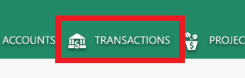

When you open the Transactions area, FaaSBank grabs **any unprocessed scheduled transactions dated on or before the current date.** This info is taken from **a loan's "current" amortization schedule.** Only loans **with an outstanding balance** will have scheduled transactions displayed**.**

A user has a few options when it comes to handling the scheduled transactions that appear in the main grid area of the window:

* If you want to **post** a transaction to a loan, ensure the **'*Post*' box** (the first column in the grid) is ticked. When you click the Post button in the right column, all rows that have the Post box ticked will get posted.

  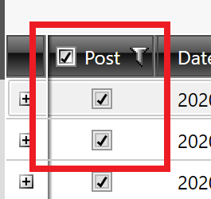

* If you want to delete a scheduled transaction - i.e. it should not be posted to the loan because the client did not make the payment - then you can **right-click** the row and select **Delete**. This will remove the transaction from the grid.

  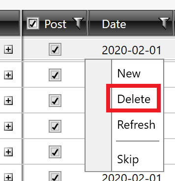

* If the client was given permission to skip a scheduled payment, you can **right-click** the row and select **Skip**. This will remove the transactions from the grid. When a payment has been Skipped, it will **not** negatively impact the loan's delinquency, because they were provided with permission to miss the payment.

  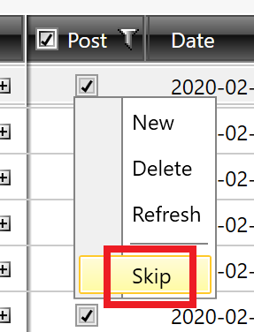

* If you need to change the amount or date of a payment prior to posting, select the row in the grid, then edit the necessary information in the area at the bottom of the window.

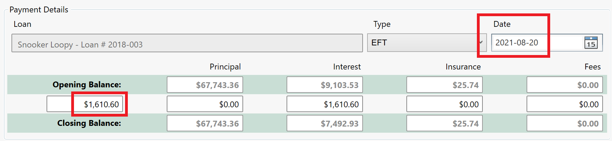

When all of the transactions to be posted have been identified via the 'Post' column, click the **Post button** at the right side of the screen.

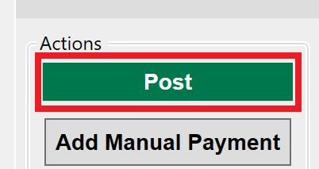

You will then see a pop-up window that tells you the various types of transactions, and the number of each, that are about to be posted. If everything looks good, click the **Yes button**.

If things do **not** seem correct, click the No button. This will return you to the grid.

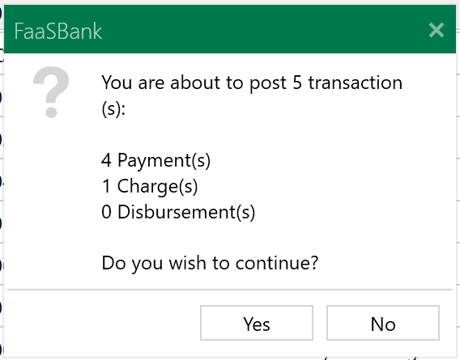

After the post process is complete, you will see a pop-up similar to the one shown below. Clicking the **Yes button** will generate a **Transaction Processing report** showing all of the transactions that were posted. You can use the ***Report Title*** **field** to change the title that appears on the generated report.

Clicking the No button will return you to the grid.

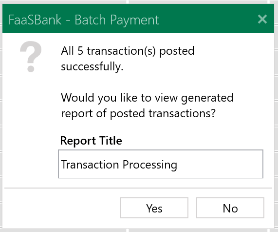

If you are finished with the Transaction Processing area, you can safely close the window by clicking the '**x**' icon found in its tab at the top of the software.

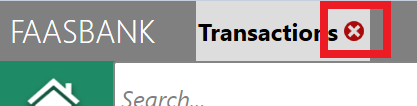

### Why wouldn't a loan be shown in the Transaction Processing window?

By default, when you open the Transaction Processing window, FaaSBank grabs **any unprocessed scheduled transactions dated on or before the current date.** This info is taken from **a loan's "current" amortization schedule.** Only loans **with an outstanding balance** will have scheduled transactions displayed**.**

A loan's scheduled transactions may **not** get displayed/shown in the grid area of the window for a few different reasons:

#### The Loan has been flagged as Non-Performing

When a loan has been identified as being Non-Performing, scheduled payments will **not** be displayed in the Transaction Processing window, but scheduled **charge** transactions will e.g. month end Interest charges.

A loan can be flagged as Non-Performing from within its **Options tab**.

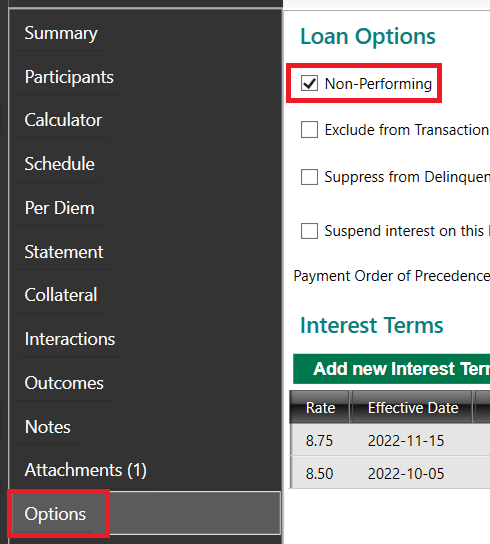

#### The Loan has been flagged as being Excluded from Transaction Processing

When a loan has been identified as being excluded from Transaction Processing, **none of its scheduled transactions** will be displayed in the Transaction Processing window.

A loan can be flagged as being excluded from Transaction Processing from within its Options tab.

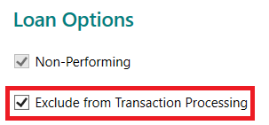

#### The Loan has no eligible unprocessed scheduled transactions

If the loan has no unprocessed scheduled transactions dated on or before the "Effective Sweep Date" selected in the left column of the window, then no scheduled transactions associated with the loan will be loaded into the window. This may indicate that the loan's amortization schedule is outdated and needs to be updated (via FaaSBank's Bring Forward process).

Steps on the Bring Forward process can be found here: [FaaSBank User Guide](https://docs.google.com/document/d/1DtA1c6eWvJQ0mkmqoA6iWnAp13z3Q8UmvwPTQlMC72E/edit)

## Posting a Manual Payment

You can post a one-off payment to a loan using the **Manual Payment button** on the software's home screen, or the equivalent button found within the loan's **Statement** area.

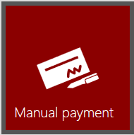  
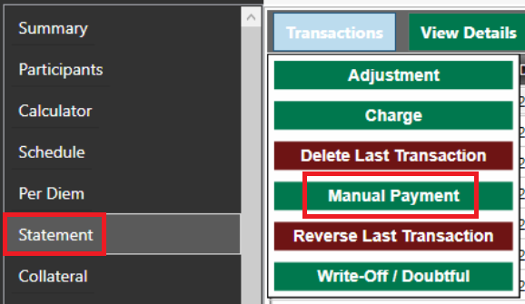

In the Manual Payment window, first you will want to **search for and select the loan** that you wish to post the payment to. (The loan will already be selected if you use the Manual Payment button found in the loan's Statement area.)

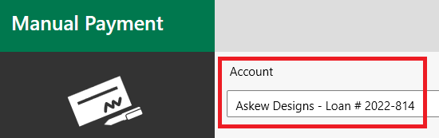

Next, select the **type** of payment (e.g. Cash, Cheque, EFT) and **date** that you want to post the payment for.

**Note**: a red border appearing around the Date field (like in the screenshot below) simply indicates that the selected date differs from the "current" date. It is nothing to worry about 🙂

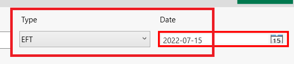

If you want to have FaaSBank distribute the payment across the various outstanding loan balances as per the loan's default payment order of precedence (it can be viewed in the loan's Options tab), **enter the payment amount into the leftmost field in the middle row of the window**. If you then click the **tab** key on your keyboard, or simply click into another field, the software will automatically distribute the payment across the balances as necessary.

For example, in the screenshot below, I entered a payment amount of **$5,000** into the leftmost field. Clicking the tab key on my keyboard then distributed the payment across the loan's outstanding balances:

* $4,336.59 to Principal, and  
* $663.41 to pay down the outstanding Interest

This loan has no outstanding Insurance or Fee balances, which is why their amount fields show as 0.00.

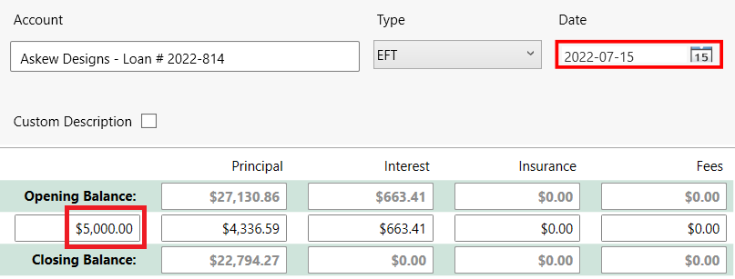

You can use the **Comments** field at the bottom of the window to capture any notes you wish to record alongside the payment.

Finally, once the window looks good, click the **Post button** to post the payment to the loan.

If you go to the loan's Statement, you will then be able to see evidence of your posted payment transaction 💸

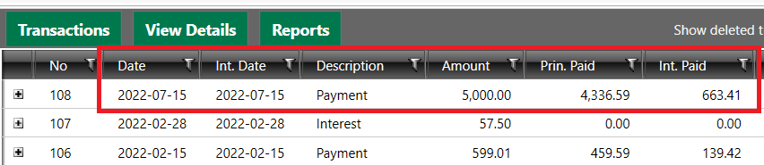

### Paying out a loan that has suspended interest switched on

FaaSBank **won't** allow you to payout a loan that has suspended interest switched on: you'll need to switch off suspended interest before you are able to post the payment.

The video below walks through the process of posting a payment Payment to a loan that has suspended interest enabled.

[Posting a payout Payment to a loan that has interest suspended - Watch Video](https://www.loom.com/share/37f7b64ad80b4e29bdf115f80c0f549f)

[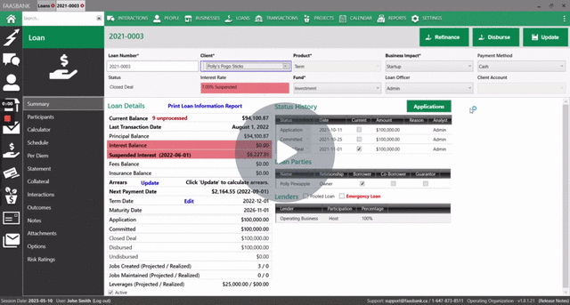](https://www.loom.com/share/37f7b64ad80b4e29bdf115f80c0f549f)

## Posting Overpayments

Overpayments allow you to take a loan into a negative Principal balance, reflecting that the client made a payment that was greater than the outstanding balance remaining on the loan.

By default, overpayment functionality is **enabled** in the Manual Payment window, but **disabled in the bulk Transaction Processing window**. To allow the posting of overpayments in Transaction Processing, you can switch on the '*Allow Loan Overpayments in Transaction Processing*' setting in **Settings -> General -> Organization**.

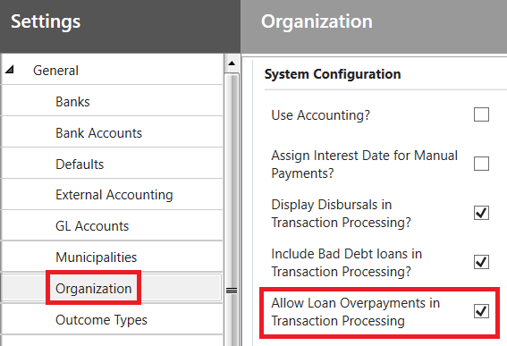

In the Manual Payment window, when you enter a payment amount that is greater than the loan's total outstanding balance, you will see that the overpaid amount is shown as **a negative amount in the Closing Principal Balance field** (the field also gets shaded red).

For example, in the screenshot below, I am posting a **$23,000** payment to a loan. Looking at the Closing Principal Balance field, we can see that it is shaded red, indicating that this payment is for an amount greater than the loan's outstanding balance. If posted, it will result in the loan going into **a negative Principal balance** of $190.87.

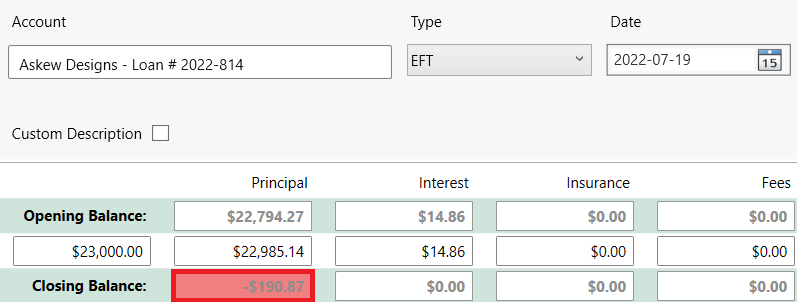

When you attempt to post such a payment, FaaSBank will display a pop-up message informing you that doing so will take the loan into a negative balance. Click **Yes** on the pop-up message to proceed with the posting.

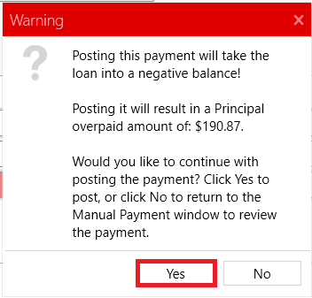

The result is that the loan will now have a negative Principal balance. The loan will remain at its Closed Deal/Disbursed status until a user posts a transaction to reflect the client being reimbursed by the overpaid amount. See this section of the User Guide for steps on how to post a Paid Adjustment to bring the loan back to a 0.00 balance: [FaaSBank User Guide](https://docs.google.com/document/d/1DtA1c6eWvJQ0mkmqoA6iWnAp13z3Q8UmvwPTQlMC72E/edit)

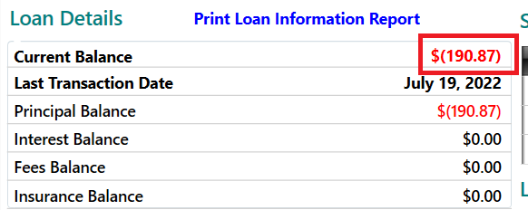

### Posting overpayments to Paid Out loans

It is possible to post overpayments to loans that are already at Paid Out/Paid in Full status.

To be able to do this, you must ensure that the loan record in question is Active. You can activate a loan by opening it, **ticking the Active check-box** found at the bottom of the Summary tab, then using the **Update button** to save the change to the loan.

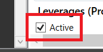

After the loan has been activated, you can then go into its **Statement** area, click the **Transactions** button, then select **Manual Payment**.

In the Manual Payment window, set the **date** of the payment, and **enter the payment amount into the middle row in the Principal column**. You will see that the Closing Principal Balance field gets shaded red, indicating that the loan will be taken into a negative balance.

When the window looks good, click the **Post button** to post it to the loan. Click **Yes** on the pop-up window that appears.

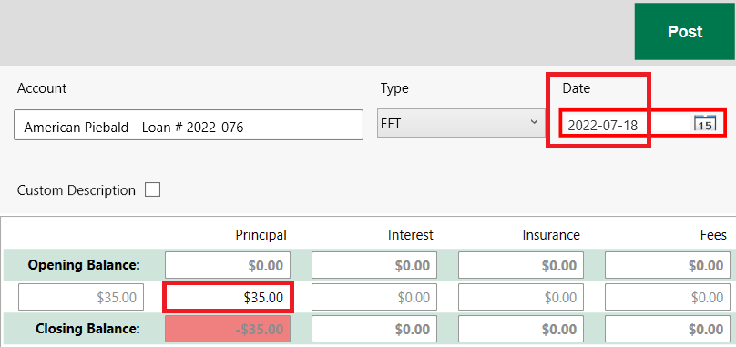

The result is that the loan will now have a negative Principal balance, and it will be reverted from Paid Out/Paid in Full to a **Closed Deal/Disbursed loan status**. See this section of the User Guide for steps on how to post a Paid Adjustment to bring the loan back to a 0.00 balance, reflecting the client being reimbursed by the overpaid amount: [FaaSBank User Guide](https://docs.google.com/document/d/1DtA1c6eWvJQ0mkmqoA6iWnAp13z3Q8UmvwPTQlMC72E/edit)

## Posting Charges

### Fee Charge

TBC!

#### Why is Interest being charged when I post a Fee Charge transaction to a loan?

The screenshot below shows an example of this happening: we posted a $100 Admin fee to our loan, and for some reason, **FaaSBank charged Interest to the loan as part of the transaction**. In our example, $304.65 of Interest was charged to the loan with the posting of the Admin fee.

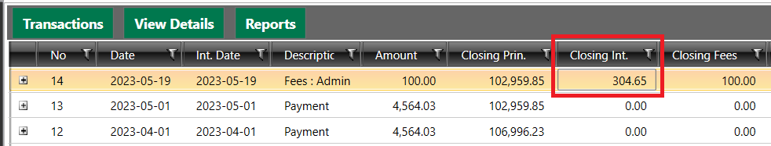

This occurs when the loan has **the '*Capitalize Fees*' option enabled** for the Interest Term that is effective as per the Fee post date. When this option is enabled, it means that Interest gets charged on the loan's outstanding Fee balances (which subsequently means that **Interest gets charged with the posting of Fee charge transactions**).

A loan's Interest Term records can be found within its **Options tab**. The 'Capitalize Fees' check-box determines this behaviour.

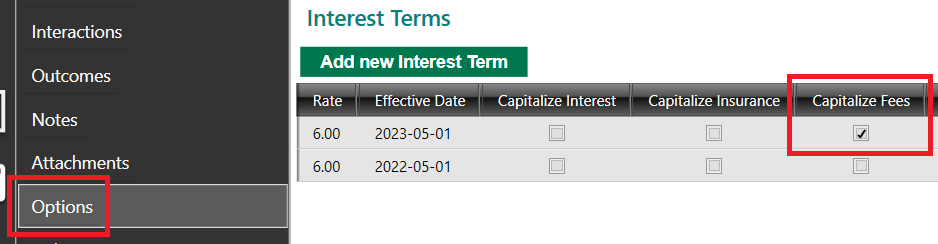

When a row in the Interest Terms grid is shaded grey, it signifies that that Interest Term has been used as part of an Interest calculation in the software, which means that the record **cannot** be manually edited by a user. In other words, FaaSBank won't allow you to edit a loan's Interest rate information if that rate has already been used to calculate Interest as part of a transaction posted to the loan.

If you wish to **stop** Interest being charged on Fees for a specific loan, you will need to **add a new Interest Term record that has the '*Capitalize Fees*' option disabled**. Note: if Interest was charged as part of a recent Fee transaction and it should **not** have been, you would want to **delete that Fee charge transaction *prior* to adding your new Interest Term record** to the loan (you can then repost the Fee after the new Interest Term record has been saved, which will result in no Interest being charged as part of the transaction).

In that situation, the process would be as follows:

1. Delete the Fee transaction that should not have included charged Interest. Note: if subsequent transactions have been posted after the Fee, you will need to delete those before you can delete the Fee transaction itself. (That opens up a whole new can of worms though, as it means the Interest accrued amounts for those transactions will differ when you come to repost them, as the loan will no longer have Interest charged on outstanding Fee balances 🙃.)  
2. In the loan's Options area, **use the '*Add new Interest Term*' button** to add a new row into the Interest Terms grid.  
3. Click into the new row, and update it as needed. In most instances, unless you are actually changing the loan's Interest Rate itself, you are going to want it to match the previous row exactly, with two key differences:  
   1. Set the ***Effective Date*** to match **the date of the last transaction posted to the loan**.  
   2. **Make sure that the '*Capitalize Fees*' check-box is disabled**.  
4. When your Interest Term row looks good, click the **Update button** in the top-right corner of the software to save the change.  
   1. At this point, FaaSBank will display a pop-up window mentioning that you may want to create a new Bring Forward amortization schedule to reflect the change you made to the loan's Interest Term. Creating a new schedule would only be necessary if you charged other Interest particulars (e.g. the loan's actual Interest Rate itself), or if the loan's current amortization schedule includes **Fee charge transactions** e.g. a monthly or annual fee charge.  
5. **Repost your Fee charge transaction** and any other transactions you deleted as part of the process. You should now see that **no** Interest was charged with the posting of the Fee transaction.

We walk through this process in the video linked below. We understand that this can be complicated, so don't hesitate to reach out to us at [support@faasbank.ca](mailto:support@faasbank.ca) if you have any questions about it 🙂

[FaaSBank - switching off fee capitalization for an individual loan - Watch Video](https://www.loom.com/share/57903c7d58f44d27983cd3a02c90b04e)

[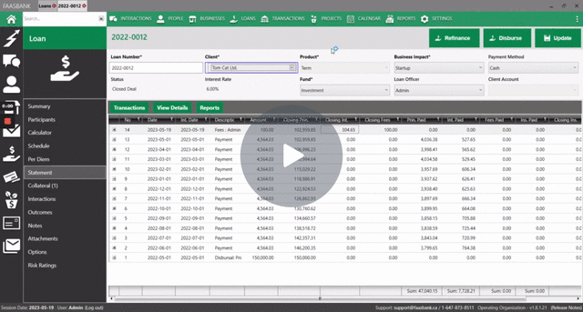](https://www.loom.com/share/57903c7d58f44d27983cd3a02c90b04e)

##### Why is 'Fee Capitalization' enabled for my loans?

When you create a new loan in the software, FaaSBank grabs a bunch of default information - default interest rate, default interest calculation method, whether or not fees should be capitalized etc. - from the loan's selected **Product**. The loan **inherits** this information from the Product; which means that unless you tell the software differently, the loan in question will have its interest calculation particulars set to match its selected Product's defaults. For example, if one of your loan products has the '*Capitalize Fees*' check-box enabled in **Settings -> Loans -> Products**, then any new loans you create on this product will automatically have the '*Capitalize Fees*' option enabled.

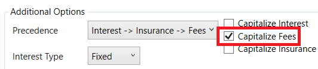

If you no longer wish to charge Interest on Fees for new loans moving forward, you should untick the '*Capitalize Fees*' option for the loan product in question, then save the change. Note: doing this will **only impact new loans** you create on that product: it will **NOT** disable the '*Capitalize Fees*' option **for existing loans** that already have it enabled. You would need to handle that situation on a loan-by-loan basis.

### Interest Charge

TBC!

### Global Interest Updater

**FaaSBank's Global Interest Updater tool** that can be used to quickly post interest charge transactions to all (or select) loans in bulk.

Please see the steps below related to the global interest updater tool:

1\. The Global Interest Updater is launched from **Settings -> Loans -> Extras**. In here, click the **Global Interest Updater button**.

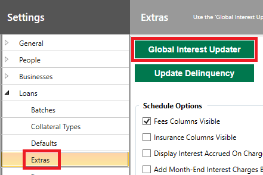

2\. In the left column of the Global Interest Updater window, **select the date** you would like to post the interest charges to the loan. For example, if you wanted to post January month end charges, you would set the date to January 31st. When you change the date, the main grid area will refresh.

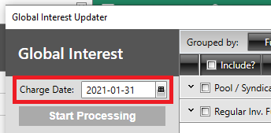

There are also a few tick-boxes in the left column which you can use to **exclude** certain types of loan if needed. Excluded loans will **NOT** receive interest charge transactions.

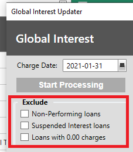

3\. When your date is selected, you then need to select **which loans will receive an interest charge transaction**. This gets done in the main grid area of the window.

To select all loans, simply tick the wee **box found at the top of the first column**. This will then automatically select all eligible loans. If you don't want all loans to receive interest charges, you can expand the funds and manually select/deselect loans as required.

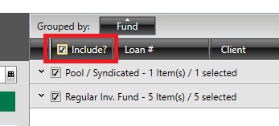

4\. When the relevant loans and the correct date are selected, use the **Start Processing button** to initiate the global interest updater. After a confirmation pop-up, it will then post interest charges to all the selected loans as per the selected date.

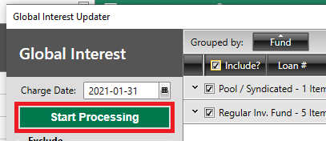

After posting it will ask if you want to generate a report to show all the interest charges that got posted; and if you open one of the impacted loans and view its Statement, you will see a new interest charge transaction appear there 🙌

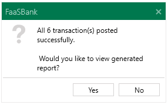

### Insurance Charge

## Reversing / Deleting a Transaction

### What's the difference between the two?

Reversals and deletions are very similar. The key difference between them is that by default reversals **will** appear in the FaaSBank user interface - for example, on the loan's Statement - and on reports, whereas deletions will **not**. **Deletions get hidden by default**.

Our best practice recommendations are:

* **Reverse** a transaction where the fault or problem is a result of the **client** e.g. a cheque came back NSF. In this case, you would want to reverse this transaction so that you and the client can see it on reports. Reversals appear red on a loan's Statement.

* **Delete** a transaction where the fault or problem is a result of **user error** e.g. a user posted a payment for an incorrect amount. In this case, you would want to hide this transaction from reports by default, so deleting it makes more sense. Deletions appear blue on a loan's Statement.

If you wish to **view deleted transactions** on the loan's **Statement**, you can **tick the 'Show deleted transactions' check-box** found in the top-right corner of the grid.

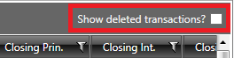

Similarly, if you wanted to include deleted transactions on reports, for example the Loan Details report, you would have to **tick the 'Deleted' transaction parameter** prior to generating the report:

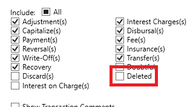

### How to Reverse or Delete a Transaction

To reverse or delete a transaction, open the loan's **Statement** tab, click the **Transactions button** found at the top of the Statement, then **select your desired option**:

* Delete Last Transaction; or  
* Reverse Last Transaction

Both options will open a transaction window, allowing you to either reverse or delete the last transaction posted to the loan.

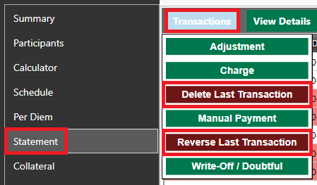

### Reversal/Deletion MVPs (Most Vital Points) 🏀

The most important thing to note is that **you can only reverse/delete the most recently posted non-reversed/deleted transaction on a loan**.

Confusing? 😕

Let's try to clarify things with a few examples:

On the loan in the screenshot below, if we were to perform a reversal or a deletion, it would impact the payment for $3,306.65 posted 2020-07-15, as it is **the most recent transaction posted to the loan which has not yet been reversed/deleted**.

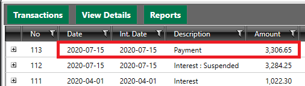

Now, let's imagine that we have reversed that payment. In this case, the loan's Statement will now look like the screenshot below, with the Reversal transaction being the most recently posted to the loan:

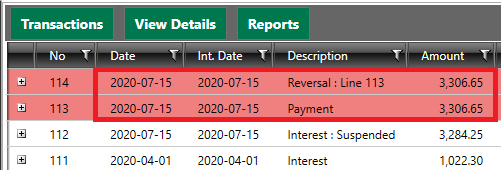

In this case, if we were to perform a second reversal or a deletion, it would impact the **'Interest: Suspended' transaction** posted 2020-07-15, as **it is the most recent transaction that has not been reversed or deleted**.

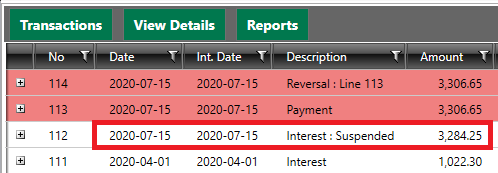

Which brings us to a very important point: **it is not possible to reverse/delete a transaction that has already been reversed/deleted**! To achieve this, simply **repost** the transaction to the loan.

For example, in the screenshots above, we reversed the payment dated 2020-07-15. If this was an accident and the payment should never have been reversed, the way to rectify the situation would be to **repost the payment to the loan**.

### Help! I accidentally reversed a transaction that I meant to delete! (or its twin sister: I accidentally deleted a transaction that I meant to reverse!)

As mentioned above, reversals and deletions are very similar: the primary difference is that reversals are shown on the loan's Statement and reports, whereas deletions are hidden by default.

If you accidentally reversed a transaction that you meant to delete - or accidentally deleted a transaction that you meant to reverse - you can very easily rectify the situation by **right-clicking** the transaction in the loan's Statement, and **selecting the 'Mark as Deleted' option** (or '**Mark as Reversed**' option).

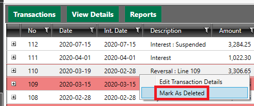

For a reversed transaction, this will mark it as deleted and hide it from the loan's Statement; whereas for a deleted transaction, it will mark it as reversed, and show it in the Statement.

## Posting an Adjustment

The Adjustment window can be used to make adjustments to loan balances, and also to post forgiveness amounts to loans on forgivable loan programs e.g. CF RRRF loans.

### "Missing a General Ledger account" message when attempting to post a loan forgiveness transaction

If you encounter the error message below when attempting to post a forgiveness transaction in the Adjustment window, it means that the loan's fund is **missing a Forgiveness Expense GL account**. To ensure that accurate journal entries can be created, FaaSBank will require a Forgiveness Expense account to be identified for the fund.

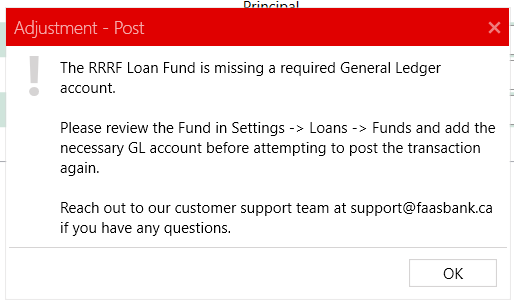

To identify the Forgiveness Expense account for the fund, go to **Settings -> Loans -> Funds**, and select the relevant fund from the fund list i.e. the fund associated with the loan in question.  

You will see a field named ***Forgiveness Expense***. Use it to select the GL account that should be **debited** by the posting of a forgiveness transaction on the selected loan fund.  

If your org **doesn't** use the journal features of FaaSBank, you can safely select any GL account in the field as you will not be using the journal entries created from the software..  

If you **do** use the journal features but you don't see the relevant GL account in the field's account list, you can add a new GL account in **Settings -> General -> GL Accounts**, then come back into the Funds section and select the account.

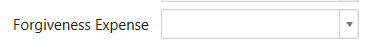  

Once the Forgiveness Expense account has been identified for the fund, **save the change** using the Save button in the top-right corner of the window. You should then be good to proceed with posting the forgiveness adjustment transaction to the loan.

## Loan Consolidation - Merging One or More Loans Together

A short video showing how to use the Loan Consolidation tool can be found [here](https://www.loom.com/share/194be297db6d43e79235387095d7c254?sharedAppSource=team_library).

FaaSBank's **Loan Consolidation** window can be used to **merge one or more loans together**.

FaaSBank charges interest to the selected merge date, and **transfers the entire loan balances into one selected loan**. No need for pesky adjustments, manual interest calculations or manual loan status changes - FaaSBank does all that heavy lifting for you 💃💪

First you will want to open the **Loan consolidation window** via the tile on the home screen:

In the **'Target Loan' field** at the top, select the loan that will **remain after the transaction** i.e. the loan that the other loans will **be merged into**.

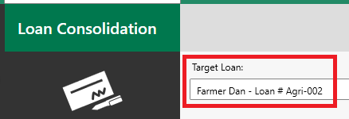

Next, identify the transaction **date** i.e. the date that the loans will be merged together.

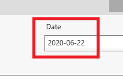

In the **'Loan' field** in the middle of the window, **search for and select the loan that will be merged into the 'Target' loan**. When the loan is selected, click the green **Add button**.

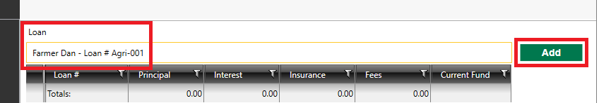

This will add the loan into the grid under the field.

If you are **merging multiple loans into the 'Target' loan**, perform the same process for each loan: search for the first loan in the 'Loan' field, then click the **Add button** to add it into the grid; search for the second loan in the 'Loan' field, then click the Add button etc. Do this until all loans that will be merged into the 'Target' loan appear in the middle grid.

The fields under the grid show the net impact of the transaction. The **Closing Balance row** shows you what the 'Target' loan's closing balances will be if you post the consolidation.

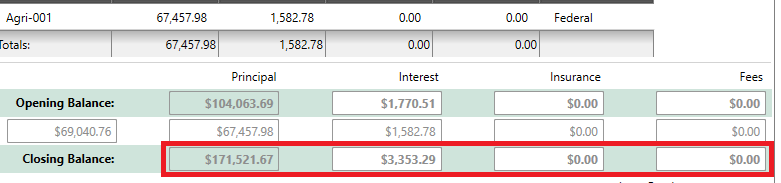

If all looks good, click the **Post button** in the top-right corner of the window to post the consolidation. Click **Yes** on the confirmation window.

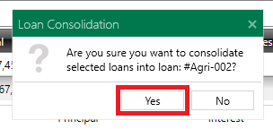

Posting this transaction will transfer the selected loan's (or loans') balances into the 'Target' loan; and it will **automatically advance the merged loan(s) to 'Consolidation' status**. The date and amount of new status will be set to the date and amount of the Consolidation transaction.

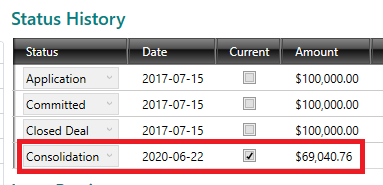

A **Consolidation transaction** will be posted to all loans involved, making it easy to see when and from where the balances were transferred.

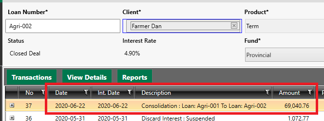

### Deleting a Consolidation

A Consolidation transaction can be deleted like any regular FaaSBank transaction.

Deleting a Consolidation will:

1. Delete the Consolidation transactions for **ALL** loans involved; and  
2. Delete the 'Consolidation' statuses that were added to the merged loans.

## Loan Write-Offs

A loan can be written off using the Write-Off window. It will allow you to perform either a full or partial write-off.

The Write-Off window can be accessed via the button on the FaaSBank home screen, or via the Transactions button found within the loan's **Statement**.

### Regular vs. Discard Interest Write-Offs

A **Regular** write-off will write-off **ALL** of the loan's outstanding balances, including any outstanding interest, fees and insurance. (It should be noted that a user can edit the amounts to be written-off though. Doing this would result in a partial rather than a full write-off.)

On the other hand, a **Discard Interest** write-off will write-off all outstanding balances **EXCEPT any outstanding interest**. Rather than writing off the interest, FaaSBank will simply **un-charge it** from the loan and discard it. This method can be useful when it comes to writing off loans that have huge outstanding interest balances: organizations may decide to discard the interest amount because they know the client will never pay it back.

If you are **partially** writing off a loan, you can click into the Amount fields and update the values as necessary. For example, in the screenshot below, I am doing a discard write-off (which clears the loan's interest balance to 0.00), but I am only partially writing off the Principal: I am writing off $10,000, which leaves a closing Principal balance of **$17,295.30**.

Fully writing off a loan - be it via the Regular or Discard Interest methods - will advance a loan to **Bad Debt status**; whereas partially writing off a loan will leave it at **Closed Deal status**. (A partially written-off loan will then get automatically advanced to Bad Debt status when its remaining balances are either paid down or written-off.)

### Doubtful / Provision for Loss

Doubtful / Provision for Loss balances can be applied and edited via the **Write-Off** transaction window. It can be accessed via the FaaSBank home screen, or via the Transactions button found within the loan's **Statement**.

**Note**: posting a Doubtful Write-Off transaction does **not** change a loan's balance in any way. It is solely used to identify/specify the portion of a loan that you consider to be doubtful for collection for the client.

After you have selected the relevant loan in the Write-Off window, you will next want to set your **date** (this will be the date the Doubtful transaction gets posted to the loan) and select **Doubtful** from the Write Off Method drop-down menu.

When this is done, **enter the loan's Doubtful amount into the New Doubtful field**.

For example, the loan below has an outstanding Principal balance of $126,462.05, and we are specifying that $100,000 of that is considered Doubtful. (Outstanding Interest, Fee and Insurance balances can also be included in the specified Doubtful amount if required.)

Enter any relevant comments into the window's Comments field, then click the **Post button** to post the transaction. A pop-up window will ask you to confirm. Click **Yes** to proceed.

This process will post a **Doubtful transaction** to the loan's Statement. If you open the loan, you should be able to view the transaction. When a loan has a Doubtful balance, you will see a **Doubtful column** appear at the very right side of the Statement window. This column only appears if a loan has (or had) a Doubtful balance.

When a loan has a Doubtful balance, a **Doubtful Amount** row will appear in the Loan Details grid on the loan's Summary page. Clicking the **Edit button** will launch the Write Off window, allowing you to edit the loan's Doubtful balance.

#### Editing the Doubtful amount on a loan

As mentioned above, a user can edit a loan's Doubtful amount by clicking the **Edit button** found on the loan's Doubtful Amount row. Clicking this button will open the Write Off window.

Alternatively, a user can enter the Write Off window, select the relevant loan, then manually **select the Doubtful option** from the Write Off Method drop-down menu.

**Specify the loan's new Doubtful amount in the New Doubtful field**. You will see that the Change in Doubtful field reflects the change you will be making to the loan's Doubtful amount: it will show a negative amount if you are reducing the amount; and a positive amount if you are increasing the Doubtful amount.

In the example below, we are reducing the Doubtful amount on a loan from $100,000 to $40,000. The Change in Doubtful field reflects this by showing -$60,000.

When the New Doubtful amount looks good, click the **Post button** in the top-right corner of the window. A pop-up window will then ask you to confirm if you wish to proceed with modifying the loan's Doubtful amount. Click **Yes** to proceed.

A transaction will be posted to the loan's Statement; and the **Doubtful Amount row** on the loan's Summary page will be updated to reflect the change.

#### Backdating Doubtful transactions

By default in FaaSBank, you can only post a transaction as far back as the most recent non-reversed/deleted transaction on the loan. For example, if a loan has a Payment dated March 15th 2023, you will **not** be able to post any transactions with a date before March 15th 2023 unless you reverse/delete the Payment first.

One exception to this rule is Doubtful transactions, as very often your accountant/auditor may not inform you of the doubtful/provision amounts on your portfolio until many months *after* your financial year end.

FaaSBank has a special setting that can be enabled to allow your organization to backdate Doubtful transactions. In other words, when this setting is enabled, you will be able to post Doubtful transactions ***before*** the date of the last transaction on the loan 🙌

##### Enabling the "Back-dated Doubtful Posting" system setting

You can enable the "**Back-dated Doubtful Posting**" setting from within **Settings -> General -> Organization**. Remember to save the change after ticking the check-box.

##### Posting a backdated Doubtful transaction

When the system setting is enabled, you can post a backdated Doubtful transaction from **within a loan's Statement area**.

In the Statement grid, **right-click** where you want to insert the Doubtful transaction, then select the '***Post Doubtful***' option.

For example, if I wanted to post a Doubtful transaction as per September 30th 2022 on the loan below, I would select transaction line number 60, right-click it, then select the '***Post Doubtful***' option.

A pop-up window will appear, allowing you to **set the date and amount** of the Doubtful transaction to be posted. Select the relevant date in the '*Transaction Date*' field; and specify the Doubtful amount in the '*New*' field. Click the **Post button** when the window looks good.

In our example screenshot below, we are specifying that this loan should have a Doubtful amount of $10,000 as per September 30th 2022.

After clicking the Post button, a pop-up window will appear asking you to confirm that you would like to proceed. Click **Yes** to post the transaction.

After posting, the loan should automatically reload, and you should now see **your backdated Doubtful transaction inserted into the correct position in the loan's Statement grid**.

In our example loan, the Doubtful transaction gets inserted as line 61 on the Statement; and the line number for every transaction falling *after* the Doubtful transaction gets **incremented by 1** e.g. the October 1st 2022 Payment is now line number 62 rather than 61.

##### Deleting a backdated Doubtful transaction

If you messed up something with your backdated Doubtful transaction - e.g. you selected the wrong date or you entered the wrong amount - simply right-click the Doubtful transaction row in the Statement grid, then **select the '*Delete Doubtful*' option**.

A pop-up window will appear asking you to confirm that you wish to delete the transaction. Click **Yes** in the pop-up; then click the **Post button** in the '*Apply Doubtful Amount*' window that appears. Click **Yes** on the final pop-up confirmation window (we *really* want to make sure that your intention is to delete the Doubtful transaction 😅).

Following that, the Doubtful transaction will be removed from the loan's Statement. (You can always view deleted transactions by ticking the '*Show deleted transactions?*' check-box in the top-right corner of the Statement.)

#### Which report will show me Doubtful transactions that have been posted?

Use the **Transaction Activity** (or Transaction Activity by Fund) report to view posted Doubtful transactions within a specific date range.

The report can be accessed from the little menu button in the top-right corner of the software (the three little vertical dots under the exit 'X'). There navigate to **Reports -> Transactions -> Transaction Activity**.

In the report's parameter window, set your date range as needed, then ensure that Doubtful is the only selected transaction type. Doing this will mean your generated report includes **only Doubtful transactions posted within your selected date range**.

## Managing Suspended Interest on a Loan

To suspend interest on a loan is to freeze its Interest balance at a selected date. No further interest will accrue on the loan until interest suspension is switched **off**.

### Switching on suspended interest for a single

To suspend the interest on a loan, go to the loan's **Options tab**:

In Options, you will want to **tick the *Suspend interest on this loan* box**.

After doing this, use the ***From*** **field** to select the date from which interest will be suspended on the loan.

When the date has been selected, click the **Update button** in the top-right corner of the Loan record to save the change.

You will then be presented with a confirmation pop-up window, asking you to confirm that you want to suspend interest on the loan from the selected date. This window will also inform you of how much interest will be charged to the loan's Outstanding Interest balance (if any).

In our screenshot below, it tells us that suspending interest as of September 30th, 2019 will charge **$35.89** to the loan's Outstanding Interest balance. This is **how much interest has accrued on the loan from the loan's last transaction to the selected suspended interest date**.

Click **Yes** to switch on suspended interest.

After clicking Yes, the loan will save and reload.

At the top of the loan record it will now tell you that interest is suspended; and if you look at the loan's Statement tab, you will see a new **Interest transaction** has been posted. If you expand the transaction, you will see that the comment has been populated with the sentence: ***Suspending interest on the loan***.

 

### Switching off suspended interest for a single loan

Note: you will be forced to switch off suspended interest before you can fully payout a loan. See this section of the guide for further details on that process: [FaaSBank User Guide](https://docs.google.com/document/d/1DtA1c6eWvJQ0mkmqoA6iWnAp13z3Q8UmvwPTQlMC72E/edit)

After a period, you may wish to switch **off** suspended interest on a loan. Doing so means that **interest will once again begin accruing on the loan**.

To switch off suspended interest, go to the loan's **Options tab**:

Untick the ***Suspend interest on this loan*** **box.**

When you untick that box, a pop-up window will appear. This pop-up window allows you to determine:

1\.     **The date suspended interest will be switched off**; and

2\.     **How you want to deal with the loan's suspended interest**.

There are two date fields in the pop-up window: **Interest Charge Date**, and **Transaction Date**. Generally, you will want to set both to the same date: the date that you want to switch off suspended interest on the loan. However, if for whatever reason you don't want to charge interest to the transaction date that will appear on the loan's Statement, you can set the Interest Charge Date to fall before the Transaction Date. In our experience this is a rare occurrence.

Following the date selection, you will need to decide **how you want to handle the suspended interest** amount that has gathered up on the loan since interest suspension was switched on. There are three options:

1\.     **Apply** – this will charge the suspended interest to the loan i.e. it will get added onto the loan's Outstanding Interest balance. This is the most common selection.

2\.     **Capitalize** – this will capitalize the suspended interest onto the loan's Principal balance i.e. it will transfer the amount onto Principal, so that interest gets charged on it going forward.

3\.     **Discard** – this simply discards the suspended interest amount without charging it to the loan.

 

When you have selected your dates and Action method, the pop-up window will inform you of the change that will be made. In the screenshot below, we have selected October 18th, 2019, and the Action method ***Apply***.

FaaSBank informs us that switching suspended interest off at this date will **charge $129.21 to the loan's Interest Balance**. (The messaging that appears will be relevant to your selected dates and Action method.)

If all looks well, click the **Post button** in the pop-up window. If you wish to leave suspended interest switched on, click Cancel.

 

After clicking Post, FaaSBank will save the change to the loan and the record will reload. If you then go to the loan's **Statement**, you will see a new Interest transaction has been posted, to reflect the switching off of suspended interest.

In our example, our transaction is called **Interest: Suspended**, and the comment was automatically set to ***Apply suspended interest to the loan***. As per the pop-up message above, we can see that this transaction charged $129.21 of interest to the loan's Interest balance.

Please note that **reversing or deleting the transaction that switched off suspended interest will result in suspended interest being switched back on** for the loan.

### Viewing all loans that currently have interest suspended

To view all loans that have interest suspended, you can go into the Accounts/Loans grid, then at the bottom of the left column, tick the Interest Suspended box. The grid will then refresh to show all loans that have interest suspended switched on.

  

Alternatively, if you wish to see how much suspended interest exists on your portfolio as per a particular date, you can generate the **Loan Balance by Fund report** with the '***Suspended interest at report run date***' **check-box option ticked**.

The report will then include a column called '**Suspended**'. It shows how much suspended interest exists on each loan as per your selected report run date.

### Switching suspended interest on for multiple loans via Global Interest Updater

TBC

### Switching suspended interest off for multiple loans via Global Interest Updater

It is possible to switch off suspend interest for multiple loans at the same time using the Global Interest Updater window.

First, open the Global Interest Updater from **Settings -> Loans -> Extras**.

In the Global Interest Updater window, set the **Charge Date** to be the date that suspended interest will be switched **off** for your selected loans, then **tick the Interest Un-Suspension box**.

The grid will then refresh to display only the loans that have interest suspended as per your selected date.

The next step is selecting **which loans** will have suspended interest switched off. Select the relevant loans using the check-box found in the '*Include?*' column. To switch suspended interest off for **all loans**, tick the check-box found **in the column header**. That will then select all loans on all funds.

Alternatively, if you only want to switch it off for **particular loans**, you can click into the grid and make your selections as needed.

The next step is **very important**, as it determines **how the suspended interest amounts will be dealt with**. There are three options when it comes to handling suspended interest amounts. Make your selection by ticking either the *'App*.', '*Cap*.' or '*Disc.*' check-boxes found in the column header:

1. *App.* = **Apply** – this will charge the suspended interest to the loans i.e. it will get added onto the loans' Outstanding Interest balances.  
2. *Cap.* **= Capitalize** – this will capitalize the suspended interest onto the loans' Principal balances i.e. it will transfer the amount onto Principal, so that interest gets charged on it going forward.  
3. *Disc.* **= Discard** – this simply discards the suspended interest amounts without charging it to the loans.

When the window looks good to go - i.e. you have selected your date, ticked the 'Interest Un-Suspension' field, selected the necessary loans and determined how the suspended interest will be handled - you can then click the **Start Processing button**.

A pop-up window will appear, telling you that suspended interest is going to be switched off. The window will state how the interest is to be dealt with, and how many loans on each fund will be impacted.

If the information displayed on the pop-up window looks good, click the **Yes** button. If there is a problem, click **No** to return to the Global Interest Updater window to make changes.

FaaSBank will then begin the process of switching off suspended interest for the selected loans.

When the process is complete, a pop-up window will appear. Click the **Yes** button to generate a report showing the impact of your batch interest un-suspension. The report will then be displayed in a new window. From there you can print or save a copy as needed.

The final step is to **exit** the Global Interest Updater window. If you then open one of the loans that was involved in the process, you should see that suspended interest has been switched off; and a transaction has been posted to its **Statement** showing evidence of that having happened. The transaction will say whether the loan's suspended interest amount was applied, capitalized or discarded.

### Partial Handling of Suspended Interest

Please note that this feature is switched **off** in FaaSBank by default. If you would like to have it switched on for your organization, please contact [support@faasbank.ca](mailto:support@faasbank.ca).

The partial suspense option allows you to **partially handle a loan's suspended interest amount**, while leaving interest suspension switched **on** moving forward.

When the partial suspension option has been enabled in your FaaSBank, you will see a '**Partial Suspense**' check-box appear in the *Suspended Interest* pop-up window that appears when you untick the '*Suspend interest on this loan*' check-box in the loan's **Options** tab.

When 'Partial Suspense' is ticked in this window, an **Amount** field will appear, allowing you to determine **how much of the suspended interest you wish to apply/capitalize/discard**.

Take a look at the video recording below to see how the process works.

[FaaSBank - partially applying/capitalizing/discarding suspended interest - Watch Video](https://www.loom.com/share/4ec62cb4cd7e469baa40a692fa0d7d26)  

#### When would the partial suspense option be used?

Sometimes you may only want to deal with a portion of the suspended interest that has gathered up on a loan, and leave suspended interest **switched on** moving forward. Fern encountered this at the end of the COVID relief loan cycle: some organizations suspended interest on their entire loan portfolio in March 2020, then switched suspension off as per September 30th 2021.

There were occasions where loans already **had their interest suspended prior to March 2020 though**: for these loans, rather than switching suspended interest off in September 2021, the organization wished to discard **only** the suspended interest that had accrued for the COVID relief period (March 2020-September 2021), but leave the suspended interest amount that existed as per March 2020 (and also leave suspended interest **switched on** moving forward).

### Suspended Interest FAQ

#### I need to suspend interest on a loan, but a payment has been posted AFTER the date that I want to suspend the interest at. Do I have to delete that payment to be able to suspend interest as per my desired date?

Correct - the switch on date for suspended interest can only be **as far back as the loan's last transaction date**. If transactions are dated **after** the desired suspension date, you would have to delete them, suspend the interest, then repost any transactions that were deleted.

#### Is the suspended interest balance showing on the Loan Summary as of the current date? And on the Loan Balance by Fund report, is it at the date of the report?

Correct - the suspended interest balance shown in Loan Summary is as of **the current date**; and the suspended interest balance shown on Loan Balance by Fund is as of the report run date **if the *Interest accrued to report run date* parameter is selected**.

#### If we use the Global Interest Suspension Tool to select multiple loans, or loan funds, presumably you still cannot select a date before the most recent transaction for all selected loans?

Correct - the Global Interest Suspension tool will **exclude** any loans that have a last transaction date dated after the selected suspension date. They won't appear for selection in the Global Interest Suspension tool interface when that is the case.

#### Can you also confirm that suspending interest by using the Global Interest Suspension Tool will result in the same reports as by selecting loans individually – ticking it off there will carry through so it shows in the Loan Options of the individual loans, and on the Loans Balance by Fund report?

Correct - the Global Interest Suspension tool works in the exact same way as manually switching on suspended interest via the loan's Options tab. It's the same process applied in bulk.

#### Is there a report that shows how much suspended interest was discarded?

Yep, the **Transaction Activity report** can be used to find Discard suspended interest transactions that were posted within a selected date range. It can be accessed from the little menu button in the top-right corner of the software. There navigate to Reports -> Transactions -> Transaction Activity.

In the report's parameter window, set your date range as needed, then update the transaction type tick boxes so that **only the *Discard* option is selected**. This means that the report will only include Discard suspended interest transactions posted within your selected date range.

Click **OK** to generate the report.

## Creating EFT (Electronic Fund Transfer) export files

FaaSBank can be used to create EFT (Electronic Fund Transfer) export files that can be uploaded to your financial institution. These files contain all the information pertinent to your expected payments:

* Client name  
* Client bank account that the money will be withdrawn from  
* Client's loan number  
* Date and amount of their expected payment  
* Your organization bank account that the money will be deposited into

FaaSBank is currently capable of creating export files for the following institutions:

* BMO  
* CIBC  
* Desjardins Financial Services  
* First Nations Bank of Canada  
* RBC  
* Scotiabank  
* TD

Please contact [support@faasbank.ca](mailto:support@faasbank.ca) if you wish to use FaaSBank's EFT export functionality but your financial institution is not in the list above.

The steps below outline how to do the following in the software: add your organization's bank account information; add your client's bank account information; how to link a client's bank account to their loan; and how to generate the EFT export file.

### Adding an organization bank account

The first step in being able to create EFT export files is adding your organization's bank account information into FaaSBank's Settings area. This is the account that **EFT payments will be deposited into** (and if you create credit files, the account that the disbursements will be withdrawn from).

Follow the steps below to add your bank account info to the system:

1. Navigate to **Settings -> General -> Bank Accounts**.

   

2. Click the **Add Bank Account button**.

   

3. In the fields at the bottom of the window, enter the following pieces of information:

   \- **Bank** - select your financial institution from the drop-down menu  
   \- **Account Number** - enter your organization's bank account number  
   \- **Transit Number** - enter your five-digit transit number  
   \- **Export Format** - select the EFT export format for your financial institution.

   

4. After you select your Export Format, new fields will appear on the right-side of the window. Use these fields to capture your organization's EFT information. This info should be provided by your financial institution.

   In most cases you will want to set the ***Next File Creation No.*** **value to 1**, as the first export file being generated from FaaSBank should be assigned the number '1'.

   

5. **Save** the change.

### Adding a client's bank account

A client's bank account info gets added to the **Bank Accounts tab** in their **Business record**.

There, click the **New Account button** to add a row to the grid.

Click into the row and update it with the client's bank account info:

* **Bank** - select their financial institution from the drop down menu. If their bank/financial institution doesn't appear in the drop down, it can be added in **Settings -> General -> Banks**.  
* **Transit Number** - enter their bank's transit number.  
* **Account Number** - enter their bank account number.

When the bank account row looks good, click the **Update button** in the top-right corner of the Business to save the change.

**Note**: one Business can contain **multiple bank accounts**. Use the New Account button to add more accounts to the Business record as necessary.

### Linking a Bank Account to a Loan

If the client will be making their loan payments via EFT, you will need to **link the client's bank account to their loan**.

To do this, in the header section of their Loan record, change the ***Payment Method*** **field to EFT**, then select their relevant bank account from the ***Client Account*** drop down menu.

Remember to **save** your change.

Saving this change means that scheduled payments for that loan will be aligned with their bank account in FaaSBank's bulk **Transaction Processing area**. This is where the EFT export files get produced. The steps involved in this are covered in the next section.

### Generating a Payment (debit) EFT export file

The EFT export files are produced from FaaSBank's **Transaction Processing window**. In a nutshell, the process is as follows:

1. Select the payments that should be included in the EFT export file i.e. the payments you expect to receive from your clients.  
2. Create an EFT batch, which in turn creates the EFT export file.  
   1. At this stage you would send/upload the file to your financial institution outside of FaaSBank.  
3. This places the payments into FaaSBank's EFT Manager area.  
4. From there, you can immediately post the payments to the loans, or hold off until you receive a confirmation report from your financial institution.

The steps below outline the EFT export file creation process:

1\. Open the **Transaction Processing** window via the Transactions button on the top menu bar.

2\. In the left column of the window, **advance the 'Effective Sweep Date' to the date of the EFT run** e.g. if the payments are expected on the 15th of the month and the current date is the 12th, you would want to advance the date to the **15th** so that all of the scheduled payments **up to and including** that date are brought into the grid.

You should then see the expected EFT payments get displayed in the main grid area of the window. **Note**: non-EFT payments will be displayed in the grid too. They will **not** be featured on the EFT export file though: only payments where **Type = EFT** are taken into consideration.

3\. Review the list of payments to **ensure the dates and amounts are correct**.

If a selected EFT payment should **NOT** be included on the EFT file, **untick the 'Post' box** found in its first column. **Only EFT payments to be included on the EFT export file should have their 'Post' box ticked**.

If you need to **manually add a payment** - i.e. an EFT payment that doesn't currently appear in the grid but should be included on the export file - then use the **Add Manual Payment button** in the right column.

This will open up the *Payment Details* area at the bottom of the grid to allow you to select your loan and enter the relevant payment details. Click the **Add Payment button** to add the manual payment to the grid. This will mean it can be included in the EFT export file.

4\. Once all relevant EFT payments have been selected via the 'Post' column, click the **Process EFT button** in the right area of the window.

In the pop-up window that appears, use the **Bank Account** drop down menu to select the organization bank account associated with the EFT export file being created i.e. this is **the account into which the client payments will be deposited**.

Click into the **Location field** to choose a save location for the file on your computer.

If this is a test file - for example, if you are working with your financial institution to ensure they can accept the file format being produced by FaaSBank - tick the '*Test File?*' check-box.

Finally, click the **Continue button**.

FaaSBank will then save the EFT export file to the location you identified; and it will move the selected payments into FaaSBank's **EFT Manager** area. It will also provide you with the ability to print an **EFT Processing report** showing the payments that were included on the file. Click Yes on the pop-up window to generate the report.

**Note: this will not have posted the payments to the loans!** At this stage the payments are in the **EFT Manager**, which is a kind of limbo area, reflecting that the export file has been sent to the financial institution, but you don't yet know which of the payments have been received.

Generally, most organizations will **immediately post the payments to the loans** after creating the export file.

To do this, go into the **EFT Manager** area by clicking the button in the left column of the Transaction Processing window. The figure shown in brackets tells you how many EFT payments exist i.e. this is how many EFT payments are yet to be posted to your loans.

In the EFT Manager area, review the payments to ensure that everything looks good (the payments should reflect exactly the EFT export file that was created, so generally no changes are necessary).

If everything looks good, click the **Post button** in the right column.

If no errors are encountered, a pop-up confirmation window will show you how many payments are about to be posted. If the number of payments looks correct, click the ***Yes*** **button** to post the payments to the loans. After the payments have been posted, you will be provided with the option of generating a **Transaction Processing report** showing all of the posted payments.

### Common error messages when creating the EFT export file

#### The EFT batch cannot be created as one or more of the selected EFT transactions are not linked to a valid bank account.

The following pop-up message indicates that one or more of the EFT payments selected in the Transaction Processing grid are missing valid bank account information.

In most cases this means that **a bank account has not been linked to that particular loan**. FaaSBank can only include a loan on an EFT file if its bank account info exists.

First, to see if a bank account exists for the Business client, find the offending row in the grid (it will be identified via a '*No bank account selected for this transaction*' message in the grid's Error column), expand the row using the little **+** button at the left side, then **click into the *Bank Account* field** displayed in the sub-row. This field will show any bank accounts that exist for that Business in FaaSBank.

If the relevant bank account appears in the drop down menu, **select it**. This will resolve the error message for this particular loan's payment when you come to create the EFT file.

On the other hand, if the Bank Account field is **blank**, this means that **no bank account** exists for the Business record in FaaSBank.

If this client's payment is to be included in the EFT export file, you will need to **add their bank account to their Business record and link it to their Loan**. To do that, follow the steps [here](05-transactions.md#adding-a-clients-bank-account) and [here](05-transactions.md#linking-a-bank-account-to-a-loan).

After adding the bank account, if your Transaction Processing tab is still open, return to it, right-click the payment row in question, then select **Refresh**.

If you click into the Bank Account field, you should now see that the client's bank account is shown. **Select it from the drop down menu**.

**Do this for each EFT payment that is missing bank account information**. Following that, attempt to create the EFT export file again.

### Generating a Disbursal (credit) EFT export file

TBD

*Ahhh, I forgot to print the EFT Processing report! And/or I forgot to create the EFT export file! And/or I lost the EFT export file!*

## Transaction Export window

The Transaction Export window in FaaSBank is where a user can create journal entries based on the loan/grant transactions that have been posted in the software. Please see the next section of the User Guide here for information on the journal entry set-up and creation process: [FaaSBank User Guide](https://docs.google.com/document/d/1DtA1c6eWvJQ0mkmqoA6iWnAp13z3Q8UmvwPTQlMC72E/edit)

### Transactions section

When you post a transaction in FaaSBank, it gets placed into what we call a "transaction batch". A transaction batch is just a grouping of posted transactions that share something in common (generally they were posted in the same calendar month).

In the window's left column, you will see two grids: one showing "Open" transaction batches, and the other showing "Closed" transaction batches. A "Closed" transaction batch simply reflects that **journal entries have been created for the transactions within that batch**. When a user selects an "Open" transaction batch and uses either of the 'Close and Export Batch' or 'Close Batch' buttons in the right column, FaaSBank will create journal entries for all selected transactions in the batch, then "close" the transaction batch. (Note: if a user manually **deselects** some of the transactions in the batch, journal entries will **NOT** be created for those transactions. In this case the transaction batch will remain open, populated with just the deselected transactions. All selected transactions will be placed into a "Closed" batch.)

When a transaction batch has been "closed", its associated journal entries can be found within the Journals section of the window.

#### What does the grid in the Transactions section show?

The Principal / Interest / Fees / Insurance columns in the Transaction Export grid do **not** reflect paid amounts, as the grid can contain different types of transactions (disbursals, payments, consolidations, fee charges, adjustments etc.) That is not their intended purpose.

The columns in the grid reflect the **net impact** of the transaction on the loan, as this is more akin to what the journal impact for the transaction would be. For a Payment transaction, the Interest column shows the difference between the Interest that was **accrued**/charged with the payment versus the Interest that was **paid** with it.

For example, here is a payment for $1,141.62. In the Transaction Export window, the Principal column shows (378.94) and the Interest column shows 0.00:

If we look at the loan's Statement though, we can see the impact of the Payment on the loan:

* It paid down $378.94 of the loan's Principal balance  
* $762.68 of Interest was charged as part of the Payment, and $762.68 (i.e. the full charged amount) was paid.

This is why the Transaction Export grid shows 0.00 in the Interest column for the Payment transaction: it is a reflection of the net impact. The amounts cancelled each other out.

If you need to see **paid** amounts, you can always right-click on the batch row in the window's left column, then select **Transaction Activity report**. It will generate a report that has separate columns for Charged versus Paid amounts.

## Creating Journal Reports & Export Files

### Review your loan fund-GL account setup

If you plan to use FaaSBank's journal features, before posting any transactions in the software you should **review your loan fund setup to ensure that the correct General Ledger accounts are identified for each fund**. This can be done in **Settings -> Loans -> Funds**.

Please see this section of the User Guide for information on configuring loan funds, GL accounts, and your desired accounting package: [FaaSBank User Guide](https://docs.google.com/document/d/1DtA1c6eWvJQ0mkmqoA6iWnAp13z3Q8UmvwPTQlMC72E/edit)

### Using the Transaction Export window to create journal entries

Journals in FaaSBank can be created in the **Transaction Export window**. It can be accessed via the tile on the software's home page.

By default, transactions in FaaSBank get placed into **monthly** batches e.g. all transactions dated in February 2021 get placed into a batch together. (If needed, the batch frequency can be changed in FaaSBank's Settings area: Settings -> Loans -> Batches.)

In the left column of the Transaction Export window, you will see a grid showing **Open** transaction batches. These represent transactions that have **not yet had their journals created**. (Closed batches on the other hand represent transactions that **HAVE** had their journals created.)

The first step in the journal creation process is selecting the relevant open transaction batch. This is the batch that includes the transactions you wish to create journals for. **Select the desired batch in the Open grid**.

The window's main grid area will then display all the transactions included in that batch. White rows are transactions that will have journals created, whereas transactions shaded grey will **NOT** have journals created. (Transactions can be excluded from the journal process based on the organization's external accounting setup in Settings -> General -> External Accounting.)

For example, many organizations exclude disbursal transactions from the FaaSBank journal process as they manually cut the cheques from their accounting packages. Importing the transaction's FaaSBank journals would result in duplication in their accounting system. In this case, much like the 'Interest' charge transaction shown in the screenshot below, disbursals would be shaded grey as they are not included in the journal process.

By default FaaSBank will create journal entries for all of the white transaction rows found in the batch. If for some reason you wish to **exclude certain transactions**, you can use the **Export** column in the grid to deselect those items. When transactions are deselected, they will remain within the open transaction batch. Their journals can be created at a later date as needed.

When you have confirmed that the correct batch has been selected - and all relevant transactions are selected - you will want to use one of two buttons found in the window's right column:

* **Close and Export Batch**  
  Use this button when you **want to create a journal export file** from FaaSBank. When this option is selected, FaaSBank will produce a text or CSV file that can be imported into your accounting package. After the file has been created, you will also be given the option of generating a printable report that shows all the journals contained on the file.

* **Close Batch**  
  Use this button when you want to create journals for the selected transactions, but you do **NOT** want to create an export file. This option is most frequently used by organizations who manually enter their journals into their accounting system. This option will create the journal entries and provide the user with a printable report showing all of the journals in the batch.

When you click either button, you will be faced with a pop-up that looks like the one below. This is FaaSBank confirming that you wish to create the journals for the selected batch. Click **Yes** to proceed.

Some organizations create **separate journal export files for each of their loan funds**. If this is the case for your organization, at this stage you will see an additional pop-up window, asking if you wish to create files for each relevant loan fund.

Following this, you will be able to decide **where on your computer you wish to save the journal export file(s)**. **Before importing the journal file, Fern would recommend that you review the generated Journal by Fund report**, to ensure that the relevant general ledger accounts will be debited/credited as anticipated. After the journal report has been reviewed, you can proceed with importing the exported file into your accounting system.

Finally, you will then be presented with the opportunity to view a printable **Journal by Fund report**. Click Yes on the pop-up window to generate the report. The report is a visual representation of the journals included on the export file.

### FAQs - Journals

#### I changed the GL account setup for a loan fund, but the journals for my posted transactions did not get updated to reflect my change?!

If you post a transaction *then* change the GL account setup for the loan's fund, the account changes do **NOT** get reflected in the journals for those transactions: its journals will still reflect the GL accounts that were assigned to the fund **when the transaction was *originally* posted**.

If you need a posted transaction to reflect your GL account change(s), you should do the following:

1. **Reverse/delete** the transaction that is impacting the old GL accounts.  
2. **Repost the transaction**. During the posting process, FaaSBank will pick up your GL account changes and reflect that in the journals for the transaction.

#### Ahhh, I forgot to print the Journal report! And/or I forgot to create the journal export file! And/or I lost the journal export file!

If you forgot to print the Journal report, forgot to create the journal export file, or if you've misplaced the journal export file, you can quickly perform these processes within the Transaction Export window's **Journals tab**.

When journals are created, they are placed into **a journal batch**. To regenerate the Journal report, in the Journals tab, locate your desired batch, **right-click its row then select either of the report options**: Print Journal Report or Print Journal By Fund Report. The report will then be generated in a separate window.

If you forgot to generate - or misplaced - the journal **export file**, select your desired journal batch in the window's left column, then click the **Accounting Export button** in the right column. FaaSBank will then allow you to save a new copy of the file to your computer.

