# Loan Management

## Clearing up Small Remainder Balances

### Outstanding Interest

If a loan has a small outstanding Interest balance, you can adjust it off via a regular Adjustment by entering the amount into the **Decrease Interest** **Balance** field.

For example, with the below loan, it has a small outstanding Interest Balance of **$0.03**. To clear it, we set the **Date** field as required (generally, though not always, you will want this to be the date of the most *recent* transactions on the loan), then enter the amount into the **Decrease Interest Balance** field. You can see that this will result in the loan's Closing Interest Balance being updated to $0.00.

Use the **Post** button in the top-right corner of the Adjustment window to post the transaction.

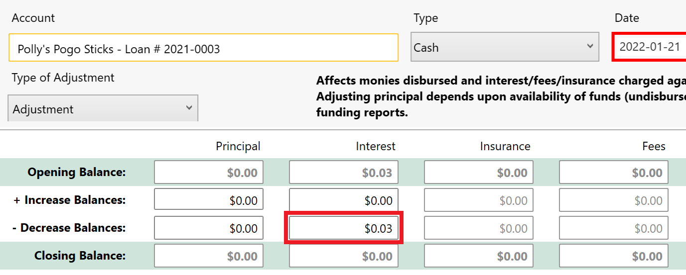

If the loan has no undisbursed amounts (and no other outstanding balances), posting such a transaction will result in it being advanced to a **Paid Out loan status**. You will be able to see evidence of the transaction on the loan's Statement.

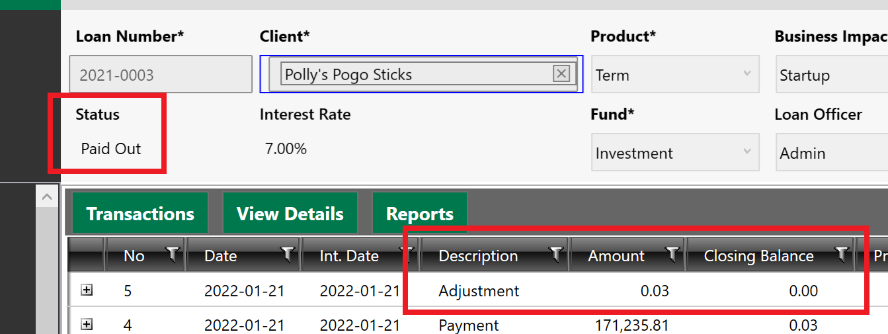

### Outstanding Principal

Post a **Forgiveness Adjustment**. This allows you to "**forgive**" part of a loan's Principal balance, rather than writing it off. **Note**: this type of adjustment is switched **OFF** by default. Please contact [support@faasbank.ca](mailto:support@faasbank.ca) if you would like to have it switched on for your organization.

Before posting one of these transactions, someone in your organization will need to go into **Settings -> Loans -> Funds** and identify which GL account should be aligned with the forgiven amounts. This would be the account that gets **debited** by the Forgiveness transaction. This Forgiveness Expense account can be identified for each of your loan funds. (If a new GL account needs to be created for this, that can be done in **Settings -> General -> GL Accounts**.)

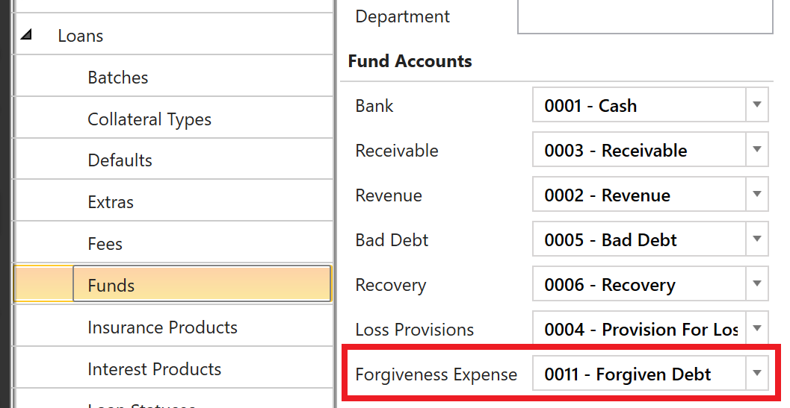

When you have confirmed that a Forgiveness Expense GL account exists for the loan fund, you can then use the **Adjustment** window's ***Adjust Forgiven Amounts*** **option**. After selecting it, enter the desired amount of the forgiveness into the *Principal Decrease Balance* field. When everything looks good, click the **Post button** to post the transaction.

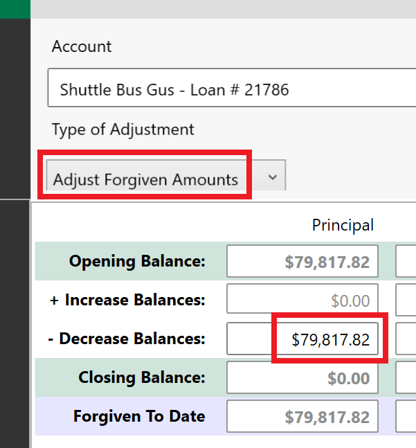

This will post a **Forgiveness Adjustment transaction** that you will be able to see on the loan's Statement.

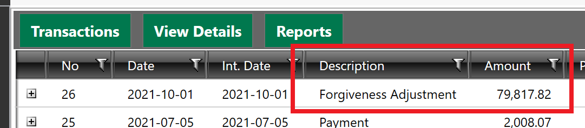

## Skipping Scheduled Payments

In FaaSBank a user can flag a scheduled payment as being "**skipped**". This tells the software that the client has been **provided with permission to miss the payment**.

Flagging a payment as "skipped" will stop it from showing as unprocessed within Transaction Processing, **without it negatively impacting the loan's delinquency**.

### Skipping a Payment within a Loan Record

To skip a specific payment on a loan, go into the loan's **Schedule tab**, **right-click the desired payment**, then choose the ***Mark as Skipped*** **option**.

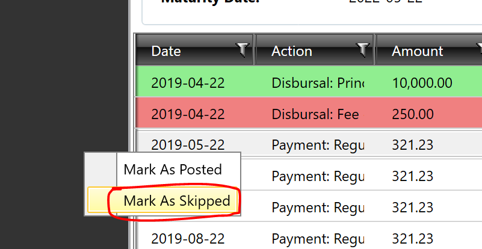

After the change has been saved, you will see that the payment gets shaded orange. This reflects that it has been successfully identified as "skipped".

### Skipping a Payment from within Transaction Processing

It is also possible to quickly and easily flag scheduled payments as being "**skipped**" in FaaSBank's **Transaction Processing area**.

To flag a scheduled payment or payments as "skipped", please follow the steps below:

1. Go into FaaSBank's **Transaction Processing area**.

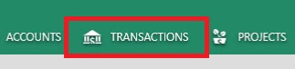

2. In the left column, **advance the Effective Sweep Date so that it pulls in all desired scheduled payments**. For example, if you wanted to mark all April payments as being skipped, you would want to set this date to **April 30th 2020**, so that it pulls in all of that month's scheduled payments.

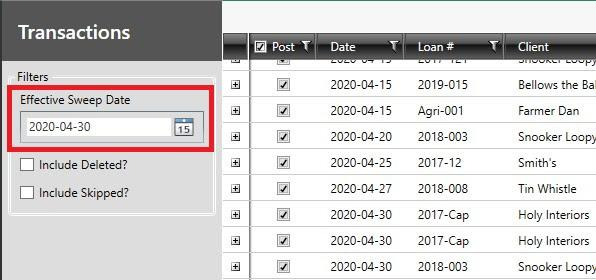

3. Using the **Shift or Ctrl buttons** on your keyboard, you can then **click and select all the payments that will be marked as skipped**. **When a payment has been successfully selected, its row will appear highlighted in gold/orange**, like in the screenshot below.

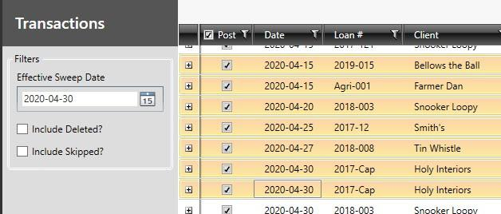

4. When the relevant payment/payments have been selected, you will then want to **right-click one of the selected payments and select the Skip option. NOTE:** We would not recommend selecting **ALL** of the payments to be skipped at one time. Breaking them down into groups of 5/10/15 payments at a time should make it more manageable.

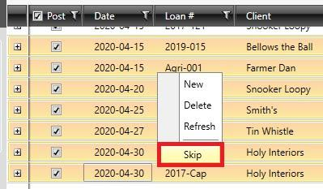

5. When you click Skip, **a pop-up window will appear, showing all the payments that will be marked as skipped**. If all looks good, click the **Skip button** in the bottom-right corner of the window:

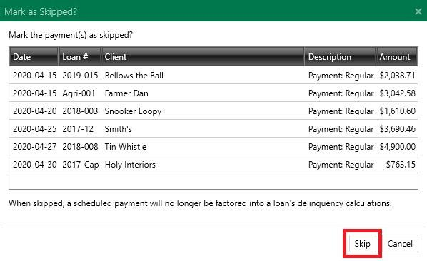

Clicking the Skip button will flag those payments as skipped. This in turn **removes them from the Transaction Processing grid as they are no longer expected to be received from the client**.

### Generating a Report to Show Payments that have been Skipped

If you then wish to run a report to show all the payments that have been flagged as skipped, you can do so using the **Anticipated Payments and/or Anticipated Payments by Fund reports**. These two reports can be accessed via the little menu button in the top-right corner of the software:

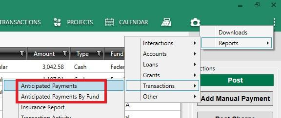

When generating the report you can **select the relevant run dates, then use the '*Include payments of status*' field to choose to display only payments that have been flagged as 'Skipped'**. Note: you must **tick the '*Display payment statuses*' check-box** to enable the '*Include payments of status*' drop-down menu. The generated report will then only show skipped payments that are dated within your specified date range.

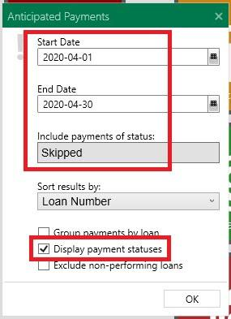

## Creating Bring Forward amortization schedules

A Bring Forward amortization schedule is a schedule which uses the loan's outstanding balances as its starting point. A lending organization may wish to do this when they have agreed to payment restructuring with a client, or if a floating/variable interest rate has changed.

Please follow the steps below to create a Bring Forward schedule for a loan.

Note: In these steps we are using the regular Calculator area to create the Bring Forward schedule. You can also use the **Schedule Scripts area** of the Calculator if a more flexible schedule is needed.

1. Go into the loan's **Schedule** tab and click the **Bring Forward button**. This will take you to the loan's Calculator area.

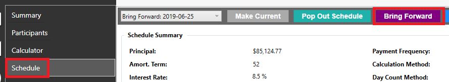

2. First, we would recommend reviewing the **Key Dates section** of the Calculator.

   For a Bring Forward schedule, **the Disbursal Date is really the start date** of the new schedule. Our recommendation would generally be to **move the Disbursal Date value back as far as the field will allow you**, which will be to the loan's last transaction date. Doing this means that the starting balances shown on the generated schedule will match what the balances on the loan's Statement as per that date.

   Set the **Initial Payment date** as required. This should be the date of the client's next expected payment.

   Set the **Term Date** as required. Please note that the Term Date has no bearing on the calculation of the schedule itself. It is solely used as a way to inform the client of when the interest rate on the loan is subject to change. For example, some lending organizations do a one-year term, where the loan's interest rate is liable to be changed after a year. In this instance, you would set the Term Date in the Calculator to be one year after the loan's disbursal date.

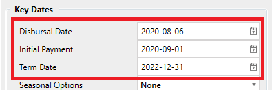

3. Next you will want to review the **Key Values section** of the Calculator:

   ***Principal***  
   You should only enter a value into the Principal field if the client is receiving additional funds i.e. a loan top-up. If they are not receiving additional funds, you should ensure that this field value is set to **0.00**.

   ***Amort. Term*** and ***Payment***  
   An important thing to remember is that **one of these two fields must be blank**: either FaaSBank will be calculating the length of the amortization term based on the schedule's payment amount, or it will be calculating the payment amount based on the amortization schedule.

   If you **know the payment amount** that the client wishes to make, clear the Amort. Term field and enter the payment amount into the Payment field.

   Alternatively, if you **want FaaSBank to calculate the client's payment amount**, clear the Payment field and enter the loan's amortization term into the Amort. Term field.

   ***Interest Rate***  
   By default this field will be populated with the loan's current effective interest rate. You should only edit this value if the interest rate on the loan is changing.

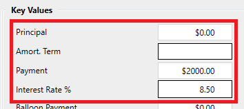

4. Review the other sections of the Calculator as required:

   ***Fees***  
   The Fees section of the Calculator can be used to include **one-off or recurring fees** on the amortization schedule. If no fees are being charged, the Fee Frequency field should be set to 'None'.

   ***Insurance***  
   The Insurance section of the Calculator can be used to include **monthly insurance charges** on the amortization schedule. Note: if your organization has no active insurance products, this section of the Calculator will be blank.

   ***Interest***  
   The Interest section of the Calculator can be used to make changes regarding the interest on the loan. We do **not** recommend making many changes in this section, as it can result in the loan having its interest calculated using a method that is different to its top-level loan product.

5. When the set-up of the Calculator looks good, click the **Calculate button** to generate the schedule.

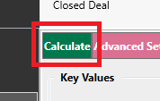

The amortization schedule will then appear in a Report Preview window for your review. You will see that the first lines on the schedule start with the words '*Bring Forward*'. This identifies the loan's existing outstanding balances. They are the starting point for the schedule.

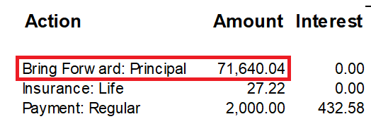

If you want to print or save a copy of the schedule as a PDF or Word document, you can use the toolbar found at the top of the Report Preview window.

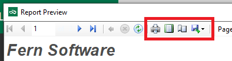

6. If the schedule looks good, your final step is returning to FaaSBank and saving the schedule to the loan.

   To do this, click the **Add to Schedules button** found at the top of the Calculator.

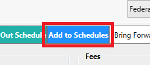

7. FaaSBank will then display a little confirmation pop-up window. Click **Yes** on the pop-up to make this schedule the loan's Current schedule.

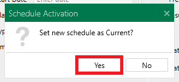

8. Finally, if your organization creates **task reminders** for a loan's term date, you will be displayed with the 'Term Renewal' pop-up window. Clicking **Yes** will allow you to create a task based on the term date that was specified on the loan's new schedule.

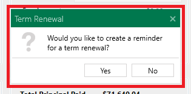

### Bring Forward Interest

If the start date of the Bring Forward schedule was not moved back to the loan's last transaction date, or if it was but the last transaction did not result in interest being charged to the loan, then you will need to post the Bring Forward Interest charge transaction. This will align the loan's Statement with the outstanding Interest balance shown on the Bring Forward schedule.

To post this transaction, return the loan's **Summary tab**. There you should see red text on the Current Balance row: **1 unprocessed**. Click the red text.

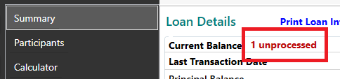

Clicking the text will open the Transaction Processing window. In the grid you will see a **Bring Forward: Interest charge transaction** for the loan. The Amount of the charge will be the interest accrued on the loan from its last interest date until the transaction date (which will equal the start date of the Bring Forward schedule you created.)

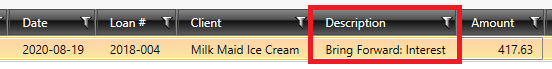

To post the transaction, click the **Post button** in the right column.

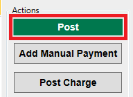

A confirmation pop-up window will appear. Click **Yes** on it. FaaSBank will then post the interest charge.

After the posting you will be provided with the option of generating a report to show the charge.

When you return to the loan and view its **Statement**, you will see the Interest charge transaction has been posted. This now means that as per the post date, your new schedule and the loan itself are in harmony with one another 🙌

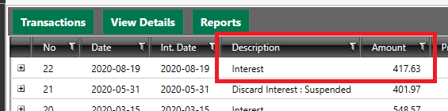

### When creating a Bring Forward schedule, the Disbursal Date field acts as the start date for the schedule

A Bring Forward amortization schedule is a schedule that **uses the loan's outstanding balances as its starting point**. This process can be initiated by clicking the Bring Forward button found in a loan's Schedule tab.

A Bring Forward schedule can be created when an existing loan is being disbursed additional funds, but it can also be created when no new funds are being disbursed to the client.

If **no new money is being disbursed** to the client, when doing the Bring Forward you will first want to ensure that the **Principal field in the Calculator is set to 0.00**. (Alternatively, if the client is receiving additional funds, enter that amount into the Principal field.)

Following that, set the Disbursal Date as needed. When doing a Bring Forward that involves no new money, the Disbursal Date field acts as **the start date for the schedule you are creating**. **Note**: it is **not** possible to set the Disbursal Date to fall before the last transaction date on the loan when you are doing a Bring Forward. The best practice is to **set the Disbursal Date to equal the loan's last transaction date**, as that way the schedule and the loan's Statement will be in harmony as at that date. If the selected Disbursal Date is dated after the loan's last transaction date, FaaSBank may prompt you to post an Interest charge to the loan, to bring the Statement into alignment with the new schedule.

The generated schedule will show **the loan's outstanding balances as per your selected date**, with one row per outstanding balance e.g. a transaction row for outstanding Principal, and a transaction row for outstanding Interest.

## Bulk Schedules Tool - creating bulk Bring Forward schedules

The Bulk Schedules tool allows users to **create Bring Forward amortization schedules for multiple loans at one time**. This can be helpful if you have a program where all loans have the same terms (e.g. RRRF), or if your organization uses variable interest rates and you wish to create new schedules to reflect rate changes.

When calculating the new schedules, you have the option of using the loan's current scheduled payment amount (which will either decrease/increase the loan's term), or you can keep their existing maturity date and have FaaSBank calculate a new payment amount based on it.

### Important points of note

#### Eligible Loans

Please note that only loans that do **NOT** have any scheduled fee or insurance charges on their current amortizations schedule will be loaded into the Bulk Schedules tool. Please see below for further information on why these loans are excluded.

In future we will be updating the tool to accommodate loans that have scheduled fee and/or insurance charges.

#### Scheduled interest charges are taken into consideration

If a loan's current amortization schedule includes **monthly Interest charges**, these **will** be automatically included on the loan's new schedule that gets calculated using the Bulk Schedules tool.

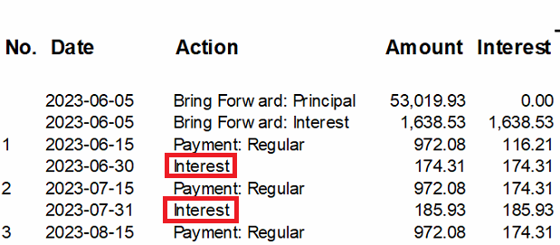

#### Scheduled fees are not taken into consideration

The Bulk Schedules tool does **not** factor fees into its schedule generation. We would recommend manually handling any loans that have frequent fees on their schedules (e.g. monthly fee charges) i.e. if you need to create a new schedule for such a loan, **perform the regular Bring Forward process** rather than using the Bulk tool.

#### Insurance charges are not taken into consideration

Currently, the Bulk Schedules tool is **not** capable of factoring insurance into its generated schedules. This means if you need your amortization schedules to show monthly Insurance charge transactions, you should **perform a regular Bring Forward** (i.e. initiated from within the Loan record itself) rather than using the Bulk tool.

#### Suspended interest is not taken into consideration

If you use the Bulk Schedules tool to create a new amortization schedule for a loan that has suspended interest enabled, the generated schedule will **not** reflect that: it will show Interest accruing on the loan in the regular manner. (This is the same as when a Bring Forward schedule is created for a suspended interest loan using the regular Calculator currently.)

#### Undisbursed amounts are not taken into consideration

If a loan has any undisbursed funds, it will not be displayed on the schedule generated by the Bulk Schedules tool.

If you need to create a Bring Forward schedule reflecting the client receiving additional funds, you should perform a regular Bring Forward rather than using the Bulk Schedules tool.

#### Forgiveness amounts are not taken into consideration

Loan forgiveness amounts (also known as forgiveness "Claims" in FaaSBank) are not handled by the Bulk Schedules tool. In other words, if you attempt to create a schedule for a forgiveness loan program (such as the First Citizen's Fund), FaaSBank will **not** factor any forgiveness amounts into the generated schedule.

### Using the tool

The video linked below gives an overview of how the tool works. Please note that this video focuses on using the tool to create updated amortization schedules to accommodate the Community Futures RRRF loan program changes that occurred in late 2023.

[RRRF Loan Program Changes - using the Bulk Schedules tool to create new Bring Forward schedules - Watch Video](https://www.loom.com/share/97ce4f4936ef4e169869727473a18a86)

[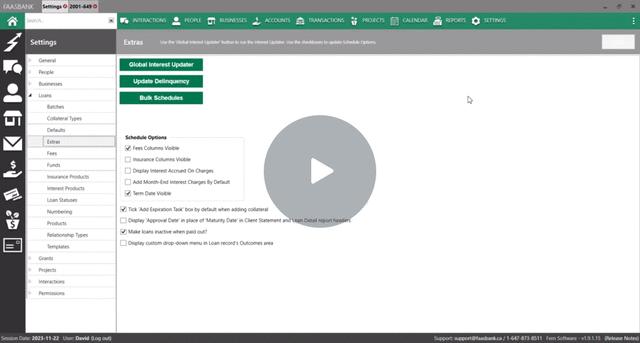](https://www.loom.com/share/97ce4f4936ef4e169869727473a18a86)

The Bulk Schedules tool can be launched from within **Settings -> Extras**. There, click the **Bulk Schedules button**.

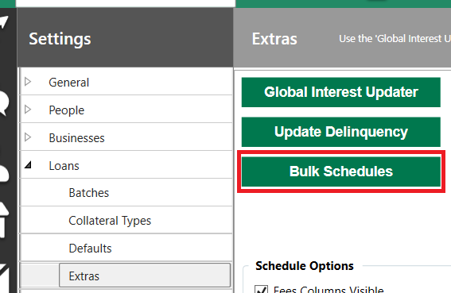

As outlined above, the tool will load in loans that are considered eligible for the bulk schedule generation process e.g. loans that do **not** have fee or insurance charges on their current amortization schedules.

The left column of the tool allows you to set two key parameters:

* **Start Date** - the start date for the Bring Forward schedules that will be created by the tool.  
* **Calculation Type** - this is a drop-down menu with two options. The selected option determines how the new Bring Forward schedule will be generated for each loan selected in the grid:  
  * ***Fixed Term*** - the Bulk tool will generate a Bring Forward schedule **with a new payment amount** based on the loan's existing maturity date (or a new maturity date that you specify in the tool)  
  * ***Fixed Payment*** - the Bulk tool will generate a Bring Forward schedule with **a new maturity date** based on the loan's current scheduled payment amount (or a new payment amount that you specify in the tool).

Further information on these fields can be found below.

#### Start Date fields

You will notice **two "Start Date" values** in the Bulk Schedules tool: one in the left column of the tool, and one for each loan row that appears in the grid.

The field in the left column allows you to set a "Start Date" for **all loans** in the grid. The "Start Date" acts as the loan's Bring Forward date i.e. it represents the date of the '*Bring Forward*' balance transactions that will appear at the start of the generated amortization schedules.

A key thing to note is that the scheduled Start Date for a particular loan **cannot fall *before* the loan's last transaction date**. For example, if a loan had a Payment posted on **August 15th 2023** and you attempted to create a new schedule for the loan starting **August 1st 2023**, the Bulk Schedules tool will **not** allow this to occur. In this instance, if you change the Start Date field in the left column to fall before a loan's last transaction date, the loan's "Start Date" field in the grid will be set to its **last transaction date** (rather than the date you selected in the left column).

Below is a screenshot of that scenario: our loan has a last transaction date of June 15th 2023, but we've set the "Start Date" field in the left column to June 1st 2023. You can see that in the grid, the loan's individual "Start Date" gets set to June 15th, as it will **not** allow an amortization schedule to have a start date earlier than a loan's last transaction date (as this is where FaaSBank grabs the loan's outstanding balances from; you can see a loan's last transaction by expanding out its hidden row).

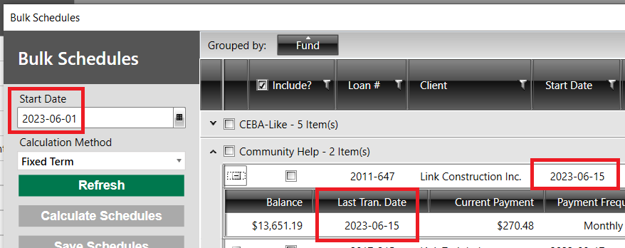

#### Calculating schedules for the selected loans

##### When Calculation Type = Fixed Term

When the Calculation Type = Fixed Term, the Bulk tool will **calculate a new payment amount** based on the loan's existing maturity date. You can also click into the '*New Maturity Date*' field to change a loan's maturity date as needed.

When this is the case, the '*New Payment Amount*' field in the grid will be populated for each selected loan after the 'Calculate Schedules' button has been used.

##### When Calculation Type = Fixed Payment

On the other hand, when the Calculation Type = Fixed Payment, the Bulk tool will **calculate a new maturity date** based on the '*New Payment Amount*' value that exists in the grid.

As mentioned above, by default the '*New Payment Amount*' field gets set to the loan's current scheduled payment amount. You can however click into the field to make edits as needed i.e. to manually specify the loan's desired regular payment amount.

The '*New Maturity Date*' field will be populated after the 'Calculate Schedules' button has been used.

You will see the new maturity date populated in the '*New Maturity Date*' field for each selected loan after you have clicked the '*Calculate Schedules*' button. It reflects the date of the final payment on the newly calculated schedule.

#### Clicking the 'Calculate Schedules' button

When you click the 'Calculate Schedules' button, each loan selected in the grid will have a new Bring Forward amortization schedule calculated. At this point, the 'Calculate Schedules' button will be disabled, and the 'Save Schedules' button will be enabled, to allow you to save the schedules to the loans.

The 'Calculate Schedules' button will be re-enabled if you make any changes to the window e.g. change the 'Start Date' selected in the left column or for an individual loan row.

#### Previewing the calculated schedules

Use **the 'Preview' button** found in the rightmost column of the grid to view the calculated schedule for a particular loan. It will appear in a pop-out Report Preview window.

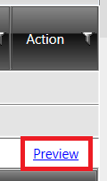

Two exports are also possible at this stage:

1. Use the ***Export Schedules*** **button** to create a PDF file containing *all* new schedules. This is a quicker way to preview all of the new schedules that were calculated.

2. Use the ***Export Excel*** **button** to save the grid contents to a spreadsheet. This way you can quickly review the new payment amounts that have been calculated for each loan. Note: the spreadsheet will include *all* loans, not just those selected in the grid.

   Use the two Export buttons in the left column as needed.

   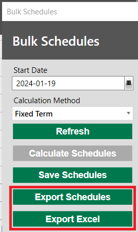

#### Saving schedules

If the calculated schedules look good, use **the 'Save Schedules' button** to save the new schedules to the selected loans.

After the schedules have been saved, you will be displayed the **Bulk Schedules Report**, which lists out each loan that had a new schedule saved.

The naming convention for schedules saved via the Bulk tool is as follows:

*`Bulk Schedule [current date in YYYY-MM-DD format]`*

For example: *`Bulk Schedule 2023-05-29`*

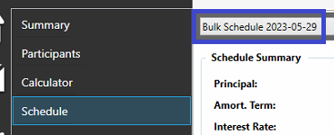

### Changing grid items after schedules have been calculated

If you calculated schedules for the selected loans then noticed a problem with one or more of the parameters/schedules, you can **make edits directly in the grid itself**.

After making the necessary edits, use **the 'Calculate Schedules' button** to recalculate updated schedules for the impacted loans.

### Grid Columns

#### Remaining Amort Term

The '*Remaining Amort Term*' column in the grid reflects **the number of months between the schedule's '*Start Date*' and the 'New Maturity Date' field in the grid** (which by default reflects the loan's current maturity date).. A change to the '*Start Date*' - via the field in the left column or within an individual row - will result in the '*Remaining Amort Term*' being recalculated.

#### Initial Payment Date

This gets set based on **the next scheduled payment on the loan's current schedule** i.e. if the next scheduled payment on the loan's current schedule falls on the 15th of the following month, then that is what will be displayed upon initial grid load. You can click into the field to change the date of next payment as required.

#### New Payment Amount

By default the '*New Payment Amount*' field gets set to the loan's **current scheduled payment amount**. You can click into the field to make edits if the client's new payment amount is to differ to their current schedule.

### Need to change the Interest Rate on multiple loans too?

This needs to be a two-step process:

1. Update the Interest Rates on the loans as needed: either on a loan-by-loan basis or via the Bulk Interest Rate updater functionality found in the Global Interest Updater; then  
2. Use the Bulk Schedules tool to create new schedules that reflect the rate change.

### Bulk Schedules Tool FAQ

#### Why are some rows grey with red text?

This indicates that the loan in question has an amortization schedule with a start date equal to or greater than the 'Start Date' shown in its row. This is simply to draw attention to the fact that a new amortization schedule may already have been created for the loan.

#### Why does the 'Remaining Amort Term' show "Expired" for some loans?

This means that the loan's current amortization schedule has **expired** i.e. its Maturity Date (the date of the last payment on the schedule) falls before the '*Start Date*' shown in the loan's row.

When this is the case, the '*New Maturity Date*' in the grid gets automatically set to equal the loan's '*Next Payment Date*'. If calculating using the 'Fixed Term' method, you should amend the '*New Maturity Date*' field for those loans as needed (in other words, select the date that the loan should be paid off by).

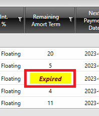

## Handling additional applications on existing loans (loan top-ups)

### If the new money HAS been approved

If the new money has already been approved, you can record this as a **Quick Commitment** on the loan.

To do this, click the **Applications button** found above the loan's Status History grid, then click the **Quick Commitment button**. A pop-up window will then appear allowing you to specify the **date** that the money was approved, and the **amount** of the new money approved.

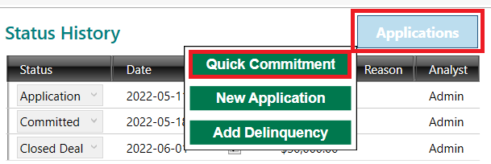

After clicking the OK button in the pop-up window, your loan will reload and you should see the new amount shown as **a new Approved/Committed status** in the loan's Status History grid. (The amount will also have been added to the Undisbursed amount shown in the loan's Loan Details area.)

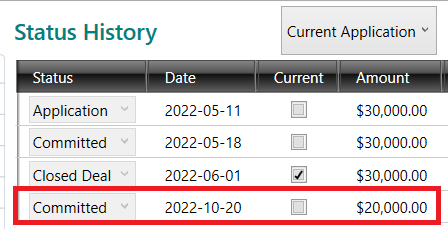

Following this, you can proceed with **creating a new Bring Forward amortization schedule and disbursing the new money**. It is up to you which order you do these in: you can either create the Bring Forward to reflect the new money *then* post the disbursal, or post the disbursal *then* create the Bring Forward schedule to reflect the loan's updated balance. The key determinant is: if you want to show the new money as an explicit **Disbursal transaction** on the new schedule, you should create the Bring Forward schedule ***prior*** to posting the Disbursal transaction to the loan.

If you decide to create the Bring Forward schedule first, ensure that the **Principal field** in the Calculator is set to the amount of new money that the client will be receiving.

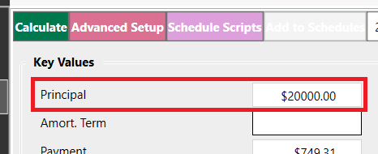

Generate your schedule; review the generated schedule for accuracy; then **save** the schedule once all looks good with it.

After the schedule has been saved, you can then use the **Disburse button** in the top-right corner of the Loan record to post the disbursal transaction to the loan.

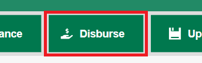

### If the new money has NOT yet been approved

If the client has applied for additional monies on an existing loan, but that money has **not yet been approved**, you can record evidence of this application by:

1. Click the **Applications button** found above the loan's Status History grid; then  
2. Click the **New Application button**.

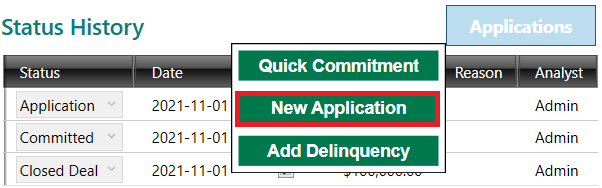

FaaSBank will then add a new Application status row into the Status History grid. You should click into this row to **specify the date of the application, and the amount of new money the client applied for**.

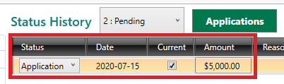

Click the **Update button** in the top-right corner of the loan record to save the change.

When a decision has been made on the new application, return to the loan record and **select the 'Pending' application** from the drop-down menu found above the Status History grid.

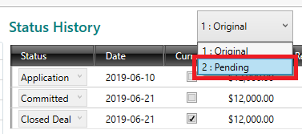

Use the **Add Status button** to add a new status row to the grid. When the new row has been added, click into the row to update the status as required:

* **Status** - set this as required e.g. if the new money was approved, set the status to Approved/Committed; whereas if the application was rejected, set the status selection to Declined.  
* **Date** - the date that the determination was reached e.g. the date that the new money was approved  
* **Amount** - the amount of money approved/declined/withdrawn

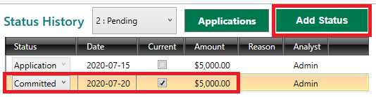

When the new status row looks good, click the **Update button** in the top-right corner of the loan record to save the change.

If the new money was approved, you should now see it showing as an **Undisbursed amount** in the loan's Loan Details grid. You can then proceed as necessary: you can disburse the funds, or create a new Bring Forward schedule to reflect their future disbursal.

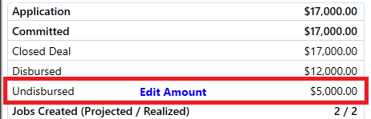

## Loan Refinances

FaaSBank's Refinance feature can be used to **create a new loan based on the balances of an existing loan**. During the Refinance process, the balance of the original loan will be transferred into the new "refinance" loan. This process will close out the original loan and advance its loan status to 'Refinanced'.

The steps for performing a refinance are as follows:

1. Open the loan that you wish to refinance.

2. Click the **Refinance button** in the top-right corner of the loan. This will open a New Loan window.

   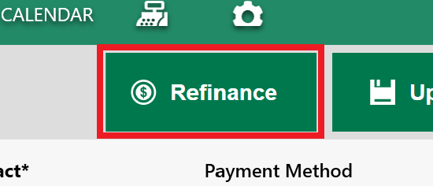

3. In the New Loan window you will see that a lot of the information from the original loan has been brought through e.g. the client name, the loan product, loan fund etc.

   Review the fields in the loan's Summary tab, make any changes that are pertinent to the new loan, then click the **Save button** in the top right corner.

   

4. When you first save the refinance loan you will see the following pop-up message.

   If the loan is receiving a top-up amount (i.e. **new funds are being disbursed**), then you should **enter the amount of new funds** into the field in the pop-up window.

   On the other hand, if the loan is **NOT** receiving additional funds (i.e. the refinance is purely a transfer of the loan's existing balances), you should leave the field at **0.00**.

   **Note**: you should **NOT** enter the loan's current balance into this window. Only new money the client will be receiving should be specified. Entering anything other than new money will result in data duplication.

   (The pop-up will appear once for the loan's Application amount, and once for its Approved/Committed amount.)

   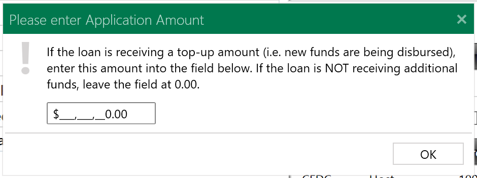

5. When the loan has been saved, you can then proceed with creating its amortization schedule. This can be done in the loan's **Calculator tab**.

   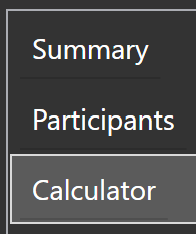

   The 'Outstanding' section in the bottom left corner of the Calculator will show **the balances of the original loan as per the selected Disbursal Date**. This is how much money will be transferred from the original loan into this new loan.

   For the purposes of a refinance, **the Disbursal Date acts as the transfer date** i.e. select the date you wish to transfer the balances from the original loan into this refinance loan.

   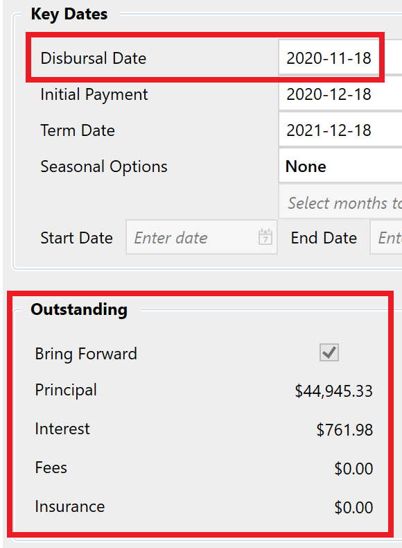

   Update the other Calculator fields as required e.g. specify the Amortization Term or the dollar value of the payments, set the Interest Rate, set the Initial Payment date etc.

   If the client is receiving new money, the amount they are getting should be specified in the **Principal field**. (By default FaaSBank will populate the Principal field with the loan's Application/Committed amount.) If the client is **NOT** receiving new money - i.e. the refinance is purely a transfer of existing balances - then the Principal field should be set to **0.00**.

   When the Calculator setup looks good, click the **Calculate button** to generate the schedule.

   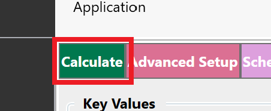

   FaaSBank will then generate and display the amortization schedule. The first row/rows on the schedule will show **'Bring Forward' amounts**: these represent **the balances that will be transferred from the original loan into the refinance loan**. There will be one 'Bring Forward' row for each balance that exists on the original loan. For example, in the screenshot below, our original loan has outstanding Principal and Interest balances.

   If the client is receiving additional money, you should see the '**Disbursal: Principal**' transaction appear directly after the 'Bring Forward' rows. This represents the new money they will be receiving. Note: you will only see the 'Disbursal: Principal' row if the client is receiving additional funds.

   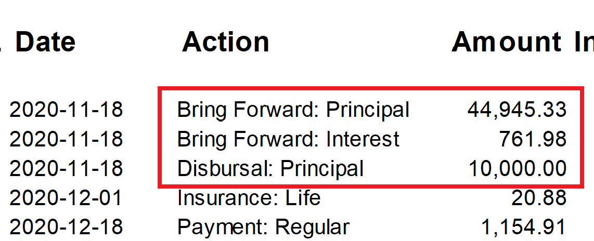

   Review the schedule to ensure that everything looks as anticipated. If there are any problems, return to the Calculator in FaaSBank, tweak the fields as needed, then generate a new schedule.

   Once you're happy with the schedule, click the **Add to Schedules button** at the top of the Calculator. This will save the schedule to the loan.

   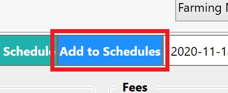

6. Before you can transfer the balances from the original loan into the refinance loan, you will need to ensure that the refinance loan has been **advanced to Approved/Committed status**.

   To advance a loan's status, go to its **Summary tab** and use the **Add Status button** as needed. Remember to **save** your changes.

   

7. When the loan has been saved at Approved/Committed status, a **Transfer button** will appear in the top-right corner of the loan. This button can be used to **transfer the balances from the original loan into the refinance loan**.

   Click the **Transfer button**. This will open the Loan Consolidation window.

   

8. The Loan Consolidation window allows you to post the transfer transaction. It gives you an overview of what will take place:

   1\. The **Target Loan** is your new loan. The balances of the original loan will be transferred into it.  
   2\. The **Date** that the balance transfer will take place. Update the date as required.  
   3\. The grid in the middle of the window shows the original loan and its balances as per the selected date. This is how much money will be transferred to the new refinance loan.

   

   If everything in the window looks good, click the **Post button** to post the transfer. Click **Yes** on the pop-up confirmation window that appears.

   

9. Posting the transfer performs the following actions:

   1. Transfers the balances out of the original loan and advances its status to **Refinanced**. (The 'Amount' for the Refinanced status gets set to the amount of money that was transferred as part of the refinance process.)

      

   2. Transfers the balances into the refinance loan and advances its status to **Closed Deal/Disbursed**. (The 'Amount' for the Closed Deal status gets set to the amount of **new money** that the client will be receiving. It does not include the transferred amount.)

      

10. The final step in the refinance process is to **disburse any new funds** that the client is receiving. You can do this using the **Disburse button** in the top-right of the loan.

    

## Editing a Loan's Undisbursed Amount (Decommitting funds)

If undisbursed money on a loan should no longer be available for disbursal to the client, you can:

1. Click the **Edit Amount text** on the loan's Undisbursed row (found in the Summary tab)  
2. Click into the currency field in the row  
3. Change the amount to **$0.00**  
4. **Save** the change

A pop-up window will ask if you wish to proceed with the proposed change. Click **Yes** on the pop-up if all looks good.

That money will then no longer be available for disbursal on the loan 😁

## Generating a Per Diem report

In FaaSBank, the Per Diem tool can be used to find a loan's payout amount for a particular date or range of dates. In layman's terms, it shows **what the outstanding amount owing on the loan will be as per your selected dates**.

To generate a Per Diem payout for a loan, open the loan and go into its **Per Diem** section.

First, decide whether you want to **include scheduled transactions in the Per Diem** i.e. should any charges and/or payments on the loan's amortization schedule be taken into account.

If you want the scheduled transactions to be taken into consideration, you can leave the ***Include scheduled charges*** and ***Include scheduled payments*** check-boxes **ticked**.

On the other hand, if you do **NOT** want scheduled transactions to be taken into consideration, you should **untick** the two check-boxes.

Next, use the **Start Date and End Date fields** to set your Per Diem period. FaaSBank will show you the loan's total outstanding balance for every date within the selected range. If you want to see the payout amount for a specific date, set both the Start and End Date fields to the same date.

When both dates have been selected, the Per Diem information will appear in the grid underneath the buttons.

The **Fixed Rate and Variable Rate** columns show **the interest rate that was used** to calculate each day of accrued interest in the selected date period. **Note**: these two columns do **not** appear on the printed Per Diem report.

If all looks well with the Per Diem, you can choose to either **print** a copy of the Per Diem report, or **email** a copy of the report to the client as a PDF attachment (if your user is configured for sending emails in the software).

Click the **Print Per Diem button** to have the report appear in a Report Preview pop-up window. From there it can be printed or saved to Word, Excel or PDF.

If you have FaaSBank configured for email, you can use the **Email Per Diem button** to quickly send a copy of the report to the client. Clicking the button will open FaaSBank's Email window. From there, prior to sending you can update the subject and body of the email as required.

## Loan Status Management

### Loan Status FAQ

#### This loan/line of credit has a zero balance but it is not at Paid in Full status. How do I get it to Paid in Full status?!

A loan will remain at Closed Deal status if it has been fully paid down but it has **funds still available for disbursal**.

When this is the case, use the **Close button** in the top-right corner of the Loan record. It will **clear the loan's undisbursed amount, then advance it to Paid in Full status**.

#### Pop-up message about dates being out of order

## Fund Transfers

In FaaSBank, one loan has **one loan fund**. The assigned fund determines which General Ledger accounts will be credited/debited if you use the software to create journal entries for your external accounting package.

Occasionally, you may need to transfer a loan from one fund to another. In FaaSBank, you can do this for an individual loan account by using the Fund field found in the Loan record; or if multiple loans are involved, you can use the Bulk Fund Transfer tool.

If your organization uses FaaSBank to create **journal entries**, the fund change is significant from a **General Ledger perspective**, as it means journal entries will be created showing the movement of the loan balances from the "old" to the selected "new" loan fund. Any subsequent transactions to the impacted loans will then credit/debit the "new" fund's accounts moving forward, rather than those associated with the fund.

A fund transfer can also have ramifications related to which funder reports a loan contributes to. This is because each loan fund can have a default reporting program assigned to it. When you move a loan from one fund to another, FaaSBank's default behaviour will be to align the impacted loans with the program that is associated with the "new" fund. For example, if you are a CFDC office and you are moving a loan from a non-CF fund to a CF-reportable fund, then the impacted loans will start to appear on your CF Performance Report moving forward.

### Performing a Fund Transfer for a single loan

To change the fund for an individual loan:

1. Open the Loan record in question.

2. In the **Fund** drop-down menu in the Loan's header area, select the Fund that **the Loan is being transferred to**.

   

3. At this stage, a pop-up window may appear. It is to inform you that the selected loan fund has a different default reporting program than the loan's current fund, and that clicking Yes will update the loan's reporting program to match that of the new fund.

   Click **Yes** in the pop-up window to update the loan's reporting program to match that of the new fund.

   

4. Next, click the **Update button** in the top-right corner of the Loan record.

   

5. A pop-up window will appear, informing you of the impending fund transfer. Review the pop-up to ensure the correct fund has been identified.

   Click **Yes** to proceed.

   

6. Another pop-up window will appear. In it, select the desired date of the Fund Transfer. This will be the date that is shown for the Fund Transfer on the Loan's Statement (and it will also reflect the date of the associated journal entries if your organization uses the journal features of FaaSBank).

   If you wish to have Interest accrued to the transaction date, you can advance the '*Effective Interest Date*' field to match your selected transaction date.

   Click the **Post button** when you have selected the relevant dates.

   

7. You will then be displayed a pop-up window informing you that the Fund Transfer transaction has been successfully posted. Click the **OK button** in the pop-up.

   Your Loan record will then reload, and you should see the new fund selected in the Fund field. Click the **OK button** on the subsequent pop-up window.

If you go to the Loan's **Statement tab**, you should see that the **Fund Transfer transaction** has been posted with your selected transaction date. (The transaction will have a 0.00 Amount, as it has no impact on the loan's outstanding balances: it just reflects the money moving from one fund to the other.)

The GL impact of the Fund Transfer transaction will be along these lines, reflecting the movement of the loan's balance from one fund to the other:

* **Debits**  
  * "Old" fund's Bank account  
  * "New" fund's Receivable account  
* **Credits**  
  * "Old" fund's Receivable account  
  * "New" fund's Bank account

### If many loans are moving fund - Bulk Fund Transfer Tool

FaaSBank's **Bulk Fund Transfer tool** can be used to post fund transfer transactions to multiple loans at one time.

1. The Bulk Fund Transfer tool can be launched from **Settings -> Loans -> Extras**. There, click the **Bulk Fund Transfer button**.

   

2. In the left column, use the **Transfer Date field** to select the date of the fund transfer. This will be the date of the Fund Transfer transaction that gets posted to the impacted loans.

   

3. Use the **Current Fund field** to select the fund that the impacted loans are currently associated with. The grid will then be populated with loans on that fund.

   Use the **Target Fund field** to identify the new fund that the impacted loans will be transferred to.

   

4. The **Reporting field** shows the default program associated with the Target Fund. It lets you know **which program the impacted loans will be associated with if you post the fund transfer**.

   If you want the impacted loans to retain their current reporting program(s), tick the '*Keep Current Programs*' check-box field.

   

5. In the grid area, **identify the loans that will be transferred to the Target Fund**. Select the relevant loans by ticking the '*Include*' check-box on their row.

   

6. When the relevant loans have been selected, click the **Transfer button** in the left column.

   

7. A pop-up window will then appear, informing you of what will occur if you proceed with posting the fund transfers. It will tell you how many loans have been selected, and which fund they will be moved to.

   If the information in the pop-up window looks good, click the **Yes button** to proceed.

   

8. FaaSBank will then post fund transfer transactions to the selected loans.

   Click **OK** on the pop-up window to generate the Bulk Fund Transfer Report. It shows all loans that received the fund transfer.

9. Close the Bulk Fund Transfer window.

If you go to one of the impacted Loans and view their Statement, you should see that the **Fund Transfer transaction** has been posted with your selected transaction date. (The transaction will have a 0.00 Amount, as it has no impact on the loan's outstanding balances: it just reflects the money moving from one fund to the other.)

The GL impact of the Fund Transfer transaction will be along these lines, reflecting the movement of the loan's balance from one fund to the other:

* **Debits**  
  * "Old" fund's Bank account  
  * "New" fund's Receivable account  
* **Credits**  
  * "Old" fund's Receivable account  
  * "New" fund's Bank account

#### PacifiCan CFs - WD Fund Group

When you use the Bulk Fund Transfer Tool to transfer loans from a non-WD fund to a "WD" reportable fund, **the selected loans will also be assigned to the new fund's "WD Fund Group"**.

A reminder that the WD Fund Group gets set at the Loan Fund level in **Settings -> Loans -> Funds**. The four options are:

* Non-Repayable Regular Investment Fund  
* Repayable Regular Investment Fund  
* Repayable EDP Investment Fund  
* Other Partnership Investment Funds

If you ever need to change an individual loan's WD Fund Group, you can do that from within the loan's **Outcomes area**. Use the '*WD Fund Group*' field and save the change.

## Loan Delinquency

FaaSBank has **three** different methods of calculating delinquency. An organization should choose whichever method works best for them.

The three methods are :

1. **Balance Comparison - Principal Balance Only**

2. **Balance Comparison - Total Balance**

3. **Payment Comparison**

The word '*comparison*' is a reference to a loan's amortization schedule: regardless of the delinquency calculation method that is selected, **a loan's delinquency will always be calculated against its current amortization schedule**. This is a good reason to ensure that amortization schedules are kept accurate and relevant.

The delinquency calculation method used by FaaSBank can be changed in **Settings -> General -> Organization**:

In that area of Settings, use the **Delinquency Calculations** drop-down menu to determine if you want to calculate delinquency using the **Balance or Payment Comparison methods** (both methods are outlined in detail below):

If you select the Balance Comparison method, you can then use the **Del. Calculation Balance field** to determine if delinquency should be calculated using the loan's **Principal Balance or its Total Balance** i.e. its total outstanding balance, including any outstanding interest, fees and insurance.

When you have made the necessary selections, use the **Save button** in the top-right corner of the screen to save your changes.

### Comparing the Delinquency Calculation Methods

#### Balance Comparison - Principal Balance, and Total Balance methods

Both of the 'Balance Comparison' calculation methods mean that delinquency is being calculated by **comparing the loan's actual balance against what its balance is expected to be as per its Current amortization schedule**.

With regard to the two different balance options:

* **Principal Balance**  
  This means that the loan's **outstanding Principal balance** is compared against what its Principal balance is expected to be as per its amortization schedule. Any outstanding interest, fees and/or insurance is **NOT** taken into consideration.

* **Total Balance**  
  This means that the loan's **total outstanding balance** is compared against what its total outstanding balance is expected to be as per its amortization schedule. Outstanding interest, fees and/or insurance balances **ARE** taken into consideration.

Regardless of which of the balance options are selected, if the loan's actual balance (Principal or Total) is ***greater*** than its expected balance, that loan is considered behind schedule and it will appear on the **Loan Delinquency report**.

Alternatively, if the loan's actual balance is ***less*** than expected as per its amortization schedule, the loan is considered to be **ahead** of schedule, and thus will **not** appear on the Loan Delinquency report.

It is important to note that the delinquency calculation grabs the loan balances - actual and expected - from the most recent transaction that falls **on or off before the selected generation date of the Loan Delinquency report**.

For example, if you were backdating the report to July 30th 2020, FaaSBank will grab the actual and expected balances as follows:

* **Actual balance**  
  The report will get that value from **the transaction** that falls closest to (on or before) the report generation date e.g. if a loan has two payments, one dated July 28th and one dated August 1st, the balance as per the July 29th payment would be used in the delinquency calculation, as it falls closest to but *before* the report run date of July 30th.

* **Expected balance**  
  The report will get that value from **the scheduled transaction** (coming from the loan's current amortization schedule) that falls closest to (on or before) the report generation date.

FaaSBank then performs a straightforward comparison of the two balances. For example, if we were using the Principal Balance Comparison method:

1. As per today, a loan's outstanding Principal balance is **$5,000**.  
2. We look at the loan's current amortization schedule, and see that as per today's date, the Principal balance on the loan **should be $4,000**.  
3. FaaSBank **subtracts the expected balance from the loan's actual balance**:

   **$5,000 - $4,000 = $1,000**

In the eyes of FaaSBank, this loan is **behind schedule by $1,000**, which is the amount that will appear for the loan on the Loan Delinquency report.

#### Payment Comparison Method

Rather than comparing the actual loan balance to its expected balance, this method compares the **dollar value of payments *made* to the dollar value of payments *expected***.

When using this method, it does not matter if a payment pays down Principal, Interest, Fees or Insurance: **the key value is the total dollar amount of the payment**. The balance it impacts has **no** bearing on the delinquency calculation.

An example: a client's loan was disbursed on January 1st. As per their current amortization schedule, they are expected to make $200 payments on the 15th of each month.

Let's imagine today is February 20th. At this point in time, the client should have made **two payments totalling $400**:

1. $200 on January 15th  
2. $200 on February 15th

In reality, the loan client has only made a single payment, for **$250**.

Using the 'Payment Comparison' delinquency calculation method, if the Loan Delinquency report was generated as per "today" (February 20th), this loan would show as delinquent by **$150**. This is calculated as follows:

1. Sum of **expected payments** from the loan's current schedule: 2 \* $200 = **$400**  
2. Sum of **actual payments made** up to the report's run date: **$250**  
3. Expected payments minus actual payments: $400 - $250 = **$150 delinquent**

### Generating the Loan Delinquency report

The **Loan Delinquency report** can be generated in two areas of the software:

1. From the **Reports menu button** in the top-right corner of the software (the three little vertical dots found under the exit 'X'). There, navigate to **Reports -> Loans -> Loan Delinquency**.

   

2. From the left column of the **Accounts/Loans grid view**. To view the reports in this section, you will first need to click the **Reports button** at the top of the window's left column.

   

By default, the Loan Delinquency report **excludes**:

* **Loans owing less than 1% of their outstanding Principal/Total Balance**  
  * This is so that loans with very small delinquent amounts do not bog down the report  
* **Non-Performing Loans**  
  * These are loans that have been identified as non-performing by a user  
  * A loan can be flagged as non-performing within its **Options tab**

### Viewing the delinquency amounts for a single loan

To view the arrears information for a specific loan as per the current date, open the loan record and click the **'Update' text found on the Arrears row**:

A pop-up window will appear, providing you with two options: calculate delinquency for:

1. The **selected loan** i.e. the loan record you are in; or  
2. **All loans**

If you only want to calculate delinquency for the loan you are in, leave the dropdown menu at **Selected Loan**, then click the **OK button**.

FaaSBank will then calculate the loan's delinquency, and display the necessary info - if there is any - on the loan's **Arrears row**.

### FAQ: I don't want a particular loan to appear on the Delinquency Report. How can I get it off of the report?!

A loan appears on the Delinquency Report when it is considered to be behind schedule by FaaSBank. If a loan was provided with permission to **miss/skip certain payments**, you should ensure that this has been reflected in the schedule. The instructions for **how to identify a payment as being skipped** can be found [here](06-loan-management.md#skipping-scheduled-payments). (A common problem is that a user accidentally *deleted* a deferred payment rather than *skipping* it. Fixing this can often have a positive impact on the loan's delinquency.)

If you have a new payment arrangement with the client, you could create **a Bring Forward amortization schedule** to reflect the new agreement. Creating, saving and making the Bring Forward schedule the loan's Current schedule will drop that loan from the Delinquency Report as **their loan balance will then be aligned with the schedule** i.e. they will no longer appear behind schedule.

Alternatively, if you don't want to create a new schedule but would still like them to be dropped from the Delinquency report, you can go into the loan's Options tab and tick the **Suppress from Delinquency Reporting check-box**. That will immediately drop the loan from appearing on the report. Note: you will need to switch that option off to ever have the loan reappear on the report.

## Tidying up negative loan balances (managing overpaid loans)

You can use the Adjustment window to tidy up a negative Principal balance on an overpaid loan.

To do this:

1. Open the **Adjustment window**.

2. If your desired loan is not already selected, **search for and select it** in the Account/Loan field.

3. Ensure that Type of Adjustment = **Adjust Paid Amounts**.

   Set your transaction **Date** as needed.

   Enter the relevant amount into the **Increase Principal Balance field**. Generally you will want to bring the loan's Principal balance back to $0.00, in which case you would enter the amount shown in the Opening Principal Balance field.

   For example, in the screenshot below, the loan was overpaid by $3.87. To bring its balance back to $0.00, we enter $3.87 into the Increase Principal Balance field.

   

4. Once the Adjustment window looks good, click the **Post button** in the top right corner to post the transaction.

If the loan has no undisbursed monies, FaaSBank automatically advance it to a Paid Out loan status and make the loan inactive 😁

On the other hand, if the loan has undisbursed funds, you can go into the Loan record, manually clear the undisbursed funds figure to $0.00, then close out the loan.

## Variable Interest Products

In FaaSBank, loans can be associated with a variable (also known as a floating) interest product. When this is the case, it means that changes made to the interest product are automatically reflected in the interest calculations for the loans linked to the product. This is different to regular interest rates, where a user would have to either add the new interest rate to each loan manually, or use the Global Interest Updater tool to apply a bulk interest rate change to multiple loans.

### Setting Up a Variable Interest Product

A new variable interest product can be created within **Settings -> Loans -> Interest Products**.

There, click the **Add button** to add a new row into the Interest Products grid. Click into the Name field and type an appropriate name for your new interest product. This could be something like *Prime* or *Base Rate*. This is the name that will be shown in the user interface. If required, you can also set Minimum and Maximum boundaries for the product.

Next, you will want to use the **Rate History grid** to specify the current effective interest rate for your product. You will also need to specify the rate's **Effective Date**. This is the date that this particular rate comes (or came) into effect.

**Note**: you should ensure that the Effective Date for the product's initial rate falls **on or before** the Disbursal date of the first loan that will be associated with the rate. For example, let's say you are entering existing loans into FaaSBank that need to be associated with the variable interest product. If your oldest loan to be entered has an initial disbursal date of December 21st 2021, you must ensure that the Effective Date for the product's initial rate is **on or before** that date: December 21st 2021. If you accidentally forgot to backdate the Effective Date of the rate, it would mean that Interest would not be calculated correctly on your loan.

In the screenshot below, we have stated that our Prime variable interest product starts with a Rate of 0.65% effective March 20th, 2020.

When your interest product set-up looks good, click the **Save button** in the top right corner of the window to save the changes.

#### Updating a Variable Interest Product (Changing the Interest Rate)

When the interest rate for your variable interest product changes, you will want to update FaaSBank to reflect this change.

To update the rate on your interest product, navigate to **Settings -> Loans -> Interest Products**.

Select the relevant entry in the Interest Products grid, then click the **Add Rate button** found above the Rate History grid.

Clicking the button will add a new row into the Rate History grid. Click into the new row to set the new **Rate** and its **Effective Date** as necessary.

For example, in our screenshot below, we have stated that our interest product is changing from 0.65% to 0.80% as per November 22nd, 2021.

Click the **Save button** in the top right corner to save your changes.

**Note**: adding a new rate to a variable interest product will impact how Interest gets calculated on all loans that are associated with the product, but it will **not** automatically update the current amortization schedules for those loans. If you wish to update a loan's amortization schedule to reflect the change to the variable interest product, you must create a new Bring Forward schedule on the loan. Information on creating Bring Forward amortization schedules can be found [here](06-loan-management.md#creating-bring-forward-amortization-schedules).

##### Impact of changing a rate on an Interest Product

Let's imagine your organization has an Interest Product set-up as per the screenshot below:

In this scenario, interest would get calculated as follows:

* 2.45% *up and including* March 31st  
* 2.70% *from* March 31st onward

For example, if you were to charge Interest on a loan tied to this Product as per **March 31st**, it would be calculated solely using **2.45%**; then if you were to charge Interest on the same loan as per **April 1st**, it would be calculated at **2.70%** (in this case, it would be one day of Interest reflecting March 31st to April 1st).

### Linking a Variable Interest Product to a Loan Product

Linking a variable interest product to a loan product will ensure that any new loans created on the loan product will automatically be associated with the variable interest rate. This means that you do not have to worry about manually selecting the variable interest rate every time you are creating a new loan with that particular loan product.

To link an interest product to a loan product, first navigate to **Settings -> Loans -> Products**.

In the Loan Products grid, select - or create - the loan product that will be associated with the interest product.

When the relevant product is selected, in the area at the top of the window, select ***Variable*** from the **Interest Type** drop-down menu, then select the relevant interest product from the **Default Interest Product** drop-down menu.

In our example below, we have set the Default Interest Product to *Prime*.

Click the **Save button** in the top right corner to save your changes.

This means that when you are creating a new loan on that particular loan Product, the software will automatically **associate the loan with the variable interest product** you selected in the Product's settings area. You will be able to see this when you come to create an amortization schedule using the loan's **Calculator** area: a new field called **Variable Interest Rate %** will be displayed in the interface. The field will show the variable interest rate that is effective as per the Disbursal Date value selected in the Calculator.

When you generate the amortization schedule, you will see that it says '*Floating Rate*' in the Interest Rate field, reflecting that the loan is linked to the variable interest product. The Interest Rate shown on the schedule is the combination of the two interest rate fields (Interest Rate % and Variable Interest Rate %) from the Calculator.

### How to tell if a loan is associated with an Interest Product

After a loan has been disbursed, you will see its Interest Rate information displayed in the loan's header section, and also within its **Options** area.

In the header section, if a loan shows the name of an Interest Product, this indicates that it is associated with that product. For example, in the screenshot below, we can see that the rate on this loan is shown as '*Prime + 4.00%*'. 'Prime' is the name of the assigned Interest Product, and 4.00% is the fixed interest rate on the loan.

Similarly, in the loan's **Options** area, when a loan is associated with an Interest Product, you will see the Interest Product column displayed in the **Interest Terms grid**. It shows the name of the Interest Product that the loan is linked to.

## Managing Forgivable Portions

### Posting the Forgivable Portion on RRRF Loans

When a RRRF loan client has paid down the necessary amount of Principal, you can use the Adjustment window to post a '*RRRF Claim*' type transaction to forgive the remaining Principal balance. If the transaction reduces the loan's Principal balance to 0.00, the loan will be automatically advanced to a Pay Out-type loan status e.g. Paid in Full.

In the example below, we are forgiving the remaining $20,000 of Principal on a RRRF loan that was originally for $60,000.

1. Make your way to the **Adjustment window**. You can do that by clicking the Adjustment button on the software's home screen; the Adjustment button within the loan's Statement area; or when the loan is due its forgiveness amount, you can also click the ***Claims Due*** text found in the loan's Summary screen.

2. In the Adjustment window, ensure that the *Type of Adjustment* field is set to '**RRRF Claim**'. Also ensure that the ***Amount*** field accurately reflects the amount the client is being forgiven. Update the amount if the value is incorrect.

   By default the ***Date*** field gets set to equal the date of the last transaction post to the loan. Change the date if needed.

   ❗ Note: the GL impact of this transaction is that it will **debit** the loan fund's **Forgiveness Expense** account. You can see which account has been identified as the fund's Forgiveness Expense in Settings -> Loans -> Funds.

3. When the window looks good, click the **Post button** to post the transaction to the loan.

If you return to your loan, you should see that the RRRF Claim transaction is shown on the loan's Statement; and the loan will have been advanced to a Pay Out-type status.

### Editing Forgivable Portion on Eligible Loans

Users can now manually **edit the eligible forgiveness amount** on loans. This is possible via the **Edit button** on the loan's *Claims to date* row.

For example, if a RRRF loan client received funding from another government body, they may not be eligible for the full $20,000 forgiveness on their $60,000 loan. If this is the case, a user can now **click the 'Edit' text** on the loan's *Claims to date* row.

When you click Edit, an '*Edit Loan Forgiveness*' pop-up window will appear, allowing you to **change the amount of forgiveness the client is eligible for**. Click into the field in the pop-up window and update the forgiveness amount as required.

For example, in the GIF below, we're stating that the client is only eligible for $15,000, rather than the default $20,000. After clicking OK on the two subsequent pop-up windows, you'll see that the *Claims to date* row gets updated to reflect the new forgiveness amount.

Any changes you make will then be reflected on the **RRRF Forgiveness Report**:

### Removing the Forgivable Portion on a Loan

If a client is not considered to be eligible for the forgiveness portion on their loan, you can remove it by clicking the '**Remove Forgivable Portion**' text on the loan's *Claims Due* row.

A pop-up message will ask you to confirm that you wish to proceed with the change. Click **Yes** to remove the forgivable portion on the loan. After the change you will see that the three Claim rows are no longer shown in the Loan Details area.

**Note**: you will need to contact Fern support if you wish to have the forgivable Claim rows reappear for a loan after they have been removed.
