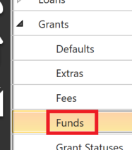
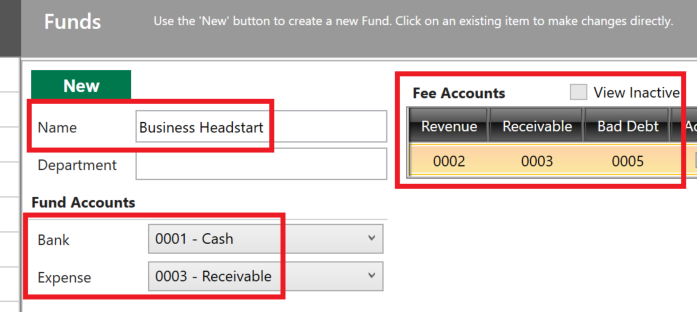
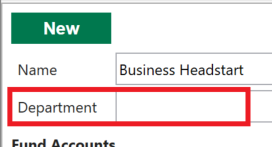
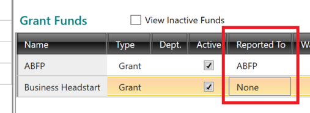
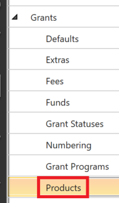
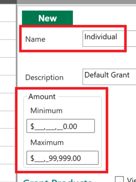
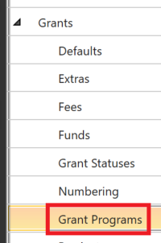
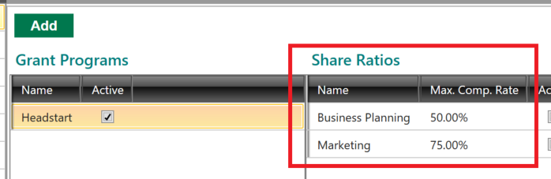
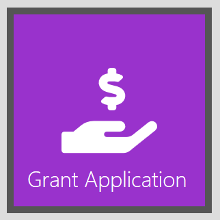
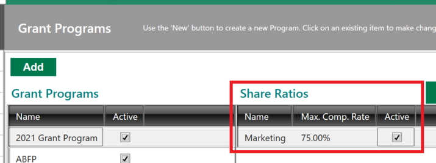

# Grant Management

FaaSBank has a separate Grants module, allowing you to manage the non-repayable contributions you make to your clients. **Please note that the Grants module may be switched off by default in FaaSBank: if you would like to utilize it, please contact Fern support at [support@faasbank.ca](mailto:support@faasbank.ca) and they will be able to activate the module.**

When the module has been enabled, there are a few items you will need to complete before being able to save a grant to the system.

## Creating a Grant Fund

First you will need to create a grant fund, as all grants in the system must be aligned with a fund.

To create a grant fund, go to **Settings -> Grants -> Funds**.

In that window, click the **New button**.

You will need to specify the following pieces of information before saving your fund:

* **Name**  
  * Give your fund a name to help identify it in the system.  
* **Bank**  
  * Identify the Bank General Ledger account associated with the fund. Note: this is important if you plan to use FaaSBank to create journal entries for grant transactions. If your organization will not be creating journal entries for grant transactions, you can select any account in the drop-down menu.  
* **Expense**  
  * Identify the Expense General Ledger account associated with the fund. As per the previous point, you can select any account if your organization will not be creating grant journal entries from FaaSBank.  
* **Fee Accounts**  
  * Note: you will only see this grid if at least one grant fee has been added to FaaSBank's Settings area. If you will not be charging fees on your grants you can ignore this.  
  * You may not plan to post fees to grants, but FaaSBank needs to ensure that it has the relevant General Ledger account information in case someone in your organization ever does decide to do it. As per the previous two items, if you will not be creating grant journal entries, you can select any accounts for Revenue, Receivable and Bad Debt.  
  * Use the **New button** found above the Fee Accounts grid to add a row to the grid; then click into the row to select the Revenue, Receivable and Bad Debt accounts.

After that, you can use the **Save button** in the top-right corner of the window to save your new grant fund.

Two other items of note in the grant fund window:

* **Department field**  
  * This is only important if you will be creating grant journal entries from FaaSBank and in your third party accounting package you use a Department code to help distinguish those transactions. If this is the case, enter the relevant Department code into the field.

    

* **Reported To selection**  
  * In the Grant Funds grid you will see a column named Reported To. You can use this column to align a grant fund with one of your mandatory reporting programs. For example, if your organization participates in the NACCA ABFP grant program, then you would want to select 'ABFP' for the relevant fund in the Reported To column.  
  * When mandatory reports are generated, FaaSBank uses the Reported To value to determine whether or not grants should contribute to that report e.g. when generating the NACCA ABFP report, FaaSBank only includes grants if its selected fund has been identified as Reported To = ABFP.  
  * Click directly into the field in the grid to make the appropriate selection. If no mandatory report exists for that grant fund, you can set the selection to 'None'.  
    * Note that you can create a new Grant Program within FaaSBank's Settings area, then link your fund to it. We will cover that below.

      

## Creating a Grant Product

A grant product is very basic: it simply determines the **minimum and maximum amounts** allowed for a particular type of grant. For example, you may have one grant product for individuals and another for communities. Each of those products may have different upper and lower limits on how much money the client can receive.

By default FaaSBank creates a grant product called... Default 😁

You will see this product if you go into **Settings -> Grants -> Products**.

If your organization offers a single type of grant, you can simply **update the Default product** to meet your needs: click its row in the Grant Products grid, then set the **Name**, **Minimum Amount** and **Maximum Amounts** as required.

Click the **Save button** in the top right corner of the window to save your change.

If you wish to add other grant products, click the New button in the window, enter the necessary information for that product, then click **Save**.

## Creating a Grant Program

Finally, before you create a grant, you should create at least one grant program. A grant program is important because it can be used to identify grants on **mandatory funding reports**.

For example, let's say your organization gets money from a particular government department to disburse to your clients as grants. In future they may ask you to submit reporting **purely related to the grants approved and/or disbursed using that pot of money**. Ensuring all the relevant grants are associated with the correct grant program makes that easy from a reporting perspective: Fern would be able to develop a report that focuses solely on that particular grant program.

To create a grant program, go to **Settings -> Grants -> Grant Programs**.

Click the **Add button** to add a new row to the Grant Programs grid. Click into the Name field in the grid and type a name for your program.

Next, you need to create at least one 'Share Ratio' to be associated with your program. A Share Ratio is **a common reason why a client would be receiving the grant** e.g. Business Planning or Marketing. Each Share Ratio must have a maximum compensation ratio e.g. if the client would be eligible for grant compensation of up to 75% on that particular item, then enter 75 into the *Max. Comp. Rate* column.

The Share Ratios come into play when you are specifying the **Purpose** of a grant in FaaSBank: you can select the relevant purpose (or purposes) of a grant, and FaaSBank will automatically calculate the compensation based on the maximum compensation rate associated with your selected item.

For example, in the screenshot below, our Headstart grant program has two Share Ratio items: Business Planning and Marketing. If a client is using the grant for Business Planning, their compensation will be calculated up to a maximum of 50%, whereas if the grant is for Marketing, they can receive compensation of up to 75%.

If you do not know the compensation rate for your program, you can create a catch-all Share Ratio - e.g. call it ***Other*** - and assign it a Max. Compensation Rate of **100%**.

Finally, use the **Save button** in the top right corner of the window to save your grant program.

As mentioned in the Creating a Grant Fund section, you can then associate one or more grant funds with your grant program. Click [here](07-grant-management.md#creating-a-grant-fund) for further information.

## Creating a New Grant

When at least one grant fund, product and program exists in FaaSBank's Settings area, you can then proceed with creating a new grant in the system 🙂

*Section to be completed*

### FAQ: When I try to add a Purpose to my grant, it displays a mysterious error message saying 'Sequence contains no elements'.

This means that **no Purpose records** have been created for your selected Grant Program.

To fix this problem, go into **Settings -> Grants -> Grant Programs**, select the relevant Program, then enter a Purpose Ratio in the right-hand grid.

The Purpose Ratio should be **a common reason why a client would be receiving the grant** - e.g. Business Planning or Marketing - and the maximum compensation ratio for that item e.g. if they are eligible for compensation of up to 75%, then enter 75 into the *Max. Comp. Rate* column.

When you have entered at least one Purpose Ratio, click the **Save button** in the top right corner of the screen to save your change. After that, reopen your grant and attempt to add a Purpose. The cryptic error message should no longer appear, and you can continue working on the Grant record 😎

## Disbursing a Grant

*TBC*

## Decommitting monies on a Grant

How you decommit monies on a grant depends on **whether or not the grant has received any disbursals**. Below is an outline of the steps involved for each scenario.

### Decommitting money on a Disbursed Grant

On the Summary tab of the grant, press the **Applications button** found on top of the Status History grid. You will see an option at the bottom of the drop-down menu called **'Decommitment'**. Select this option and enter the decommitment info (amount and date).

### Decommitting Money on an Undisbursed Grant

If no money has been disbursed to the grant, to reflect a decommitment you must **add a new Approved/Committed status** to the grant; and for the status's "Amount", specify **a negative amount to account for the required amount being decommitted**.

To do this: in the Status History grid, press the **'Add Status' button** then:

1. In the new status row added to the grid, change the Status to **Approved/Committe**d and **input a negative symbol** in front of the amount you are inputting. Specify the amount of money being decommitted.  
2. Press the **Update button** in the top right-hand corner to save the change. This will update the grant's status to show as a 'Decommitted' amount as needed.
