# Reports

## Loan Reports

The easiest way to generate loan reports in FaaSBank is by using the menu button in the top-right corner of the software (the three little vertical dots under the exit 'X'). There navigate to **Reports -> Loans**. An overview of the reports can be found below.

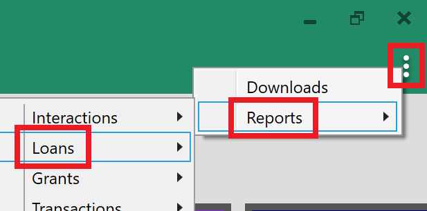

The loan reports can also be generated from within the **Loans / Accounts grid view**. Here it is possible to run many of the reports for **specific** rather than all loans. To do this, first select the relevant loans in the grid (use the Ctrl key on your keyboard to select them). Once the loans have been selected, click the **Reports button** at the top of the window's left column. Finally, select the relevant report by double-clicking on its name in the left column.

When the report parameter window opens, you should see that it says '**Selected Loans**' in the *Generate For* field. This tells you that the report will be generated only for your selected loans, rather than for all loans in your portfolio.

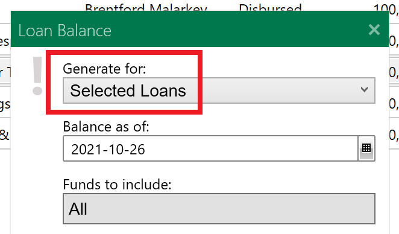

### Aged Loans Receivable

This report has the same layout as the Loan Delinquency report, in that it includes arrears information. Importantly though, this report also includes loans that are **NOT** in arrears. This provides an overview of your total outstanding loan portfolio, while also displaying arrears information.

The '*Hide business names*' check-box can be used to anonymize the report: when ticked, the report will show loan numbers but no client business names.

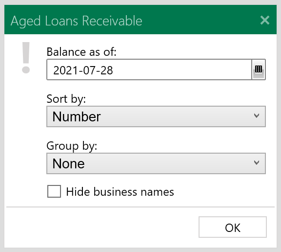

### Client Statements

This report allows for the quick generation of statements for all loans that had a transaction within the desired reporting period. The client's primary address is included on the bottom-left corner of each statement, to allow for insertion into envelopes if posting the statements to the clients.

By default the report is set to run for the month previous to the current date e.g. if the user is logged in on February 3rd, the report dates will be set to January 1st to January 31st. Simply change the dates in the report parameter window as needed.

By default, deleted, doubtful, and suspended interest discard transactions are **NOT** included on the report. If you wish for these transactions to be included you must select them in the report parameter window. Similarly, loans with no transactions within the selected reporting period are excluded from the report. To include those loans you must tick the '*Include loans with no transactions in the reporting period*' check-box.

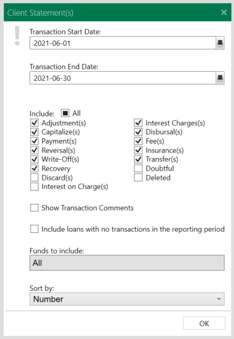

### Collateral Expiry

Shows pieces of loan collateral with expiry dates that fall on or before the report's selected run date. By default the report only includes loans at **Closed Deal/Disbursed** loan status, and groups the collateral based on the associated loan's loan officer.

By default pieces of collateral with no expiration date are excluded from the report. To include those, tick the '*Include collateral with no expiration date*' check-box.

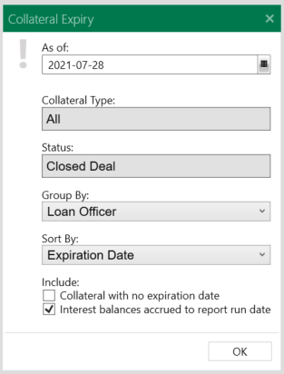

### Disbursement Summary

This report shows any loan that had money **approved/committed**, **disbursed, capitalized or claimed** (e.g. an ELP or RRRF forgivable claim transaction) within the selected reporting period.

The '*Committed*' column on the report gets populated with monies approved/committed within the reporting period (based on the loan's Approved/Committed status dates).

By default no grouping is applied to the loans on the report. It can be grouped by Fund, Loan Officer, or Primary NAICS Code though.

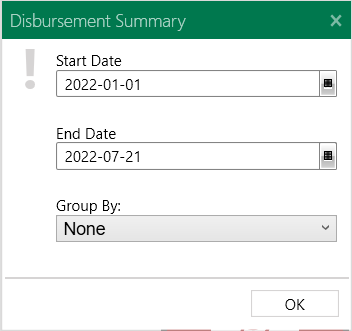

### FCF Borrowers Summary Report

This report provides summary information about the borrower on an FCF loan e.g. jobs created/maintained, borrower name, address, purpose of loan etc. It also provides a quick overview of the loan itself e.g. payment frequency, payment amount, interest rate etc.

By default the report is generated for active FCF loans that are at Closed Deal/Disbursed status. No date range is applied: it grabs loans based on their "current" status at the time of report generation.

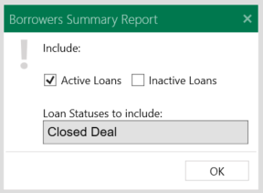

### FCF Claim Report

This report shows high-level claim information for your FCF loans. It includes claims posted to date, and claims currently due.

By default the loans on the report are grouped by loan fund and sorted by client (business) name.

No date range is applied: the report includes loans that have Closed Deal/Disbursed as their "current" status at the time of report generation.

The 'Client' column on the report displays the loan's primary borrower name first, with all loan co-borrower names listed on a new row underneath.

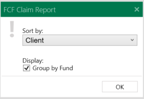

### FCF Monthly Report

This report shows FCF loans approved within your selected report date range i.e. the loan has an Approved/Committed status dated within the selected date range.

The report includes the amount the client has been approved for, the amount disbursed, and FCF borrower fee information.

The Summary table in the bottom-left corner of the report shows your office's FCF allocation less the FCF approvals made within your selected date range. Note: contact Fern support if you need to update your FCF allocation amount.

By default the loans on the report are sorted by approval date ascending. Users also have the option of creating an Excel version of the report.

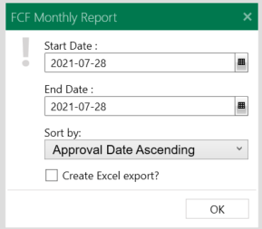

### Interest Paid Statements

Generates a letter showing how much interest was paid on a loan between two selected dates.

Each loan commands its own letter, and by default a letter is generated for every loan that had a transaction within the reporting period. By default the report is set to run for the beginning of the previous month until the current date. The start and end dates can be changed in the report parameter window as needed.

The name of the loan officer is shown at the bottom of each letter. This information is pulled from the Loan Officer field in each loan record. The loan officer info can be customized by ticking the '*Customize letter signatory*' check-box in the report parameter window. It will allow you to type in the signatory name and signatory position that will appear at the bottom of each letter.

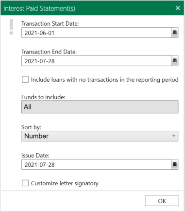

### Loan Balance

Shows the balance of each active loan at a selected date. Includes **principal, interest, insurance and fees**.

By default the report is configured to show interest accrued to the report run date i.e. the report displays interest accrued from the date of the last transaction on a loan to the report run date. If you'd rather not have interest accruing to the report date (i.e. you want the interest balances to be as per the last transaction on each loan), untick the '*Show accrued interest to run date?*' parameter when generating the report.

Bad Debt loans are not included on the report as their balances have been fully written-off. However if you do wish to show Bad Debt loans on the report, tick the 'Bad Debt loans' parameter.

The Loan Participation parameters are only relevant for pooled/syndicate loans.

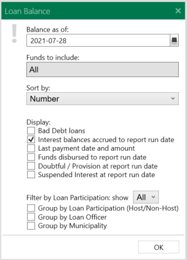

### Loan Balance by Fund

Same as the Loan Balance report, except this report shows the resulting loans **grouped by fund**. In the report parameter window you can choose which funds you want to be displayed on the report.

Once again, by default the Interest balances include interest accrued to the selected report run date.

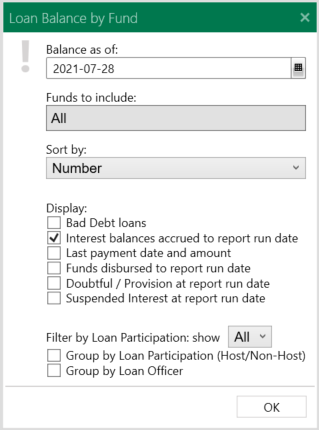

### Loan Balance with Collateral

This is the Loan Balance by Fund report, with an additional column added to show the value of active pieces of collateral associated with each loan. Please note that the collateral expiration or discharge date is **not** taken into account by the report,

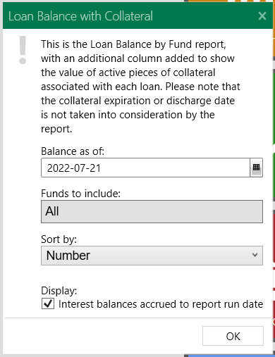

### Loans by Report Eligibility

This is a Loan Balance report where the loans are grouped by the funder reporting body.

For example, if you are a northern Ontario CFDC who is also a NACCA AFI, you could run this report to see which loans are flagged as 'ADLA' reportable, versus those identified as being 'FedNor' reportable.

The purpose of this report is to allow users to find loans that are not contributing to the correct funder reports.

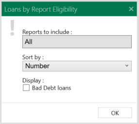

### Loan by Status

This is a loan pipeline report. By default it shows all active loans grouped by **their current status** i.e. what their statuses are currently set to in the system. For each loan it shows Application, Committed, Disbursed and Undisbursed amounts.

This report can also be generated to see loans whose current status is **dated within a particular date range**. To do this, tick the '*Include statuses dated within the following date range*' check-box, then set your date period as needed.

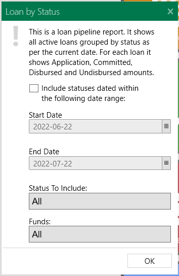

For example, if you wanted to see loans that are currently at Approved status ***and*** **the status is dated within a particular date period** (i.e. the loan was Approved within the period and it remains at Approved status currently), then you would set-up the window something like the screenshot below. This example would show loans at Approved status where the status is dated between January 1st and July 22nd 2022.

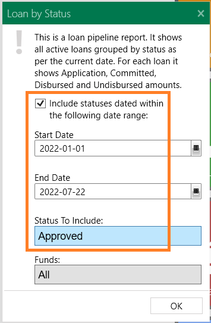

### Loan Delinquency

Displays loans in arrears at a selected date. The arrears amounts are broken down into aging buckets: 0-30 days, 31-60, 61-90, 91-120, 121-180, and 181+.

If the report run date falls within the scope of a loan's Current schedule, then only that schedule is used for calculating delinquency i.e. if using the 'Balance Comparison' delinquency method, the loan's actual balance at the report run date is compared against what its balance should be / should have been as per its amortization schedule at that date. In this case no historic or previous schedules are taken into consideration.

However, if the report run date falls before the start date of a loan's Current schedule then delinquency is calculated using a "schedule" that is programmatically created by FaaSBank: it compares the payments a client was expected to have made to the report date and compares the loan's actual balance at that date against it.

This programmatic schedule is calculated using a flag in the FaaSBank database created when a user posts, deletes or skips a payment in the software.

The report parameters can be utilized to separate the report into:

* Performing and Non-Performing loans;  
* To include Bad Debt loans (which are hidden by default);  
* To exclude loans whose arrears balance is less than a certain percentage of their principal / total loan balance;  
* To include / exclude Non-Performing loans. (Loans can be flagged as Non-Performing from within a loan record's Options tab.)

Further information on how FaaSBank manages delinquency can be found here in the User Guide: [FaaSBank User Guide](https://docs.google.com/document/d/1DtA1c6eWvJQ0mkmqoA6iWnAp13z3Q8UmvwPTQlMC72E/edit)

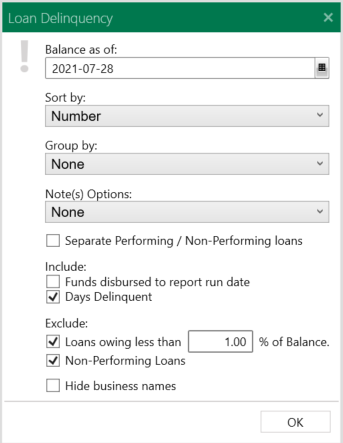

### Loan Details

Shows loan transactions posted between two selected dates.

Unlike the Transaction Activity and Transaction Summary reports, the Loan Details report produces **a separate report for each loan** that had a transaction posted to it during the selected dates e.g. if you have 50 loans that you recently posted transactions against, the system would generate 50 separate Loan Detail reports: one for each loan.

Using the report parameter window you can choose which transaction types are displayed on the report (e.g. you could filter the report to only show loan disbursal transactions); and by default, deleted transactions are hidden.

By default, a Loan Details report will only be generated for loans that had a transaction posted within the selected date range. Tick the '*Include loans with no transactions in the reporting period*' check-box to include loans that had no transactions posted to them within the selected date range.

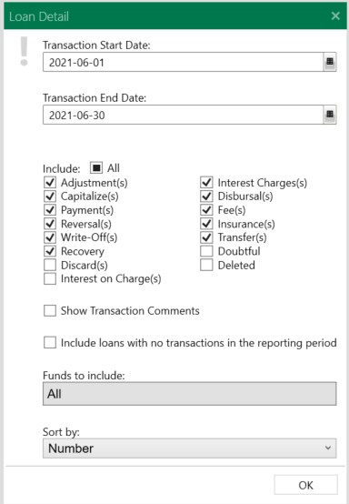

### Loan Information

A one-page snapshot of a loan.

Gives high-level loan information, including:

* product, fund, impact, loan officer etc.  
* borrower info  
* balance info as per the last transaction on the loan (interest on this report is **not** accrued to the report run date)  
* the loan's status history (including any Delinquency statuses)  
* its interest term history  
* any jobs or leverages that have been associated with the loan  
* the client's full account history (only appears when the '*Include client's full account status history?*' check-box is ticked)

By default the report will be run for all loans currently at Closed Deal/Disbursed status. Use the '*Loan Statuses to include*' drop-down menu to include/exclude other statuses as needed.

If you only want to view the report for a loan or specific loans, select them in the Accounts/Loans grid then run the report from the left column of the window.

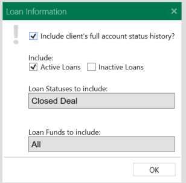

### Loan Leverages

Lists leverages - both projected and realized - that have been recorded for Loan records. (Loan leverages can be recorded within a loan's Outcomes tab. Use the 'Realized' column to identify whether or not the leverages have come to fruition.)

Where no Realized date exists, the report will display Projected leverages based on their created date i.e. when a user added them to the system.

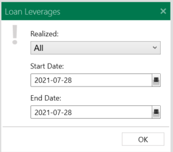

### Loan Maturity

A loan's maturity date is the date of its **expected final payment** (which comes from the loan's its Current amortization schedule).

This report shows active loans whose maturity date has already passed; or when the report run date is advanced, it also shows loans whose maturity date is upcoming (i.e. the date of the final payment on the loan's current amortization schedule is on or before the report run date).

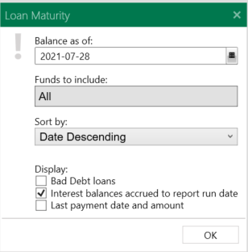

### Loan Payout

This report shows loans that will be paid out with 2 or less scheduled payments.

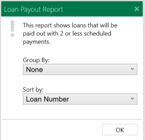

### Loan Portfolio

This report summarizes the amount collected from loans and the amount that is still outstanding.

The report only includes loans that have **an outstanding balance as per the selected report run date**. By default, the Interest Balance figure on the report is taken from per the loan transaction that most recently precedes the report run date. (To show interest accrued *until* the report run date, tick the '*Show accrued interest to run date?*' check-box.)

By default **no grouping** is applied to the loans. You can use the '*Group By*' drop-box down to group the loans by Fund, Loan Officer, Loan Product, client's Municipality (which comes from their address), and Primary NAICS Code.

The '*Generate condensed version*' check-box creates a portrait orientation version of the report. The only columns featured on this version of the report are: Loan #; Client; Interest Rate; Closed Deal Amount; Term Date; Scheduled Payment amount; Total Balance; and Undisbursed Funds.

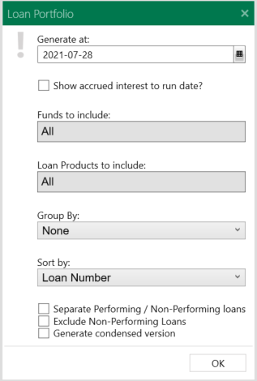

### Loan Portfolio Diversification Excel

This report is an Excel spreadsheet populated with various pieces of loan portfolio information. This report includes more information than could be squeezed into a regularly generated report 😁

As with the standard Loan Portfolio report, this report only includes loans that have an outstanding balance as per the selected report run date. Loans at Application or Approved/Committed statuses do **not** appear on the report.

Ticking the '*Include expanded outcome info?*' check-box will generate a version of the report that has expanded jobs and leverages information e.g. separate columns for each different source of leverage funding.

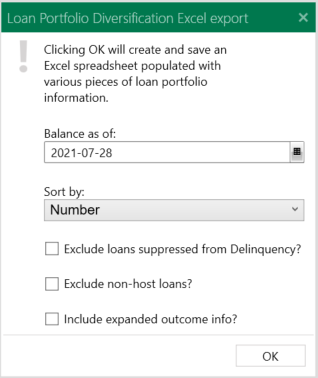

### Loan Reconciliation

The first page of this report is a summary of the information found within the report:

* The Previous Balance row reflects the loan outstanding balance as per the report start date  
* The Activities section covers the transactions that occurred within the reporting period (for the loan funds included in the report run)  
* The Current Outstanding row reflects the loan outstanding balances as per the report end date i.e. after the transactions featured on the report.

The report **includes** loans that had **no transactions** posted within the selected reporting period.

By default the report is set to be generated for all loan funds. The user can exclude/include funds as necessary using the '*Funds to include*' drop-down menu.

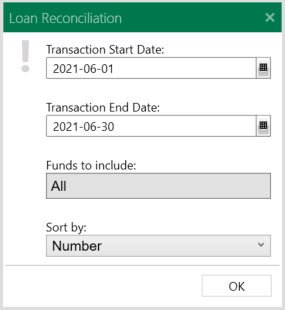

### Loan Status

Shows loan statuses with a date on or between the selected report Start and End dates.

The report shows the loan number, client name, and three monetary values associated with each status:

1. The status **Amount** (e.g. the application amount for Application statuses, or the written-off amount for Bad Debt statuses);  
2. The **Total Applied** (the total amount of money applied for by the client on this loan. This is the sum of all applications made on the loan, **regardless of date**); and  
3. The **Total Financed** (the total amount of money that has been disbursed to the loan, **regardless of date**).

The results are grouped by loan status i.e. all Application statuses are grouped together, all Approved/Committed statuses grouped together etc. The report parameter window can be used to filter the statuses and loan funds shown on the report.

By default the report also includes any delinquency statuses that have been recorded alongside loans. If you don't want delinquency statuses to be displayed, untick the '*Include Delinquency Statuses?*' check-box.  
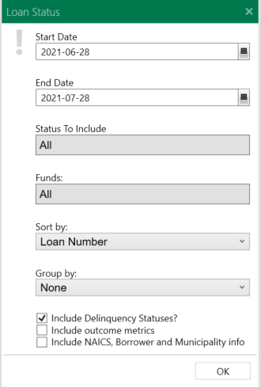

### Loan Term

A loan's term date is the date its interest rate is liable to change. (It appears on printed amortization schedules for the client's reference.)

This report shows active loans whose term date has already passed (i.e. it falls before the current date); or in the case of when the report run date is advanced, it shows loans whose term date is upcoming.

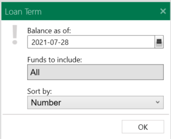

### Pending Applications

Displays all loans that are currently at an Application-type status i.e. loans that have not yet been approved, declined, withdrawn or disbursed.

No date range is taken into consideration: it grabs all loans whose current status is Application or Pending.

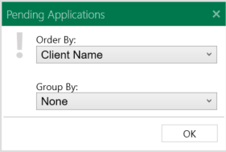

### Refinanced Loans

Provides an overview of loans that have been refinanced within the selected report run dates.

The report shows info on both the old loan (the loan that was refinanced), and the new (the loan that was created by the refinance): loan number, client, fund, the amount of money transferred from the old to the new loan, the date of the transfer, the total disbursed amount of the new loan (indicates if a loan top-up occurred), and the loan's outstanding balance.

Only loan's created using FaaSBank's 'Refinance' feature will be displayed on the report.

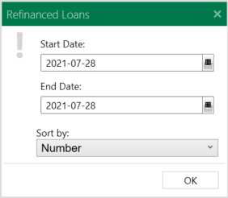

### RRRF Forgiveness Report

This report shows RRRF loans that have **not yet reached a $0.00 balance**.

The 'Eligible Forgiveness' column shows how much money is eligible for forgiveness on the loan; and the '$ to Forgiveness' column shows how much Principal the client needs to repay before they are eligible for the forgiveness portion.

No date range is taken into consideration.

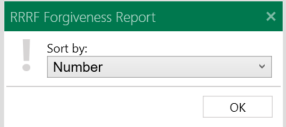

### RRRF Listing Report

This report is an Excel spreadsheet populated with RRRF loan information e.g. organization name, operating name, business number, address, sales revenue, number of employees, loan information etc.

The report gets populated with all RRRF-reportable loans that reached Closed Deal / Disbursed status. The loan's current status is not factored into the report e.g. a RRRF loan will still appear on the report if it has been fully paid out.

### Undisbursed by Fund

Shows all loans that have monies committed but are not fully disbursed as per the report run date. By default the report is broken down by loan fund and also by loan status, showing both loans that have been approved (but not disbursed) and those that have been partially disbursed as per the selected run date.

The sum of the Undisbursed totals for the Closed Deal / Disbursed loans on this report should match the Undisbursed column total on the Loan Portfolio by Fund report (if both reports are generated for the same date, and the Loan Portfolio report is generated for all funds).

Untick the '*Group loans by Status?*' check-box if you do **not** want to show loan status sub-groupings on the generated report.

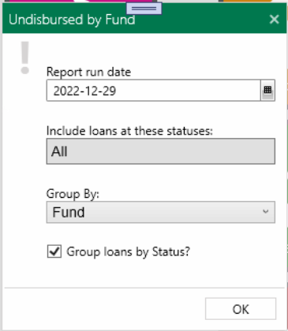

## Transaction Reports

The easiest way to generate the loan transaction reports is using the menu button in the top-right corner of the software (the three little vertical dots under the exit 'X'). There navigate to **Reports -> Transactions**.

### Anticipated Payments

Shows anticipated loan payments between two selected dates. The report grabs the payment information from loan amortization schedules. Please note that the payment breakdown shown on the report - i.e. how much Principal, Interest, Fees/Insurance is to be paid - comes **directly** from the loan amortization schedules. It does **not** take the loan's current outstanding balance into consideration.

To run the report for selected loans, select one or multiple loans in the Accounts/Loans grid, then run the report for the window's left column.

By default, the report has payments grouped by loan. In other words, if a single loan has multiple scheduled payments within your selected date range, they will be added together and displayed as a single row on the report. If you wish to see all payments listed out, untick the '***Group payments by loan***' check-box.

If you wish to see the status of the payments (Posted, Deleted, Skipped or unprocessed) displayed on the report, tick the '***Display payment statuses***' check-box.

You can use this report to see all payments that have been marked as "**skipped**" (i.e. deferred). Please see the steps [here](06-loan-management.md#generating-a-report-to-show-payments-that-have-been-skipped) on how to do that.

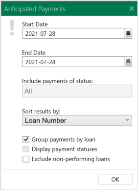

### Anticipated Payments by Fund

Same as the Anticipated Payments report, except this report shows the resulting loans grouped by fund.

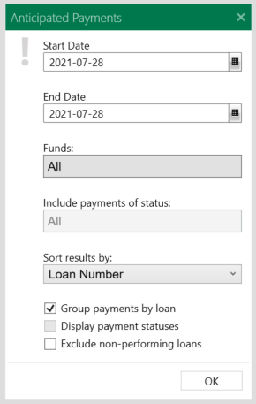

### Insurance Report

Shows insurance charge transactions posted between two selected dates.

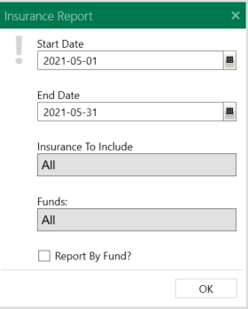

For Ontario CFDCs - to generate the **Securian** (formerly Valeyo) **spreadsheet export**, first generate the Insurance Report for the desired period. After it has opened in the Report Preview window, click the **Export button** on the top menu bar (the little Disk icon), then select **Excel**. That will allow you to save a copy of the report in the expanded Valeyo insurance spreadsheet template.

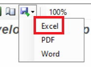

### Transaction Activity

Shows all transactions posted between two selected dates, grouped by loan.

By default the report displays the following types of transactions:

* Adjustments  
* Capitalizes  
* Disbursals  
* Fee Charges  
* Insurance Charges  
* Interest Charges  
* Payments  
* Recovery payments (against written-off loan amounts)  
* Reversals  
* Transfers  
* Write-Offs

By default, Deletions, Doubtful transactions (i.e. expected losses), and Discards (discarding suspended interest amounts) are **not** shown on the reports. They can be manually included if the user wishes to show them on the report.

The report parameter window can be used to determine which of the aforementioned transaction types appear on the report i.e. if you only wanted to see disbursal transactions posted within a particular period, you would set the Start and End Date accordingly, then untick all transaction type boxes but Disbursal.

By default the report only includes loans that had at least one transaction posted within the selected reporting period. Tick the '***Show Loans with No Activity***' check-box to include loans that had no transactions posted within the period.

The '***Funds to include***' filter can also be used to show only certain funds on the report.

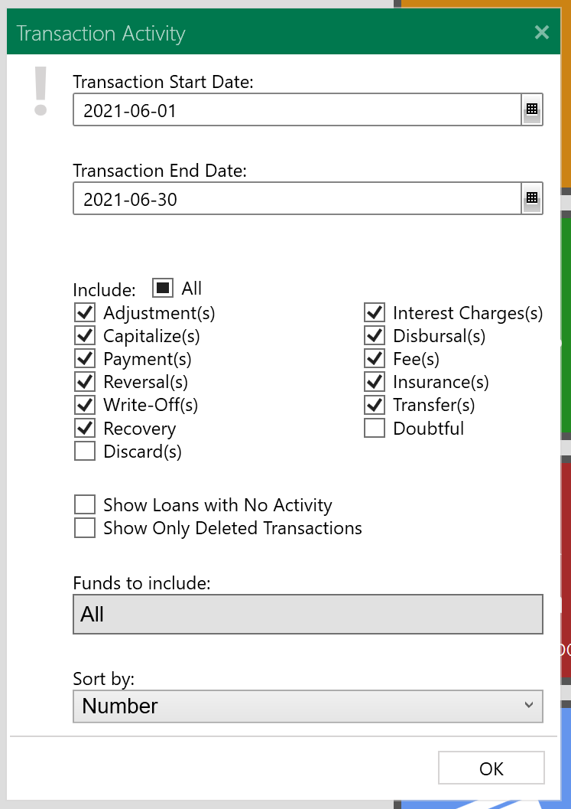

### Transaction Activity by Fund

Same as the Transaction Activity report, except this shows the loans **grouped by loan fund**.

The report only includes loans that had at least one transaction posted within the selected reporting period.

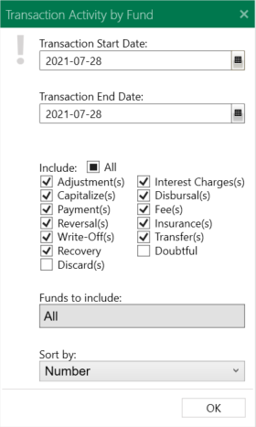

### Transaction Listing

In this report, transactions are **grouped by transaction type**, rather than by loan. For example, all payment transactions appear together, all disbursal transactions appear together etc. It is not currently possible to include/exclude particular types of transactions from the report, but that item is on our to-do list.

To generate the report: set your report date range as needed (for example, if you wanted to see all transactions posted within October, you would set the report Start Date to October 1st and the End Date to October 31st); determine which funds you want to be included (by default all funds will be included); and determine if you want the report to have a sub-grouping of Loan Number or Client Name (the primary grouping is always transaction date).

Two particular things to note about the report:

* Client Equity transactions appear as negative amounts within the 'Disbursal' transaction grouping  
* FCF Claim transactions appear within the Payment transaction grouping

### Transaction Summary

Whereas the Transaction Activity report shows all transactions listed out individually, the Transaction Summary report provides a one line summary for each loan i.e. regardless of how many transactions a loan had in the report period, only one line will appear, showing a summary of those transactions. This report is a more concise alternative to the Transaction Activity report.

By default the report only includes loans that had at least one transaction posted within the selected reporting period. Tick the '***Show Loans with No Activity***' check-box to include loans that had no transactions posted within the period.

The '***Funds to include***' filter can also be used to show only certain funds on the report.

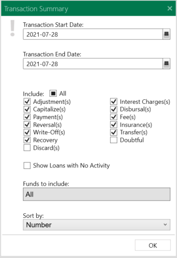

### Transaction Summary by Fund

Same as the Transaction Summary report, except this shows the resulting loans **grouped by fund**. In the report parameter window you can choose which funds you want displayed on the report.

By default the report only includes loans that had at least one transaction posted within the selected reporting period. Tick the '***Show Loans with No Activity***' check-box to include loans that had no transactions posted within the period.

The '***Funds to include***' filter can also be used to show only certain funds on the report.

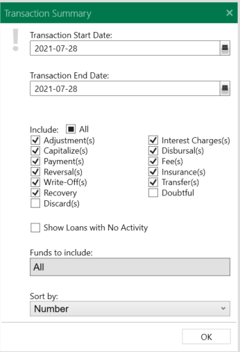

### Write Off Activity

Shows all transactions that affected written-off loan balances between two selected dates, grouped by loan. The included transactions could be write-offs, adjustments made to written-off loan balances, reductions in written-off amounts, or recovery of Bad Debt payments.

The report is split into Written-Off and Recovered amounts to provide a more rounded view of your written-off (or partially written-off) loans.

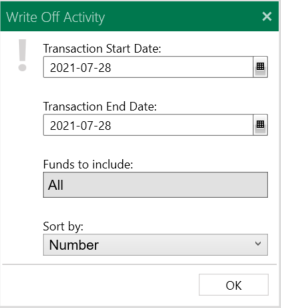

## CFDC Reporting

### British Columbia WD/WED

#### RRRF Loan Reporting

A user guide for the WD RRRF Report can be found [here](https://docs.google.com/document/d/1sVnrDs-Enbdo3uXn8fYsEuImAalBpQ4FubTqqKt8uBo/edit?usp=sharing).

A user guide related to the RRRF Loan Program Changes introduced by the Government of Canada in late 2023 can be found [here](https://docs.google.com/document/u/0/d/1IecvSq9t7EG2Gqkyso2uLtoFIx2qEVMwcDszDY7-Czw/edit).

#### WD Quarterly Performance Report

A user guide for the WD Quarterly Performance Report can be found [here](https://drive.google.com/file/d/1M5XE8q0N6jphjV5UKhKVIGDU36dDzwTt/view?usp=sharing).

### Ontario FedDev/FedNor

#### Business Number Report

The Business Number Report can be generated by clicking the little menu button icon in the top-right corner of the software, then navigating to **Reports -> Others -> Business Number Report**.

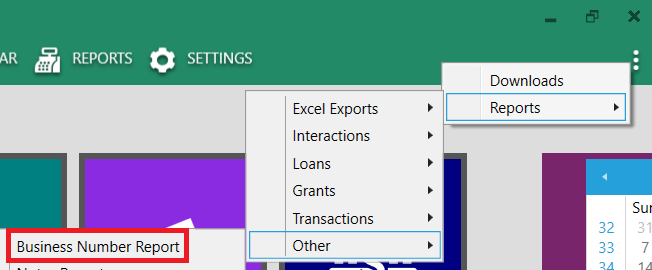

You have the following options in the report parameter window:

* *Generate as of* - the date used to generate the report  
* *Funds to include* - include/exclude specific loan funds as needed.For example, if your CFDC is also a NACCA AFI, you may exclude AFI-specific loan funds, as FedNor/FedDev may not wish to see those businesses on the report  
* *Exclude Non-Host Pool* - exclude pooled loans where your CFDC is a partner rather than host  
* *Include Line 2 in Address field* - when ticked, the generated report includes both Address Line 1 and Address Line 2 in the Address field  
* *Generate Text File* - when ticked, a Notepad file containing all of the business information will be saved to your computer

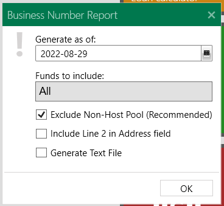

When the report has been generated, you can export the results to an Excel spreadsheet by clicking the little **Export icon** on the window's top menu bar, then selecting **Excel**. Following that, you can copy-and-paste the info into FedNor/FedDev's Excel template as needed.

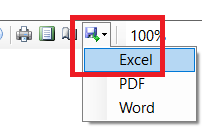

#### Insurance Report - Valeyo

The Insurance report for Valeyo can be generated from the menu button in the top-right corner of the software (the three little vertical dots). From within there, navigate to **Reports -> Transactions -> Insurance**.

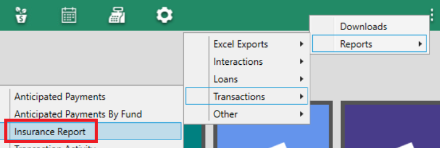

In the report parameter window, set your report **start and end dates** as needed, then click **OK** to generate the report.

That will generate a **high-level** insurance report. To have FaaSBank produce the Excel export file that can be sent to Valeyo, **click the Export icon** (the little disk) on the Report Preview window's top menu bar, then select **Excel**. It will then ask you where on your computer you wish to save the report.

FaaSBank will then save the spreadsheet report to your computer. It should open automatically in Excel 🙂

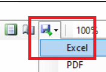

#### RRRF Loan Reporting

A user guide for the RRRF Report can be found [here](https://docs.google.com/document/d/1-1wq1SirEg9nY0LKf4h7HgAjp65XVeHby8jvRZ85E3E/edit?usp=sharing).

A user guide related to the RRRF Loan Program Changes introduced by the Government of Canada in late 2023 can be found [here](https://docs.google.com/document/u/0/d/1IecvSq9t7EG2Gqkyso2uLtoFIx2qEVMwcDszDY7-Czw/edit).

#### FedDev Performance Report

The FedDev Performance Report can be generated from the **Reports** area of the software. Click the Reports button on the top menu bar to enter the area.

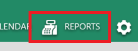

Once there, in the left column set your **date range** as needed, then click the ***Generate FedDev Metrics*** **button**.

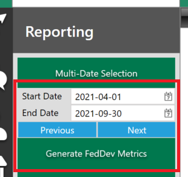

A pop-up window will appear. Enter your organization's **cash on hand** balance into the field, then click the ***OK*** **button**.

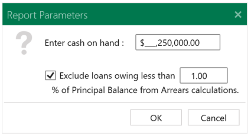

The report will then be generated. When the generation process is complete, you will see all of the report metrics in the main grid area of the window.

To drill down into a metric you can **double-click** on its row. You will then be presented with the items/records that make up the report result.

When you have reviewed the metrics and confirmed that everything is good, you will then want to create the spreadsheet report. To do this, click the ***Export to FedDev Template*** **button**. FaaSBank will then ask you where on your computer you want to save the report. Select a location and click the ***Save*** **button**.

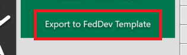

The spreadsheet version of the report will then be created and saved to your computer; and it should open automatically. You can then review the spreadsheet report prior to submitting it to your FedDev support agent.

##### Tracking Business Service Activities & Impacts in FaaSBank

The guide [here](https://drive.google.com/file/d/1cQOF4gqWkAbCy4LJ-SMJirRY-oCFSHek/view?usp=sharing) provides information on how General Inquiry and Activity interactions impact the FedDev Performance report.

## NACCA AFI Reporting

### ADLA Loan Reporting

An overview guide for the ADLA report can be found [here](https://docs.google.com/document/d/1-aDpzwqd5hxMllJcufug5-TAWn_aJZ9AdV71d9EakVU/edit?usp=sharing).

### ABFP Grant Reporting

An overview guide for the ABFP report can be found [here](https://docs.google.com/document/d/1nhTYbapHDwCMC2jV8H6bYWYE-Y9UW0885dkwmeHASr0/edit?usp=sharing).

A video recording outlining how the ABFP report works can be found [here](https://drive.google.com/open?id=14sGCdxq_ynNt6jvdSowx39T0czb7g8B7).

### ELP (Emergency Loan Program) Reporting

A user guide for the ELP Report can be found [here](https://docs.google.com/document/d/1PKgUllUDh7zp_2ulrtU6iHkg8aTREyUHwj21937rmR8/edit?usp=sharing).

A user guide on managing the ELP loans can be found [here](https://docs.google.com/document/d/18Z6HWjxOx9jora-8BZ6OxJw4OdBOoPLhqBHyHJKa2RY/edit?usp=sharing).

#### Forgiving additional money on an ELP/ELP2 loan

The Bulk ELP Forgiveness tool can be used to forgive the additional Principal amounts on ELP/ELP2 loans. Please see the user guide for the feature [here](https://fernsoftware.us4.list-manage.com/track/click?u=665d7cf93b33964367cf02089&id=4c6197c078&e=574a236fc2).

A video outlining how the feature works can be viewed at the link below.

[FaaSBank - Using the Bulk ELP Forgiveness Tool - Watch Video](https://www.loom.com/share/72a34a8b3113474d8bfaa8c77418a407)

[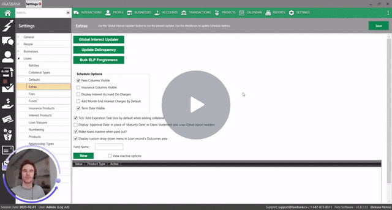](https://www.loom.com/share/72a34a8b3113474d8bfaa8c77418a407)

#### Forgiving additional money on a Paid in Full ELP/ELP2 loan

The Bulk ELP Forgiveness tool can also be used to forgive additional money on ELP/ELP2 loans that have already been **paid out**. Please see [this section of the user guide](https://docs.google.com/document/d/13Y5ZIeUT4HXbOjvjKMyNkdqIcLpZItVojZDBcrMk5Y4/edit) for steps on the process.

After the additional money has been forgiven - and you have received the rebate from NACCA - you will want to **rebate the client for the amounts they overpaid**. You can do this via an Adjustment in FaaSBank. Steps on the rebate process can be found [here](https://docs.google.com/document/d/13Y5ZIeUT4HXbOjvjKMyNkdqIcLpZItVojZDBcrMk5Y4/edit).

### NACCA Indigenous Growth Fund (IGF) reporting

An overview guide for the IGF report can be found [here](https://docs.google.com/document/d/145fxw1EaydENQyXO8SuzNGRHVH64jsFOjSWyMg0sKQM/edit?usp=sharing).

### NACCA Indigenous Women Entrepreneurs (IWE) / WELF reporting

An overview guide for the IGF report can be found [here](https://docs.google.com/document/d/1Vu1eXFQcKD-QmDlc866JBdz9johf_6yg8zxG6spgNGY/edit?usp=sharing).
