# Settings

## Banks

You are able to see the list of all banks/financial institutions if you go to **Settings -> General -> Banks**. You will be able to add, edit and delete banks in this window.

If you are unable to see this area of Settings, it might be due to user permissions. Someone who has access to updating these permissions will need to give you permission to access all sections of Settings.

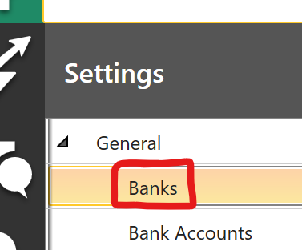

### Adding Banks/Financial Institutions

If a bank/financial institution is missing from the drop down menu in the software, you can add a new item to the list from the Banks tab within Settings. Here, click the **Add button** at the top of the grid, then enter the institution Number and Name in the fields under the grid. Remember to **save** your change.

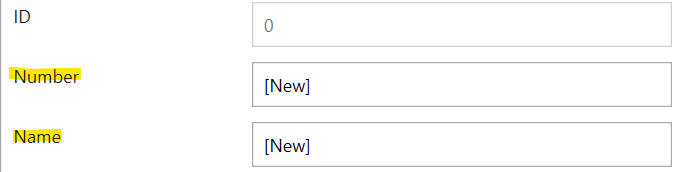

### Editing Bank Lists

To do

### Deleting Bank Lists

To do

## General Ledger accounts (GL Accounts)

Use the GL Accounts area of Settings to store your organization's general ledger accounts **if you plan to use FaaSBank to create journal entries for your loan/grant transactions**.

It can be accessed in Settings -> General -> GL Accounts.

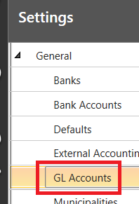

The goal should be to ensure that **all relevant general ledger accounts exist in FaaSBank** i.e. any account you expect to be credited/debited by an eligible transaction that you post to a loan/grant record in the system. (More information on "eligible transactions" can be found below in the External Accounting section [here](10-settings.md#external-accounting--journal-creation).)

After your GL accounts have been entered, the next step is associating them with your **loan funds**. Further information on that can be found in the next section.

## Interactions

### Defaults

The Interactions default section in Settings determines default values for newly created interactions. **Note:** these are global defaults rather than user defaults. In other words, they impact the creation of new interactions by **all** users.

These settings are located in **Settings → Interactions → Defaults**

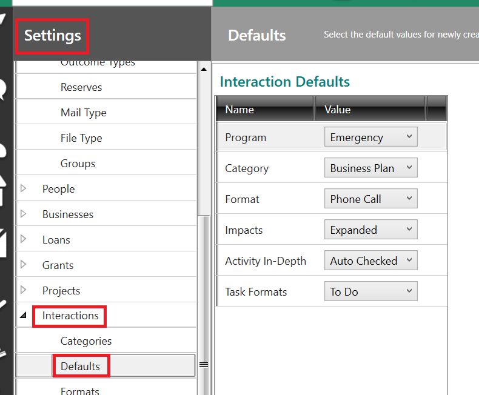

The items in the Interaction Defaults section are as follows:

#### Program

Use this field to select a default Program for new General Inquiry and Activity interactions.

Programs can be added/edited/deleted in **Settings → Interactions → Programs**.

#### Category

Use this field to select a default Category for new General Inquiry and Activity interactions.

Categories can be added/edited/deleted in **Settings → Interactions → Categories**.

#### Format

Use this field to select a default Format for new General Inquiry and Activity interactions.

Formats can be added/edited/deleted in **Settings → Interactions → Formats**.

#### Impacts

Users can choose a default impact from the following list. Their selection will populate the Impact field when the new Activity window is opened.

* Acquisition  
  * This option will not result in a selection in the Activity window for Ontario CFDCs as it is not featured on the FedNor/FedDev CFDC Performance Reports  
* Expanded  
* Maintained  
* Started  
* None

#### Activity In-Depth

You can choose between '*Auto Checked*' or '*Not Checked*' for this default.

'*Auto Checked*' will have the **In-Depth field** checked by default when creating a new activity, whereas '*Not Checked*' will **not** have the field checked by default.

**Note:** when In-Depth is not checked, the Impact field for an Activity will be set to '*None*' by default.

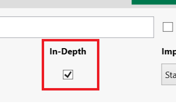

#### Task Formats

Use this field to select a default format for Task interactions.

Task Formats can be added to **Settings → Interactions → Formats**. In that area of Settings you can identify a format as being a "task" format by ticking the check-box in the Tasks column.

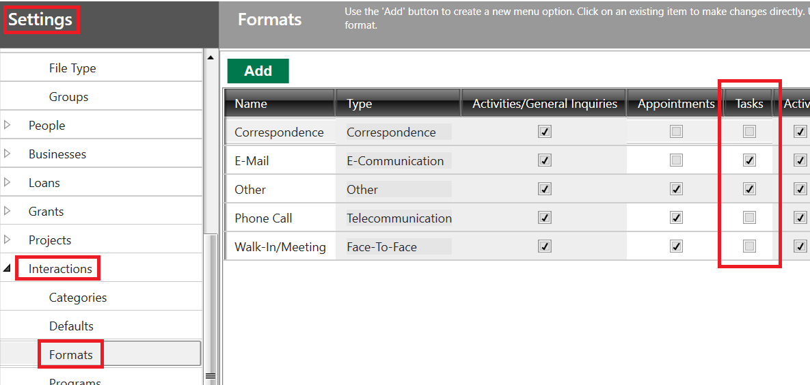

## Loans

### Loan Funds

Your loan fund setup determines which general ledger accounts will be credited/debited if you decide to use FaaSBank's journal features.

**Note**: even if your organization is not planning to create journal entries or journal reports from FaaSBank, you should still review your loan funds and **ensure that each fund is linked to dummy General Ledger accounts**. (The dummy accounts are created as part of the database creation process.) FaaSBank's transaction processing will require that each fund (and any of its associated fees) are linked to General Ledger accounts.

#### Ensuring the relevant GL accounts exist in FaaSBank

The GL accounts that can be selected for your Funds should be entered within **Settings -> General -> GL Accounts**.

The goal should be to ensure that **all relevant general ledger accounts exist in FaaSBank** i.e. any account you expect to be credited/debited by an eligible transaction that you post to a loan/grant record in the system. (More information on "eligible transactions" can be found below in the External Accounting section [here](10-settings.md#external-accounting--journal-creation).)

#### Loan Fund Overview

Each loan fund has a full set of accounts e.g. Bank, Revenue, Receivable etc. Separate accounts can be specified for Interest, Insurance and Fees transactions.

In FaaSBank the loan funds can be reviewed in **Settings -> Loans -> Funds**.

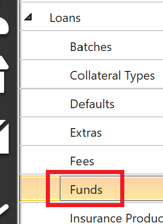

The first step is to **select a fund** in the Loan Funds grid.

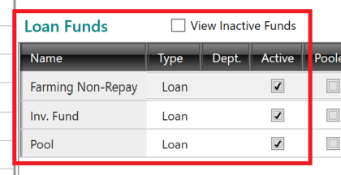

When you have selected a fund, **the general ledger accounts associated with that fund** will be displayed in the top-half of the window.

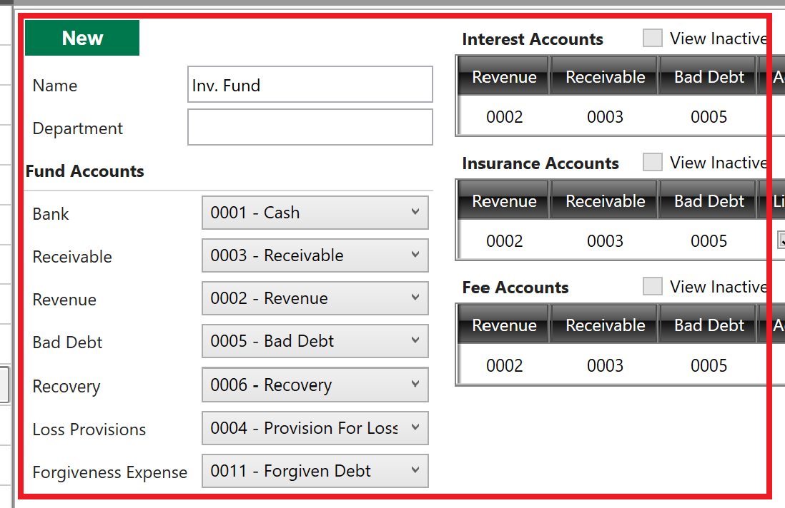

**Review the accounts for each loan fund** to ensure that they are set-up correctly. Make changes as necessary.

If required, new general ledger accounts can be added via **Settings -> General -> GL Accounts**. After being added they can then be linked to your loan funds as needed.

A few notes on the accounts:

* **Bad Debt** - this account is impacted via the posting of Write-Off transactions  
* **Loss Provision** - this account is impacted via the posting of 'Doubtful' Write-Off transactions  
* **Forgiveness Expense** - this account gets **debited** when a 'Forgiveness Claim' Adjustment is posted to a loan e.g. the forgiveness amount found on certain on COVID-related loans (RRRF, ELP programs).  
* **Fee Accounts** - if required, each fee can have its own Revenue, Receivable and Bad Debt accounts.

#### Adding a New Loan Fund

To **add a new loan fund** you should click the **New button** at the top of the Settings area, then enter a name and **select the relevant GL accounts** for that fund. Click the **Save button** in the top-right corner to save the fund when all of the relevant accounts for it have been selected.

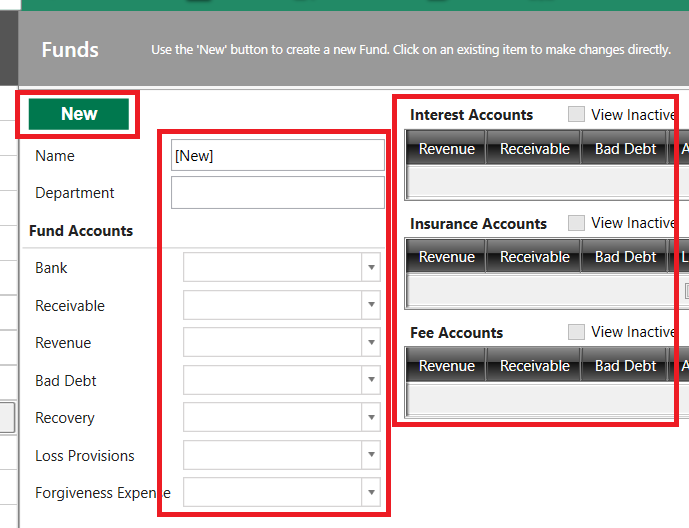

#### Linking a Fund to a Funder Report

You will also want to check that your loan funds are set-up to contribute to the **correct mandatory funding report**. You can check this in the **Reported To field** found in the Loan Funds grid.

The Reported To selection determines **which loans will contribute to which funder reports**. For example, in the screenshot below, all three funds have been identified as '*FedDev*'. This means loans on those funds will contribute to the FedDev CFDC Quarterly Performance Report.

Please note that a loan fund can only be associated with **a single funder report by default**. If a loan should appear on multiple funder reports, that change can be applied within that particular loan's *Outcomes* tab.

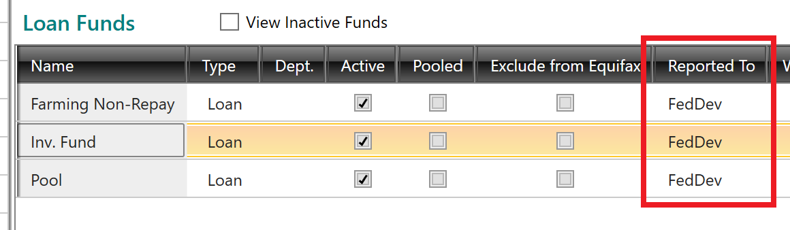

### External Accounting & Journal Creation

If you plan to create transaction journal entries from FaaSBank, the next step is reviewing the **External Accounting settings** to ensure that they are set-up correctly.

This can be done in **Settings -> General -> External Accounting**. A description of each field can be found under the screenshot.

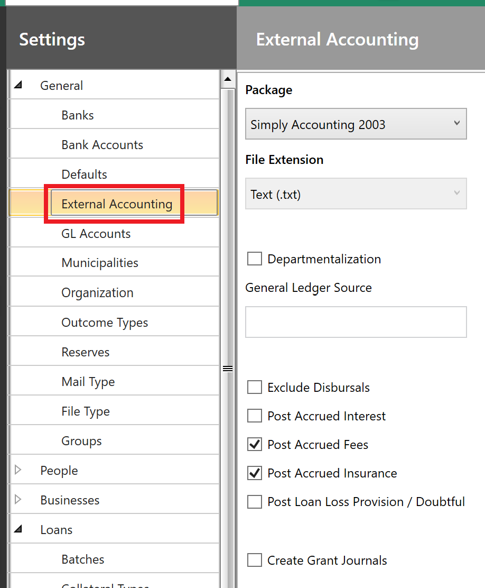

The fields in this section of Settings are as follows:

* **Package**  
  The third party accounting package that your organization uses e.g. Sage/Simply Accounting, QuickBooks etc. This selection determines the format of the journal export files that will be created by FaaSBank.

  FaaSBank is capable of producing journal files for the following accounting packages:

| Package | Default File Format | Notes |
| :---- | :---- | :---- |
| AccPac Plus | CSV |  |
| AccPac for Windows - Detailed | GL1 |  |
| AccPac for Windows - Summary | GL1 | Creates a summary file reflecting the net impact of the journals, rather than having each journal listed out individually |
| Adagio - Detailed | CSV |  |
| QuickBooks Desktop | IIF |  |
| QuickBooks Online (QBO) | CSV |  |
| Sage / Simply Accounting | TXT |  |
| Sage / Simply Accounting - Summary | TXT | Creates a summary file reflecting the net impact of the journals, rather than having each journal listed out individually |
| Sage Business Cloud Accounting | CSV |  |

* **File Extension**  
  The file extension of the journal export files that will be created by FaaSBank.

* **Departmentalization** and **General Ledger Source**  
  Some accounting packages require this additional bit of information on the journal files e.g. the Adagio accounting package. When the *Departmentalization* check-box is ticked, the *General Ledger Source* field becomes enabled, allowing you to enter the *General Ledger Source* value relevant to your accounting package. For some accounting packages this value may be referred to as the **Source Code**.

* **Exclude Disbursals**  
  Tick this field if journals for disbursal transactions should be **excluded** from the export file process.

  Many organizations exclude disbursal transactions from the FaaSBank journal process as they manually cut the cheques from their accounting packages (or post the disbursals via EFT and import the transaction into their accounting package from their financial institution). Importing the disbursal journals from FaaSBank may result in duplication in their accounting system.

* **Post Accrued Interest**  
  Tick this field if you want FaaSBank to create journals for accrued interest amounts.

* **Post Accrued Fees**  
  Tick this field if you want FaaSBank to create journals for fee charge transactions.

* **Post Accrued Insurance**  
  Tick this field if you want FaaSBank to create journals for insurance charge transactions.

* **Post Loan Loss Provision / Doubtful**  
  Tick this field if you want FaaSBank to create journals for 'Doubtful' write-off transactions (and any transactions that impact a loan's Doubtful amount).

* **Create Grant Journals**  
  Tick this field if your organization wishes to create journals for **grant** transactions posted in FaaSBank. This field is only relevant if your organization has the **Grants module** enabled.

Once you have confirmed that the correct General Ledger accounts are linked to the loan funds, you should post some test transactions in FaaSBank to ensure that the system is crediting/debiting the accounts as anticipated.

### Aligning your loan funds with batches

If you will be using FaaSBank to create journal entries, you must ensure that all of your loan funds are **aligned with a batch**. This can be done in **Settings -> Loans -> Batches**.

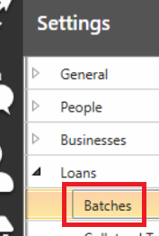

It is easiest to explain batches with an example: let's imagine you have a few different loan funds, and when producing transaction journal entries from FaaSBank, you would **like the journals for each fund to be kept separate**. That is how batches can help 😃

If you don't mind transactions/journals for different loan funds being intermingled, then you will be fine with **a single batch containing all of your active loan funds**. That way you will see all transactions grouped together in the Transaction Export window.

To do that, **tick the 'All Funds' check-box** on your single batch's row.

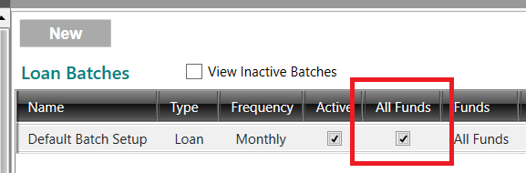

On the other hand, if you want to keep the transactions/journals for different funds **separate**, then you should create separate batches as required. For example, in the screenshot below, this organization has three separate batches specified in Settings. The 'Funds' column shows the loan funds that are associated with each batch:

* New Ventures - this is a batch for transactions posted to loans on the 'New Ventures' fund. The Frequency is set to 'Daily', which means that new transaction batches will be opened for each day that transactions are posted to those loans.  
* Loan - this is a batch for transactions posted to loans on the 'Loan' fund. The Frequency is set to 'Weekly', which means that new transaction batches will be opened weekly that transactions are posted to those loans.  
* RRRF - this is a batch for transactions posted to loans on the 'RRRF' fund. The Frequency is set to 'Monthly', which means that new transaction batches will be opened monthly that transactions are posted to those loans i.e. a batch for June 2022 transactions, a batch for July 2022 transactions etc.

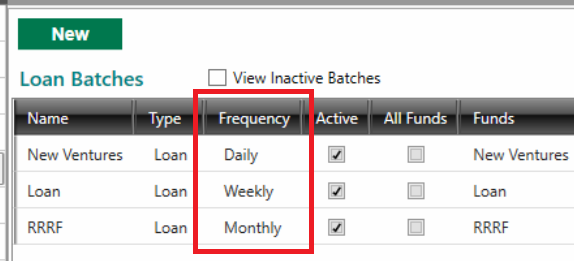

Generally we see the batch frequency being set as **Monthly**, but you have the option of changing it if needed. The Frequency determines how often new transaction batches will be opened in the Transaction Export window. A monthly batch frequency means that all transactions on the selected loan funds will be placed into a monthly batch together e.g. all transactions posted in June 2022 will be placed into a batch together (until that batch is closed; at that point, if a user posts another transaction dated in June 2022, a new  June 2022 batch would be opened).

#### Reviewing journal entries for posted transactions

You can use the **Transaction Export** window to view the accounts that are being credited and debited based on your loan fund account setup. This window can be accessed by clicking the tile on the FaaSBank home screen.

By default FaaSBank places posted transactions into **monthly transaction batches** e.g. all transactions posted in May 2021 will be placed into a batch together.

To view the journal entries for a particular transaction, follow these steps:

1. Open the **Transaction Export window**.

2. In the window's left column, in the **Open** grid, select the monthly batch in which your desired transaction(s) fall.

   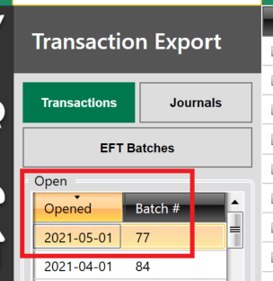

3. The main grid area will then show all transactions dated within that period.

   To view the journal entries for a particular transaction, click the little **'+' button** found at the very left side of its row.

   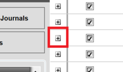

4. FaaSBank will then display **the journal entries for that transaction** in sub-rows underneath the main transaction row.

   **Review the journals to ensure that FaaSBank is crediting/debited the correct accounts**. If incorrect accounts are being impacted, this generally means that the wrong accounts have been linked to the wrong loan fund. That can be reviewed in Settings -> Loans -> Funds.

   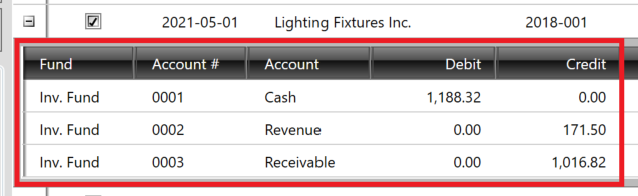

Steps on creating journal entry reports and journal export files can be found [here](05-transactions.md#creating-journal-reports--export-files).

##### Excluded Transactions

If you see a grey transaction row in the grid, this indicates that the journal entries for that transaction would **NOT** be included on the journal export file if it was created from FaaSBank. This is based on the 'Exclude' options selected in Settings -> General -> External Accounting.

For example, if your organization excludes accrued interest journal entries, then Interest charge transactions will be shaded grey in the Transaction Export window.

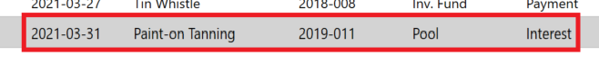

##### Account Summary

An **Account Summary** can be found in the bottom right corner of the Transaction Export window. It shows the net impact of the journal entries on your General Ledger accounts. It provides a quick way of telling if the batch totals match the figure you expect to see.

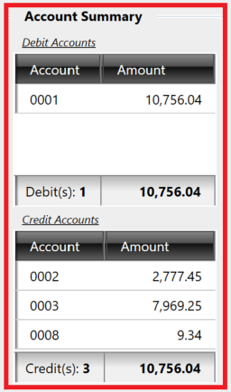

### Loan Numbering

FaaSBank has three methods of loan numbering. They can be enabled in **Settings -> Loans -> Numbering**:

1. **Manual**  
   This means the Loan Number field in the Loan record is blank, allowing the user to type in any loan number this wish. The Loan Number can include numbers, letters and/or characters.

2. **Sequential**  
   When Sequential numbering is used, FaaSBank will auto-generate a sequential loan number when the loan is **saved for the first time** e.g. loan number 001, then 002, then 003 etc. The number can also include the year if required e.g. loan number 2020-001, then 2020-002, then 2020-003 etc.

   In Settings, the Sequential field set-up is as follows:

   \- **Length** - the number of characters that will make up the sequential loan number. For example, if you want the numbers to be 001, 002, 003 etc. you would enter the Length as 3.

   \- **Last No. Used** - this shows the last sequential loan number that has been used. In the screenshot below, our Length is 3, and the Last No. Used is **14**. This tells us the next number in the sequence is **15** (which would appear in the Loan as 015, as our Length = 3).

   \- **Year Location** - this allows you to include the year in the auto-generated loan number. There are three options: *None*, *Prefix*, and *Suffix*. *Prefix* will add the year **before** the sequential number, whereas *Suffix* will add the year **after** the sequential number. In our example below, *Prefix* has been selected, which means the current year (2020) will be included **before** the sequential number e.g. **2020**-015.

   \- **Year Format** - allows the user to determine if the year should appear as 2-digits or 4-digits in the generated loan number e.g. if the year is 2020, do you want it to appear in the Loan Number field as 2020 or just 20.

   \- **Include Year Separator?** - tick this if you want the year to be separated from the sequential loan number by a hyphen e.g. 2020**-**015.

   \- **Use Fiscal Year End?** - tick this if you want the year included in the loan number to use the **fiscal** rather than **calendar** year. (An organization's fiscal year is set within their Business record.)

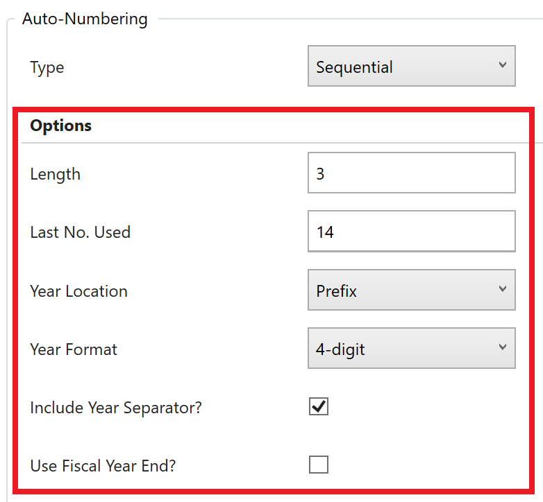

3. **Client Number**  
   When the Client Number loan numbering system is used, FaaSBank will auto-populate the Loan Number field with a client number that has been assigned to the selected **business** record. For example, if a business had the Client Number of 4708, when that business is selected in the Loan record, the Loan Number field will be auto-populated with 4708. A user can then amend the loan number as needed.

   Note: the Client Number feature is switched **off** by default in FaaSBank, meaning client numbers will likely **NOT** have been assigned to any of your business clients. This makes it tricky to start using this method after you have been using FaaSBank for a considerable period of time, as it would require entering Client Numbers for the businesses that already exist in your FaaSBank database.

## People Numbering

This is found within **Settings -> People**.

When the People Numbering system setting is enabled, FaaSBank will **automatically assign a unique number to each new Person record that gets added to the database**.

If the feature is **disabled**, new Person records get added to the database in the regular manner i.e. they are not assigned a unique number that is visible in the user interface. On the other hand, if the feature is **enabled**, the next number in the defined numbering sequence will be assigned each time a new Person record is saved to the system.

A field showing the assigned number appears in the Person record when the system setting is enabled; and you can also search for Person records using their unique number in the global search field.

The table below covers the various configuration options that you can use to determine the unique numbers that get assigned to Person records when the system is enabled.

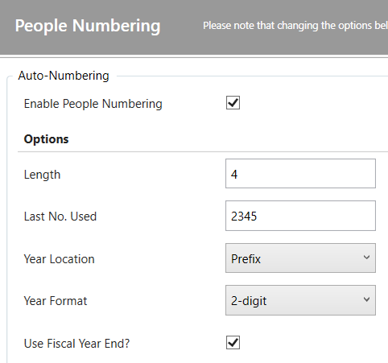

| Field Name | Values | Description |
| :---- | :---- | :---- |
| **Enable People Numbering** | True or False | Identifies if the auto-generated Person file number feature is enabled or disabled for your organizagtion.  If enabled, it means that a unique number will be auto-assigned to each new Person record added to FaaSBank.  |
| **Length** | Numeric | Indicates **the length of the Person file numbers to be generated** e.g. do you want a four character file number (1234) or five characters (12345). |
| **Last No. Used** | Numeric | Identifies the last Person file number that was assigned. The next file number to be assigned will be the number shown in the field **incremented by 1**.  For example, in the screenshot above, the most recent number assigned was 2345 (actually 23-2345, because the organization in question also includes the year as 2-digits as a prefix to the auto-assigned number). This means the next Person record to be saved to FaaSBank will be assigned number 23-234***6***, as that is the next number in the sequence. A user can override this number as required, as a way to force the next number to be assigned. |
| **Year Location** | None Prefix Suffix | This determines if the assigned person file numbers contain the year that the Person is being saved to FaaSBank. If the file number is to contain the year, it can either be added to the start (prefix) or the end (suffix) of the file number. It will be separated from the assigned number (Last Number Used) by a hyphen e.g. ***23*****-**2345 for a Person record added in 2023 when the Prefix 2-digit options are selected.   **None**, means no Year will be included in the auto-generated Person file number **Prefix**, means the Year will get included at the **start** of the Person file number **Suffix**, means the Year will get included at the **end** of the Person file number |
| **Year Format** | 2-digit 4-digit | If the file number is to contain the year, this determines if it should appear as 2- or 4-digits. **2-digit** e.g. 23 for the year 2023 **4-digit** e.g. 2023 |
| **Use Fiscal Year End?** | True or False | If the Person file number is to include a Year value, this determines if FaaSBank is to use the **calendar or fiscal year**. It will use the Fiscal Year when the check-box is **ticked**. |

### What happens when the People Numbering setting is enabled?

When the People Numbering system setting is enabled, you will see a 'File Number' field appear in the Add Person window. By default the field is disabled, and it contains the text '*System Generated*,' indicating that it will be auto-populated by FaaSBank when you save a new Person record to the system.

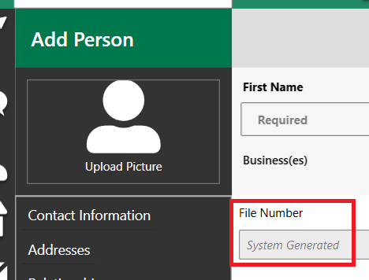

When you save a new Person record, you will see that the field gets populated with **the next number in your defined numbering sequence**. The field remains disabled to manual edits.

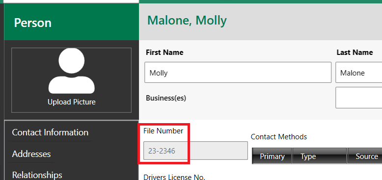

A neat thing is that you can then **search for people using their file number in the global search field**. You don't need to type in the full person number: any part of it should find the associated person 😎

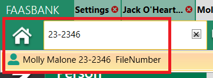

### What about the people who already exist in the software and don't have File Numbers?!

When the person file number system setting is enabled, if you open an existing Person record who **doesn't** have a file number assigned, you will see **the text '*Assign ID*' appear above their File Number field**.

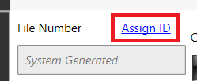

Clicking that text will **automatically assign the Person the next file number in sequence** 🙌

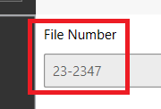

## User Management

### Adding a New User

A step-by-step guide on the process can be found [here](https://scribehow.com/shared/FaaSBank_-_Adding_a_New_User__w9WQJrJsRC2UaD8fU_rd-g). A video can be found below.

[FaaSBank - Adding a New User](https://www.loom.com/share/ba1473a08a6a4773baef45f1de44ee68)  

### Deleting/Deactivating an existing User

To remove a user from your system, navigate to **Settings -> Permissions -> Users**.

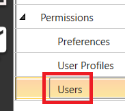

To remove a user, **untick the Active check-box** found in their row in the Users grid. After that, click the **Save button** in the top-right corner of the window to save the change.

The selected user(s) will no longer be shown on the software's login screen.

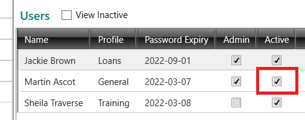

Please note that any tasks/appointments associated with that user **will remain associated with the user** despite their account being deactivated. Please contact Fern support if you would like to have their tasks/appointments assigned to another user.

### User Permissions Overview
